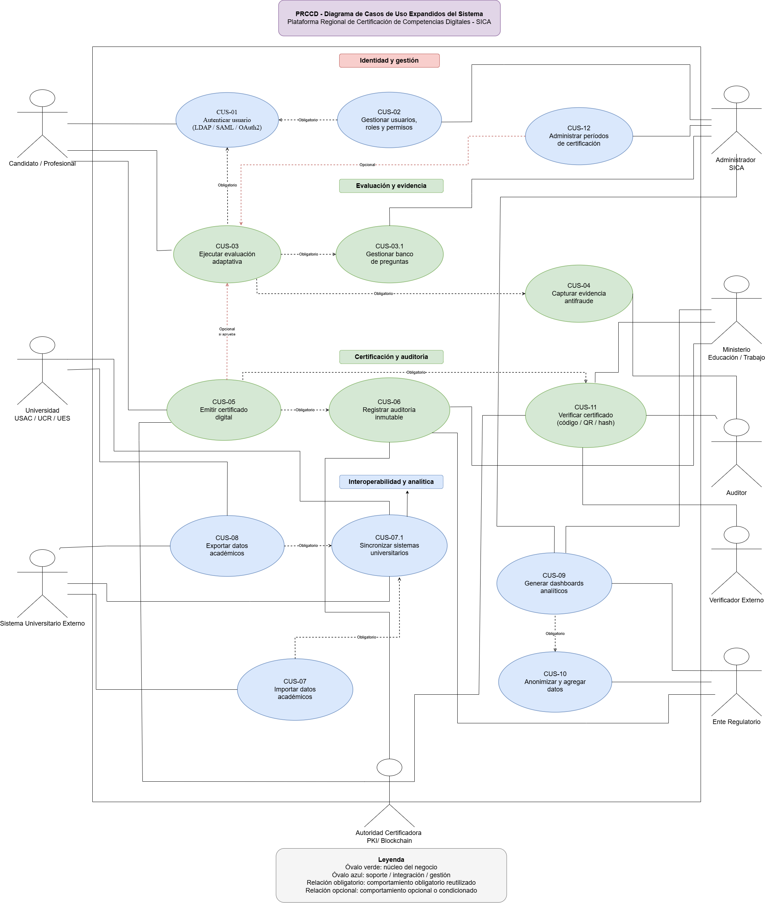

# Plataforma Regional de Certificacion de Competencias Digitales

## PRCCD - SICA

Universidad San Carlos de Guatemala
Facultad de Ingenieria
Escuela de Ciencias y Sistemas
Analisis y Diseno de Sistemas 2 - Seccion A
Escuela de Vacaciones Junio 2026

**Proyecto Fase 1**

| Nombre                           | Carne     | Rol                                       |
| ---------------------------------- | ----------- | ------------------------------------------- |
| Luis Fernando Gomez Rendon       | 201801391 | Scrum Master / Coordinador de repositorio |
| Ander Gilberto Popol Poron       | 201801518 | Product Owner / Analista de negocio       |
| Jencer Hamilton Hernandez Alonzo | 202002141 | Arquitecto de drivers y calidad           |
| Oswaldo Antonio Choc Cuteres     | 201901844 | Arquitecto de sistema e infraestructura   |
| Javier Andres Monjes Solorzano   | 202100081 | Disenador de datos e integracion          |
| Juan Jose Gerardi Hernandez      | 201900532 | Disenador UI/UX y patrones                |

Catedratica: Ing. Claudia Rojas de Moran
Vacaciones de junio 2026

---

# Tabla de Contenido

1. Identificacion del caso de negocio y Stakeholders
   * 1.1 Listado de Stakeholders y preocupaciones arquitectonicas
   * 1.2 Core del negocio
2. Caracteristicas del sistema y Drivers Arquitectonicos
   * 2.1 Drivers RF - Requerimientos Funcionales
   * 2.2 Drivers EaC - Escenarios de Atributos de Calidad
   * 2.3 Drivers de Restriccion
   * 2.4 Caracteristicas priorizadas del sistema
3. Diagramas de CDU expandidos
   * 3.1 Diagrama de casos de uso expandidos
   * 3.2 Detalle de drivers por CDU
4. Matrices de trazabilidad
   * 4.1 Stakeholders vs Requerimientos
   * 4.2 Stakeholders vs CDU
   * 4.3 Requerimientos vs CDU
5. Seleccion arquitectonica
6. Vistas Arquitectonicas - Nivel de Sistema
7. Vistas Arquitectonicas - Nivel de Infraestructura
8. Diseno de Datos
9. Diseno de Interfaces UI/UX
10. Patrones de Diseno
11. Gestion del Proyecto

---

# 1. Identificacion del caso de negocio y Stakeholders

## 1.1 Listado de Stakeholders y preocupaciones arquitectonicas

# Stakeholders y Preocupaciones Arquitectónicas — PRCCD

## 1. Directivos de Alta Dirección del SICA

### Intereses

* Unificar la región centroamericana bajo una sola plataforma de certificación.
* Que la primera versión arquitectónica esté completamente definida y documentada en 3–4 semanas.
* Visibilidad política del proyecto como logro regional.

### Preocupaciones y conflictos

* Presión de tiempo vs. calidad arquitectónica.
* Expectativa de integración sin forzar cambios en las instituciones educativas.

---

## 2. Dirección Financiera

### Intereses

* Respetar el presupuesto máximo de USD 180,000 para el piloto.
* Priorizar tecnologías Open Source para minimizar costos de licenciamiento.

### Preocupaciones y conflictos

* Tensión entre presupuesto limitado y los requerimientos técnicos complejos como blockchain, PKI, motor adaptativo y almacenamiento seguro de evidencia biométrica.

---

## 3. Administradores de TI Operativos del SICA

### Intereses

* Despliegue on-premise reutilizando servidores e infraestructura física existente.
* Que el sistema sea mantenible con personal de soporte limitado.
* Arquitectura preparada para migración futura a la nube.

### Preocupaciones y conflictos

* Capacidades técnicas heterogéneas del equipo interno.
* Complejidad de mantenimiento de un ecosistema de software fragmentado.

---

## 4. Instituciones Educativas como USAC, UCR, UES

### Intereses

* No modificar sus sistemas ni flujos de trabajo actuales.
* Integración nativa con sus sistemas legacy.

### Preocupaciones y conflictos

* Cada institución opera como silo tecnológico con protocolos de autenticación distintos: LDAP, SAML y OAuth2.
* Formatos de datos dispares: JSON, XML y CSV.
* Riesgo de rechazo institucional si se les exige adaptación.

---

## 5. Estudiantes y Profesionales Certificados (Usuarios Finales)

### Intereses

* Experiencia de evaluación fluida e intuitiva, incluso bajo exámenes adaptativos.
* Certificados digitales válidos transfronterizamente y verificables.
* Protección de sus datos personales (derecho al olvido y encriptación).

### Preocupaciones y conflictos

* Riesgo de degradación del servicio durante picos de tráfico como en la primera semana de cada mes.
* Privacidad ante la recolección de evidencia biométrica como capturas, logs de tecleo y video.

---

## 6. Ministerios de Trabajo y Educación

### Intereses

* Dashboards analíticos con métricas segmentadas por país, carrera y género.
* Validez jurídica transfronteriza de los certificados emitidos.
* Rastro de auditoría inmutable en cada certificado.

### Preocupaciones y conflictos

* Los datos analíticos deben anonimizarse antes de exponerse, generando un conflicto entre inteligencia de negocio y privacidad.

---

## 7. Entes Regulatorios y Normativos

### Intereses

* Cumplimiento con GDPR y leyes locales como la Ley de Acceso a la Información Pública de Guatemala.
* Encriptación de datos sensibles en reposo y en tránsito.
* Retención inalterable de evidencia por 5 años.
* Firmas electrónicas avanzadas para prevenir fraude académico.

### Preocupaciones y conflictos

* Distintas legislaciones de privacidad por país generan requisitos normativos en conflicto entre sí.

---

## 1.2 Core del negocio

> *Seccion a cargo de: Ander*

---

# 2. Caracteristicas del sistema y Drivers Arquitectonicos

## 2.1 Drivers RF - Requerimientos Funcionales

| ID    | Requisito Funcional                                                                                                                                                | Prioridad |
| ------- | -------------------------------------------------------------------------------------------------------------------------------------------------------------------- | ----------- |
| RF-01 | El sistema debe permitir la autenticacion federada mediante los protocolos LDAP, SAML y OAuth2 segun la institucion universitaria                                  | Alta      |
| RF-02 | El sistema debe ejecutar evaluaciones mediante un motor de examenes adaptativos que ajuste la dificultad en tiempo real segun las respuestas previas del candidato | Alta      |
| RF-03 | El sistema debe capturar y almacenar evidencia antifraude durante la evaluacion, incluyendo capturas de pantalla, logs de tecleo y rafagas de video                | Alta      |
| RF-04 | El sistema debe emitir certificados digitales verificables criptograficamente mediante PKI o Blockchain (Hyperledger)                                              | Alta      |
| RF-05 | El sistema debe mantener un rastro de auditoria inmutable por cada certificado emitido                                                                             | Alta      |
| RF-06 | El sistema debe importar y exportar datos academicos en formatos JSON, XML y CSV                                                                                   | Media     |
| RF-07 | El sistema debe integrarse nativamente con los sistemas de USAC, UCR y UES sin obligar a estas instituciones a cambiar su forma de operar                          | Alta      |
| RF-08 | El sistema debe generar dashboards analiticos segmentados por pais, carrera universitaria y genero                                                                 | Media     |
| RF-09 | El sistema debe anonimizar y agregar los datos antes de exponerlos en las interfaces gerenciales                                                                   | Alta      |
| RF-10 | El sistema debe permitir la verificacion externa de un certificado mediante codigo, QR o hash                                                                      | Media     |
| RF-11 | El sistema debe gestionar usuarios, roles y permisos por institucion                                                                                               | Media     |
| RF-12 | El sistema debe habilitar los periodos de certificacion exclusivamente durante la primera semana de cada mes                                                       | Alta      |

---

## 2.2 Drivers EaC - Escenarios de Atributos de Calidad

| ID     | Atributo          | Estimulo                                                | Entorno                                          | Respuesta esperada                                                       | Medida                                                     |
| -------- | ------------------- | --------------------------------------------------------- | -------------------------------------------------- | -------------------------------------------------------------------------- | ------------------------------------------------------------ |
| EaC-01 | Escalabilidad     | Miles de usuarios acceden simultaneamente               | Primera semana del mes, periodo de certificacion | El sistema escala sin degradar el servicio                               | Tiempo de respuesta < 3 seg con 5,000 usuarios simultaneos |
| EaC-02 | Disponibilidad    | Fallo de un componente interno                          | Periodo de certificacion activo                  | El sistema continua operando mediante redundancia                        | Disponibilidad >= 99.9%                                    |
| EaC-03 | Seguridad         | Intento de alteracion de una calificacion               | En cualquier momento                             | El sistema rechaza la alteracion y registra el intento                   | 0 modificaciones no autorizadas en la bitacora             |
| EaC-04 | Interoperabilidad | Universidad envia datos en CSV legacy                   | Integracion con sistema heredado                 | El sistema ingesta y normaliza los datos correctamente                   | 100% de registros procesados sin perdida                   |
| EaC-05 | Rendimiento       | Candidato responde una pregunta                         | Durante evaluacion activa                        | El motor adaptativo calcula y presenta la siguiente pregunta             | Tiempo de ajuste < 2 segundos                              |
| EaC-06 | Privacidad        | Solicitud de datos para dashboard gerencial             | Consulta analitica                               | El sistema expone solo datos agregados y anonimizados                    | 0 datos personales identificables expuestos                |
| EaC-07 | Auditabilidad     | Ministerio solicita verificar un certificado            | Post emision                                     | El sistema provee trazabilidad completa e inmutable                      | Tiempo de consulta de auditoria < 5 segundos               |
| EaC-08 | Mantenibilidad    | Se requiere agregar un nuevo protocolo de autenticacion | Evolucion del sistema                            | El sistema permite integrar el nuevo protocolo sin afectar otros modulos | Tiempo de integracion < 2 semanas                          |

---

## 2.3 Drivers de Restriccion

| ID   | Tipo        | Restriccion                                                                                                   |
| ------ | ------------- | --------------------------------------------------------------------------------------------------------------- |
| R-01 | Economica   | El presupuesto maximo para el piloto es de USD 180,000                                                        |
| R-02 | Tecnologica | Se debe priorizar el uso de tecnologias Open Source para optimizar costos de licenciamiento                   |
| R-03 | Operativa   | La primera version debe desplegarse on-premise reutilizando infraestructura existente del SICA                |
| R-04 | Tecnologica | La arquitectura debe estar preparada para migracion transparente a la nube en fases posteriores               |
| R-05 | Normativa   | Debe cumplir con GDPR y leyes locales de proteccion de datos de cada pais miembro                             |
| R-06 | Normativa   | La evidencia antifraude debe retenerse de forma inalterable por un minimo de 5 anos                           |
| R-07 | Normativa   | Cada certificado debe tener validez juridica transfronteriza respaldada por firma electronica avanzada        |
| R-08 | Operativa   | La arquitectura debe integrarse con sistemas legados sin obligar a las universidades a modificar sus procesos |
| R-09 | Temporal    | La primera version arquitectonica debe estar completamente definida y documentada en 3-4 semanas              |

---

## 2.4 Caracteristicas priorizadas del sistema

| Prioridad | Caracteristica                                          | Justificacion de impacto                                            |
| ----------- | --------------------------------------------------------- | --------------------------------------------------------------------- |
| 1         | Motor de evaluacion adaptativa                          | Es el nucleo funcional del negocio, sin esto no hay plataforma      |
| 2         | Emision de certificados verificables criptograficamente | Es la propuesta de valor principal ante ministerios e instituciones |
| 3         | Autenticacion federada e integracion universitaria      | Sin integracion con USAC/UCR/UES no hay usuarios en el sistema      |
| 4         | Auditoria antifraude inmutable                          | Requisito legal y de confianza institucional obligatorio            |
| 5         | Privacidad y cifrado de datos                           | Cumplimiento normativo no negociable (GDPR)                         |
| 6         | Dashboards analiticos anonimizados                      | Valor estrategico para ministerios de educacion y trabajo           |
| 7         | Escalabilidad en picos de trafico                       | Garantia de calidad de servicio durante certificaciones             |
| 8         | Preparacion para migracion a nube                       | Vision de evolucion tecnologica a largo plazo                       |

---

# 3. Diagramas de CDU expandidos

## 3.1 Diagrama de casos de uso expandidos

El diagrama de casos de uso expandidos del sistema representa las interacciones principales entre los actores externos y la Plataforma Regional de Certificación de Competencias Digitales (PRCCD). A diferencia del caso de uso de negocio de alto nivel, este diagrama se enfoca en la funcionalidad observable del sistema desde la perspectiva de sus actores, manteniéndose independiente de detalles de implementación.

## Actores del sistema

| Actor | Descripción |
|---|---|
| Candidato / Profesional | Usuario final que se autentica, realiza evaluaciones adaptativas, recibe certificados digitales y puede consultar su validez. |
| Universidad USAC / UCR / UES | Institución educativa que se integra al sistema para autenticación federada e intercambio de datos académicos. |
| Sistema Universitario Externo | Sistema legacy universitario que provee datos mediante LDAP, SAML, OAuth2, JSON, XML o CSV. |
| Administrador SICA | Responsable de configurar períodos de certificación, gestionar usuarios, roles, permisos y banco de preguntas. |
| Ministerio de Educación / Trabajo | Actor institucional que consulta dashboards, verifica certificados y revisa información regional de competencias. |
| Auditor | Actor que consulta evidencia antifraude, rastros de auditoría y registros inmutables de certificación. |
| Verificador Externo | Empresa, institución o tercero que valida un certificado mediante código, QR o hash. |
| Autoridad Certificadora PKI / Blockchain | Servicio externo o infraestructura de confianza que respalda la emisión, firma y verificación criptográfica de certificados. |
| Ente Regulatorio | Autoridad normativa que valida cumplimiento de protección de datos, auditoría, privacidad y retención de evidencia. |

## Casos de uso del sistema

| ID | Caso de uso | Descripción |
|---|---|---|
| CUS-01 | Autenticar usuario | Permite el acceso mediante autenticación federada usando LDAP, SAML u OAuth2 según la universidad. |
| CUS-02 | Gestionar usuarios, roles y permisos | Permite administrar perfiles, permisos y accesos por institución. |
| CUS-03 | Ejecutar evaluación adaptativa | Permite que el candidato realice una evaluación cuya dificultad se ajusta en tiempo real. |
| CUS-03.1 | Gestionar banco de preguntas | Permite administrar preguntas y parámetros usados por el motor adaptativo. |
| CUS-04 | Capturar evidencia antifraude | Captura evidencia durante la evaluación, incluyendo capturas de pantalla, logs de tecleo y ráfagas de video. |
| CUS-05 | Emitir certificado digital | Genera certificados digitales verificables criptográficamente mediante PKI o Blockchain. |
| CUS-06 | Registrar auditoría inmutable | Registra eventos relevantes del sistema en una bitácora inmutable. |
| CUS-07 | Importar datos académicos | Permite ingresar datos académicos desde sistemas externos en JSON, XML o CSV. |
| CUS-07.1 | Sincronizar sistemas universitarios | Coordina la integración con sistemas universitarios externos sin modificar sus procesos internos. |
| CUS-08 | Exportar datos académicos | Permite entregar información académica en formatos compatibles con las instituciones. |
| CUS-09 | Generar dashboards analíticos | Presenta métricas regionales segmentadas por país, carrera universitaria y género. |
| CUS-10 | Anonimizar y agregar datos | Procesa datos antes de exponerlos en dashboards para cumplir privacidad y protección de datos. |
| CUS-11 | Verificar certificado | Permite validar certificados mediante código, QR o hash. |
| CUS-12 | Administrar períodos de certificación | Permite habilitar períodos de certificación exclusivamente durante la primera semana de cada mes. |

## Relaciones principales

| Relación | Justificación |
|---|---|
| CUS-03 incluye CUS-01 | Para realizar una evaluación, el candidato debe estar autenticado. |
| CUS-03 incluye CUS-04 | Durante la evaluación debe capturarse evidencia antifraude. |
| CUS-03 incluye CUS-03.1 | La evaluación adaptativa depende del banco de preguntas. |
| CUS-05 incluye CUS-06 | Todo certificado emitido debe generar auditoría inmutable. |
| CUS-05 incluye CUS-11 | Todo certificado emitido debe poder verificarse posteriormente. |
| CUS-07 y CUS-08 incluyen CUS-07.1 | La importación y exportación dependen de la sincronización con sistemas universitarios. |
| CUS-09 incluye CUS-10 | Los dashboards solo deben exponer información agregada y anonimizada. |
| CUS-12 extiende CUS-03 | La ejecución de evaluaciones depende de que el período de certificación esté habilitado. |
| CUS-05 extiende CUS-03 | El certificado se emite únicamente cuando el candidato aprueba la evaluación. |

---

## 3.2 Detalle de drivers por CDU

La siguiente tabla presenta el detalle de los Casos de Uso del Sistema (CDU) identificados para la Plataforma Regional de Certificación de Competencias Digitales (PRCCD). Para cada CDU se documenta su objetivo, actores involucrados, precondiciones, flujo principal, flujos alternos y los drivers arquitectónicos asociados, permitiendo mantener la trazabilidad entre requerimientos funcionales, atributos de calidad, restricciones y funcionalidades del sistema.

---

### CUS-01 – Autenticar usuario

| Elemento | Detalle |
|-----------|----------|
| Objetivo | Permitir que un usuario acceda al sistema mediante autenticación federada utilizando LDAP, SAML o OAuth2 según la institución de origen. |
| Actor principal | Candidato / Profesional |
| Actores secundarios | Universidad, Sistema Universitario Externo, Administrador SICA |
| Precondiciones | Usuario registrado en institución integrada; proveedor de identidad disponible. |
| Flujo principal | 1. Usuario accede al sistema. 2. Selecciona institución. 3. Sistema redirige al proveedor de identidad. 4. Se validan credenciales. 5. Se genera JWT. 6. Usuario accede al sistema. |
| Flujos alternos | Credenciales inválidas; proveedor de identidad no disponible; tiempo de espera agotado. |
| Drivers RF | RF-01, RF-07, RF-11 |
| Drivers EaC | EaC-02, EaC-04, EaC-08 |
| Drivers Restricción | R-02, R-03, R-08 |

---

### CUS-02 – Gestionar usuarios, roles y permisos

| Elemento | Detalle |
|-----------|----------|
| Objetivo | Administrar usuarios, roles y permisos institucionales dentro del sistema. |
| Actor principal | Administrador SICA |
| Precondiciones | Administrador autenticado con permisos de gestión. |
| Flujo principal | 1. Consulta usuarios. 2. Crea, modifica o desactiva usuarios. 3. Asigna roles. 4. Guarda cambios. 5. Sistema registra auditoría. |
| Flujos alternos | Usuario duplicado; rol inexistente; permisos inconsistentes. |
| Drivers RF | RF-11 |
| Drivers EaC | EaC-03, EaC-07 |
| Drivers Restricción | R-05 |

---

### CUS-03 – Ejecutar evaluación adaptativa

| Elemento | Detalle |
|-----------|----------|
| Objetivo | Permitir que el candidato realice una evaluación cuya dificultad se ajuste dinámicamente según su desempeño. |
| Actor principal | Candidato / Profesional |
| Precondiciones | Usuario autenticado; período de certificación activo; banco de preguntas disponible. |
| Flujo principal | 1. Inicia evaluación. 2. Sistema presenta pregunta. 3. Usuario responde. 4. Motor calcula habilidad. 5. Ajusta dificultad. 6. Continúa hasta finalizar. 7. Calcula resultado final. |
| Flujos alternos | Interrupción de conexión; tiempo agotado; suspensión de sesión. |
| Drivers RF | RF-02, RF-12 |
| Drivers EaC | EaC-01, EaC-05 |
| Drivers Restricción | R-09 |

---

### CUS-03.1 – Gestionar banco de preguntas

| Elemento | Detalle |
|-----------|----------|
| Objetivo | Administrar preguntas, categorías y parámetros utilizados por el motor adaptativo. |
| Actor principal | Administrador SICA |
| Precondiciones | Banco de preguntas existente; permisos administrativos. |
| Flujo principal | Crear, modificar, clasificar y validar preguntas para evaluación adaptativa. |
| Flujos alternos | Pregunta duplicada; parámetros IRT inválidos. |
| Drivers RF | RF-02 |
| Drivers EaC | EaC-05, EaC-08 |
| Drivers Restricción | R-03 |

---

### CUS-04 – Capturar evidencia antifraude

| Elemento | Detalle |
|-----------|----------|
| Objetivo | Registrar evidencia de comportamiento del candidato durante la evaluación. |
| Actor principal | Candidato / Profesional |
| Actores secundarios | Auditor |
| Precondiciones | Evaluación activa. |
| Flujo principal | Captura pantallas, logs de tecleo y ráfagas de video; almacena evidencia cifrada. |
| Flujos alternos | Cámara no disponible; fallo de almacenamiento; permisos denegados. |
| Drivers RF | RF-03 |
| Drivers EaC | EaC-03, EaC-07 |
| Drivers Restricción | R-05, R-06 |

---

### CUS-05 – Emitir certificado digital

| Elemento | Detalle |
|-----------|----------|
| Objetivo | Generar certificados digitales verificables para candidatos aprobados. |
| Actor principal | Candidato / Profesional |
| Actores secundarios | Autoridad Certificadora PKI / Blockchain |
| Precondiciones | Evaluación aprobada. |
| Flujo principal | Construye payload; firma certificado; registra hash; genera QR; entrega certificado. |
| Flujos alternos | Error de firma; indisponibilidad PKI; error blockchain. |
| Drivers RF | RF-04 |
| Drivers EaC | EaC-03, EaC-07 |
| Drivers Restricción | R-07 |

---

### CUS-06 – Registrar auditoría inmutable

| Elemento | Detalle |
|-----------|----------|
| Objetivo | Mantener trazabilidad completa de los eventos críticos del sistema. |
| Actor principal | Auditor |
| Precondiciones | Existencia de evento auditable. |
| Flujo principal | Sistema registra evento; genera hash; almacena registro inmutable. |
| Flujos alternos | Error de almacenamiento; inconsistencia de hash. |
| Drivers RF | RF-05 |
| Drivers EaC | EaC-03, EaC-07 |
| Drivers Restricción | R-06 |

---

### CUS-07 – Importar datos académicos

| Elemento | Detalle |
|-----------|----------|
| Objetivo | Incorporar datos académicos provenientes de universidades externas. |
| Actor principal | Sistema Universitario Externo |
| Precondiciones | Fuente de datos disponible. |
| Flujo principal | Recibe JSON/XML/CSV; valida formato; transforma; almacena información. |
| Flujos alternos | Formato inválido; datos incompletos; conexión fallida. |
| Drivers RF | RF-06, RF-07 |
| Drivers EaC | EaC-04 |
| Drivers Restricción | R-08 |

---

### CUS-07.1 – Sincronizar sistemas universitarios

| Elemento | Detalle |
|-----------|----------|
| Objetivo | Mantener sincronizados los sistemas universitarios con PRCCD. |
| Actor principal | Sistema Universitario Externo |
| Precondiciones | Integración configurada. |
| Flujo principal | Consulta cambios; transforma datos; actualiza repositorio interno. |
| Flujos alternos | Endpoint no disponible; error de transformación. |
| Drivers RF | RF-07 |
| Drivers EaC | EaC-04, EaC-08 |
| Drivers Restricción | R-08 |

---

### CUS-08 – Exportar datos académicos

| Elemento | Detalle |
|-----------|----------|
| Objetivo | Entregar información académica a instituciones externas. |
| Actor principal | Universidad |
| Precondiciones | Datos disponibles. |
| Flujo principal | Selecciona información; genera formato requerido; exporta resultados. |
| Flujos alternos | Error de formato; exportación incompleta. |
| Drivers RF | RF-06 |
| Drivers EaC | EaC-04 |
| Drivers Restricción | R-08 |

---

### CUS-09 – Generar dashboards analíticos

| Elemento | Detalle |
|-----------|----------|
| Objetivo | Mostrar indicadores regionales de competencias digitales. |
| Actor principal | Ministerio de Educación / Trabajo |
| Precondiciones | Existencia de datos consolidados. |
| Flujo principal | Consulta métricas; genera visualizaciones; presenta indicadores segmentados. |
| Flujos alternos | Falta de datos; consulta demasiado grande. |
| Drivers RF | RF-08 |
| Drivers EaC | EaC-06 |
| Drivers Restricción | R-05 |

---

### CUS-10 – Anonimizar y agregar datos

| Elemento | Detalle |
|-----------|----------|
| Objetivo | Proteger la privacidad antes de exponer información analítica. |
| Actor principal | Ente Regulatorio |
| Precondiciones | Datos consolidados disponibles. |
| Flujo principal | Aplica reglas de anonimización; agrega métricas; publica resultados. |
| Flujos alternos | Registros insuficientes; reglas regulatorias actualizadas. |
| Drivers RF | RF-09 |
| Drivers EaC | EaC-06 |
| Drivers Restricción | R-05 |

---

### CUS-11 – Verificar certificado

| Elemento | Detalle |
|-----------|----------|
| Objetivo | Validar la autenticidad de un certificado emitido. |
| Actor principal | Verificador Externo |
| Actores secundarios | Ministerio de Educación / Trabajo, Auditor |
| Precondiciones | Certificado emitido. |
| Flujo principal | Ingresa código, QR o hash; sistema valida firma y registro; presenta resultado. |
| Flujos alternos | Certificado inexistente; certificado revocado. |
| Drivers RF | RF-10 |
| Drivers EaC | EaC-07 |
| Drivers Restricción | R-07 |

---

### CUS-12 – Administrar períodos de certificación

| Elemento | Detalle |
|-----------|----------|
| Objetivo | Controlar los períodos habilitados para certificación. |
| Actor principal | Administrador SICA |
| Precondiciones | Calendario institucional configurado. |
| Flujo principal | Define fechas; habilita período; publica disponibilidad; monitorea vigencia. |
| Flujos alternos | Configuración inválida; modificación fuera de tiempo. |
| Drivers RF | RF-12 |
| Drivers EaC | EaC-01, EaC-02 |
| Drivers Restricción | R-09 |

---

### Resumen de trazabilidad CDU vs Drivers

| CDU | RF asociados |
|------|-------------|
| CUS-01 | RF-01, RF-07, RF-11 |
| CUS-02 | RF-11 |
| CUS-03 | RF-02, RF-12 |
| CUS-03.1 | RF-02 |
| CUS-04 | RF-03 |
| CUS-05 | RF-04 |
| CUS-06 | RF-05 |
| CUS-07 | RF-06, RF-07 |
| CUS-07.1 | RF-07 |
| CUS-08 | RF-06 |
| CUS-09 | RF-08 |
| CUS-10 | RF-09 |
| CUS-11 | RF-10 |
| CUS-12 | RF-12 |
---

## 3.2.1 Asociación de Drivers Arquitectónicos por Caso de Uso

La siguiente matriz resume la relación existente entre los Casos de Uso del Sistema (CDU) y los drivers arquitectónicos identificados para la Plataforma Regional de Certificación de Competencias Digitales (PRCCD). Esta asociación permite verificar que cada funcionalidad del sistema se encuentra respaldada por requerimientos funcionales, atributos de calidad y restricciones definidas durante el análisis arquitectónico.

| CDU      | Nombre del Caso de Uso                | RF Asociados        | EaC Asociados          | Restricciones Asociadas |
| -------- | ------------------------------------- | ------------------- | ---------------------- | ----------------------- |
| CUS-01   | Autenticar usuario                    | RF-01, RF-07, RF-11 | EaC-02, EaC-04, EaC-08 | R-02, R-03, R-08        |
| CUS-02   | Gestionar usuarios, roles y permisos  | RF-11               | EaC-03, EaC-07         | R-05                    |
| CUS-03   | Ejecutar evaluación adaptativa        | RF-02, RF-12        | EaC-01, EaC-05         | R-09                    |
| CUS-03.1 | Gestionar banco de preguntas          | RF-02               | EaC-05, EaC-08         | R-03                    |
| CUS-04   | Capturar evidencia antifraude         | RF-03               | EaC-03, EaC-07         | R-05, R-06              |
| CUS-05   | Emitir certificado digital            | RF-04               | EaC-03, EaC-07         | R-07                    |
| CUS-06   | Registrar auditoría inmutable         | RF-05               | EaC-03, EaC-07         | R-06                    |
| CUS-07   | Importar datos académicos             | RF-06, RF-07        | EaC-04                 | R-08                    |
| CUS-07.1 | Sincronizar sistemas universitarios   | RF-07               | EaC-04, EaC-08         | R-08                    |
| CUS-08   | Exportar datos académicos             | RF-06               | EaC-04                 | R-08                    |
| CUS-09   | Generar dashboards analíticos         | RF-08               | EaC-06                 | R-05                    |
| CUS-10   | Anonimizar y agregar datos            | RF-09               | EaC-06                 | R-05                    |
| CUS-11   | Verificar certificado                 | RF-10               | EaC-07                 | R-07                    |
| CUS-12   | Administrar períodos de certificación | RF-12               | EaC-01, EaC-02         | R-09                    |

### Cobertura de Drivers Arquitectónicos

#### Requerimientos Funcionales

| RF    | CDU Relacionados         |
| ----- | ------------------------ |
| RF-01 | CUS-01                   |
| RF-02 | CUS-03, CUS-03.1         |
| RF-03 | CUS-04                   |
| RF-04 | CUS-05                   |
| RF-05 | CUS-06                   |
| RF-06 | CUS-07, CUS-08           |
| RF-07 | CUS-01, CUS-07, CUS-07.1 |
| RF-08 | CUS-09                   |
| RF-09 | CUS-10                   |
| RF-10 | CUS-11                   |
| RF-11 | CUS-01, CUS-02           |
| RF-12 | CUS-03, CUS-12           |

#### Escenarios de Atributos de Calidad

| EaC    | CDU Relacionados                       |
| ------ | -------------------------------------- |
| EaC-01 | CUS-03, CUS-12                         |
| EaC-02 | CUS-01, CUS-12                         |
| EaC-03 | CUS-02, CUS-04, CUS-05, CUS-06         |
| EaC-04 | CUS-01, CUS-07, CUS-07.1, CUS-08       |
| EaC-05 | CUS-03, CUS-03.1                       |
| EaC-06 | CUS-09, CUS-10                         |
| EaC-07 | CUS-02, CUS-04, CUS-05, CUS-06, CUS-11 |
| EaC-08 | CUS-01, CUS-03.1, CUS-07.1             |

#### Restricciones

| Restricción | CDU Relacionados                 |
| ----------- | -------------------------------- |
| R-02        | CUS-01                           |
| R-03        | CUS-01, CUS-03.1                 |
| R-05        | CUS-02, CUS-04, CUS-09, CUS-10   |
| R-06        | CUS-04, CUS-06                   |
| R-07        | CUS-05, CUS-11                   |
| R-08        | CUS-01, CUS-07, CUS-07.1, CUS-08 |
| R-09        | CUS-03, CUS-12                   |

La matriz anterior demuestra que todos los Casos de Uso del Sistema poseen respaldo directo en los drivers arquitectónicos identificados durante el análisis, garantizando trazabilidad entre las necesidades del negocio, los atributos de calidad esperados y las restricciones técnicas, normativas y operativas definidas para la Plataforma Regional de Certificación de Competencias Digitales (PRCCD).

# 4. Matrices de trazabilidad

## 4.1 Stakeholders vs Requerimientos

La matriz de trazabilidad Stakeholders vs Requerimientos permite identificar qué actores del negocio exigen, validan o se ven impactados por cada requisito funcional del sistema. Su objetivo es demostrar que los requerimientos definidos para la Plataforma Regional de Certificación de Competencias Digitales (PRCCD) responden directamente a necesidades reales de los involucrados, evitando requisitos aislados o sin justificación dentro del caso de negocio.

Esta matriz también facilita el análisis de impacto: si cambia un requisito funcional, el equipo puede identificar rápidamente qué stakeholder debe ser consultado o qué área del negocio se verá afectada. Por esa razón, se utiliza como evidencia de alineación entre las necesidades del negocio, la arquitectura propuesta y los requisitos funcionales definidos para la solución.

## Leyenda

| Símbolo | Significado |
|---|---|
| **E** | El stakeholder exige directamente el requisito. |
| **I** | El stakeholder se ve impactado por el requisito. |
| **V** | El stakeholder valida o consulta el resultado del requisito. |
| *(vacío)* | No existe una relación directa relevante para esta matriz. |

## Stakeholders considerados

| ID | Stakeholder | Interés o preocupación principal |
|---|---|---|
| ST-01 | Secretaría General del SICA | Impulsa la iniciativa regional y requiere que la plataforma unifique la certificación de competencias digitales en la región. |
| ST-02 | Alta dirección del SICA | Exige una solución estratégica, escalable y justificable que pueda integrarse regionalmente sin afectar la operación de las instituciones. |
| ST-03 | Dirección financiera | Controla el presupuesto del piloto, prioriza costos, licenciamiento y sostenibilidad económica de la solución. |
| ST-04 | Administradores de TI / Soporte operativo | Se encargan de la operación, soporte, despliegue on-premise, seguridad técnica y administración de usuarios. |
| ST-05 | Universidades integradas: USAC, UCR y UES | Proveen identidad, datos académicos e integración con sistemas heredados sin cambiar sus protocolos internos. |
| ST-06 | Ministerios de educación | Consumen información analítica y validan el impacto educativo de las competencias digitales certificadas. |
| ST-07 | Ministerios de trabajo | Requieren información confiable sobre competencias laborales y certificados verificables para el ecosistema laboral. |
| ST-08 | Candidatos / estudiantes / profesionales | Utilizan la plataforma para autenticarse, evaluarse y obtener una certificación digital verificable. |
| ST-09 | Entes reguladores y autoridades de protección de datos | Velan por el cumplimiento normativo, privacidad, derecho al olvido, retención e integridad de la evidencia. |
| ST-10 | Auditores | Revisan evidencia antifraude, trazabilidad, bitácoras inmutables y validez de certificados emitidos. |
| ST-11 | Verificadores externos de certificados | Consultan la autenticidad de certificados mediante código, QR o hash. |

## Requerimientos funcionales trazados

| ID | Requerimiento funcional | Prioridad |
|---|---|---|
| RF-01 | El sistema debe permitir la autenticación federada mediante los protocolos LDAP, SAML y OAuth2 según la institución universitaria. | Alta |
| RF-02 | El sistema debe ejecutar evaluaciones mediante un motor de exámenes adaptativos que ajuste la dificultad en tiempo real según las respuestas previas del candidato. | Alta |
| RF-03 | El sistema debe capturar y almacenar evidencia antifraude durante la evaluación, incluyendo capturas de pantalla, logs de tecleo y ráfagas de video. | Alta |
| RF-04 | El sistema debe emitir certificados digitales verificables criptográficamente mediante PKI o Blockchain (Hyperledger). | Alta |
| RF-05 | El sistema debe mantener un rastro de auditoría inmutable por cada certificado emitido. | Alta |
| RF-06 | El sistema debe importar y exportar datos académicos en formatos JSON, XML y CSV. | Media |
| RF-07 | El sistema debe integrarse nativamente con los sistemas de USAC, UCR y UES sin obligar a estas instituciones a cambiar su forma de operar. | Alta |
| RF-08 | El sistema debe generar dashboards analíticos segmentados por país, carrera universitaria y género. | Media |
| RF-09 | El sistema debe anonimizar y agregar los datos antes de exponerlos en las interfaces gerenciales. | Alta |
| RF-10 | El sistema debe permitir la verificación externa de un certificado mediante código, QR o hash. | Media |
| RF-11 | El sistema debe gestionar usuarios, roles y permisos por institución. | Media |
| RF-12 | El sistema debe habilitar los períodos de certificación exclusivamente durante la primera semana de cada mes. | Alta |

## Matriz Stakeholders vs Requerimientos

| Stakeholder | RF-01 | RF-02 | RF-03 | RF-04 | RF-05 | RF-06 | RF-07 | RF-08 | RF-09 | RF-10 | RF-11 | RF-12 |
|---|---|---|---|---|---|---|---|---|---|---|---|---|
| ST-01 - Secretaría General del SICA | I | E | I | E | E | I | E | E | I | I | I | E |
| ST-02 - Alta dirección del SICA | I | E | I | E | E | I | E | E | I | I | I | E |
| ST-03 - Dirección financiera |  |  |  | I | E |  |  | I | I | I | I | I |
| ST-04 - Administradores de TI / Soporte operativo | I | I | I | I | I | I | I |  | I | I | E | I |
| ST-05 - Universidades integradas: USAC, UCR y UES | E | I |  |  |  | E | E | I | I |  | I | I |
| ST-06 - Ministerios de educación |  |  |  | I | I |  |  | E | E | I |  |  |
| ST-07 - Ministerios de trabajo |  |  |  | I | E |  |  | E | E | I |  |  |
| ST-08 - Candidatos / estudiantes / profesionales | I | E | I | I |  |  |  |  |  | I |  | I |
| ST-09 - Entes reguladores y autoridades de protección de datos |  |  | I | I | E |  |  | I | E | I |  |  |
| ST-10 - Auditores |  |  | E | I | E |  |  |  | I | I |  |  |
| ST-11 - Verificadores externos de certificados |  |  |  | I | I |  |  |  |  | E |  |  |

## Justificación de trazabilidad

| Stakeholder | Requerimientos relacionados | Justificación |
|---|---|---|
| ST-01 / ST-02 | RF-02, RF-04, RF-07, RF-08, RF-12 | Estos stakeholders impulsan la plataforma regional, por lo que exigen evaluación adaptativa, certificación verificable, integración universitaria, analítica y control de períodos de certificación. |
| ST-03 | RF-05, RF-08, RF-09, RF-10, RF-11, RF-12 | La dirección financiera necesita control, auditoría, evidencia de valor institucional, administración de accesos y trazabilidad para justificar el piloto. |
| ST-04 | RF-01, RF-03, RF-05, RF-06, RF-07, RF-11, RF-12 | El área operativa se ve impactada por autenticación, integración, usuarios, seguridad, evidencia y operación de períodos de certificación. |
| ST-05 | RF-01, RF-06, RF-07 | Las universidades exigen interoperabilidad real, autenticación federada y compatibilidad con formatos heterogéneos sin modificar sus procesos internos. |
| ST-06 / ST-07 | RF-04, RF-05, RF-08, RF-09, RF-10 | Los ministerios necesitan certificados confiables, auditoría y dashboards con datos agregados y anonimizados para tomar decisiones regionales. |
| ST-08 | RF-01, RF-02, RF-04, RF-10, RF-12 | Los candidatos necesitan acceder, evaluarse en períodos habilitados, obtener certificación y poder demostrar su validez ante terceros. |
| ST-09 | RF-03, RF-05, RF-09 | Los reguladores impactan directamente los requisitos de evidencia, auditoría, privacidad y anonimización. |
| ST-10 | RF-03, RF-05, RF-10 | Los auditores requieren evidencia antifraude, bitácora inmutable y mecanismos de verificación. |
| ST-11 | RF-10 | Los verificadores externos dependen principalmente de la consulta pública de autenticidad del certificado. |

## Lectura de la matriz

La matriz evidencia que los requisitos funcionales de mayor prioridad se encuentran asociados con los stakeholders más críticos del proyecto. Por ejemplo, la autenticación federada y la integración universitaria se relacionan directamente con las universidades USAC, UCR y UES, debido a que el enunciado establece que cada institución trabaja con protocolos y formatos distintos. Asimismo, la emisión de certificados verificables, la auditoría inmutable y la verificación externa se relacionan con ministerios, auditores, entes reguladores y verificadores externos, debido a la necesidad de garantizar validez jurídica, trazabilidad y prevención de fraude académico.

También se observa que los requisitos de analítica y anonimización están ligados principalmente a los ministerios y autoridades regulatorias, ya que los dashboards deben mostrar información segmentada sin exponer datos personales identificables. Finalmente, los requisitos relacionados con el motor de evaluación adaptativa y los períodos de certificación impactan directamente a los candidatos y a la alta dirección del SICA, porque representan el núcleo funcional de la plataforma y la condición operativa principal del negocio.

---

## 4.2 Stakeholders vs CDU

La presente matriz de trazabilidad relaciona los stakeholders identificados para la Plataforma Regional de Certificación de Competencias Digitales (PRCCD) con los Casos de Uso del Sistema (CDU). Su propósito es demostrar que cada funcionalidad implementada responde a necesidades específicas de los actores involucrados y que todos los stakeholders relevantes tienen representación dentro de la solución arquitectónica.

Esta matriz complementa la trazabilidad Stakeholders vs Requerimientos al mostrar cómo dichas necesidades se materializan en funcionalidades concretas del sistema.

### Leyenda

| Símbolo   | Significado                                                               |
| --------- | ------------------------------------------------------------------------- |
| E         | El stakeholder exige directamente el caso de uso.                         |
| I         | El stakeholder se ve impactado por el caso de uso.                        |
| V         | El stakeholder valida, supervisa o consulta el resultado del caso de uso. |
| *(vacío)* | No existe relación significativa.                                         |

### Matriz Stakeholders vs Casos de Uso del Sistema

| Stakeholder                           | CUS-01 | CUS-02 | CUS-03 | CUS-03.1 | CUS-04 | CUS-05 | CUS-06 | CUS-07 | CUS-07.1 | CUS-08 | CUS-09 | CUS-10 | CUS-11 | CUS-12 |
| ------------------------------------- | ------ | ------ | ------ | -------- | ------ | ------ | ------ | ------ | -------- | ------ | ------ | ------ | ------ | ------ |
| ST-01 Secretaría General del SICA     | I      | I      | E      | I        | I      | E      | E      | I      | E        | I      | E      | I      | I      | E      |
| ST-02 Alta Dirección del SICA         | I      | I      | E      | I        | I      | E      | E      | I      | E        | I      | E      | I      | I      | E      |
| ST-03 Dirección Financiera            |        | I      |        |          |        | I      | E      |        |          |        | I      | I      | I      | I      |
| ST-04 Administradores TI / Operativos | E      | E      | I      | E        | I      | I      | I      | I      | E        | I      |        |        | I      | E      |
| ST-05 Universidades USAC / UCR / UES  | E      |        | I      |          |        |        |        | E      | E        | E      |        |        |        |        |
| ST-06 Ministerios de Educación        |        |        |        |          |        | I      | I      |        |          |        | E      | E      | V      |        |
| ST-07 Ministerios de Trabajo          |        |        |        |          |        | I      | I      |        |          |        | E      | E      | V      |        |
| ST-08 Candidatos / Profesionales      | E      |        | E      |          | I      | E      |        |        |          |        |        |        | V      | I      |
| ST-09 Entes Regulatorios              |        |        |        |          | I      | I      | E      |        |          |        | I      | E      | V      |        |
| ST-10 Auditores                       |        |        |        |          | E      | I      | E      |        |          |        |        | I      | V      |        |
| ST-11 Verificadores Externos          |        |        |        |          |        |        |        |        |          |        |        |        | E      |        |

### Resumen de Participación por Stakeholder

| Stakeholder                 | Casos de uso principales                                                                                                                         |
| --------------------------- | ------------------------------------------------------------------------------------------------------------------------------------------------ |
| Secretaría General del SICA | Ejecutar evaluación adaptativa, emitir certificados, auditoría inmutable, dashboards, sincronización universitaria y administración de períodos. |
| Alta Dirección del SICA     | Certificación regional, evaluación adaptativa, integración universitaria, analítica y control operativo.                                         |
| Dirección Financiera        | Auditoría, certificación, verificación y control institucional.                                                                                  |
| Administradores TI          | Autenticación, gestión de usuarios, integración universitaria, sincronización y administración de períodos.                                      |
| Universidades               | Autenticación federada, importación/exportación de datos y sincronización institucional.                                                         |
| Ministerios de Educación    | Dashboards, anonimización, auditoría y verificación de certificados.                                                                             |
| Ministerios de Trabajo      | Dashboards, anonimización, auditoría y verificación de certificados.                                                                             |
| Candidatos / Profesionales  | Autenticación, evaluación adaptativa, captura de evidencia y emisión de certificados.                                                            |
| Entes Regulatorios          | Auditoría, privacidad, anonimización y cumplimiento normativo.                                                                                   |
| Auditores                   | Evidencia antifraude, auditoría inmutable y validación de certificados.                                                                          |
| Verificadores Externos      | Verificación pública de certificados mediante código, QR o hash.                                                                                 |

### Análisis de Cobertura

La matriz evidencia que todos los stakeholders identificados durante el análisis del negocio poseen participación directa o indirecta en al menos un Caso de Uso del Sistema. Los candidatos y profesionales interactúan principalmente con las funcionalidades de autenticación, evaluación y certificación, mientras que las universidades se relacionan con los procesos de interoperabilidad e integración de datos. Por otra parte, los ministerios, auditores y entes reguladores participan principalmente en los procesos de auditoría, verificación, anonimización y explotación analítica de la información.

Asimismo, se observa que los casos de uso más estratégicos para el negocio son CUS-03 Ejecutar evaluación adaptativa, CUS-05 Emitir certificado digital, CUS-06 Registrar auditoría inmutable y CUS-07.1 Sincronizar sistemas universitarios, debido a que concentran la mayor cantidad de stakeholders interesados y representan el núcleo funcional de la Plataforma Regional de Certificación de Competencias Digitales (PRCCD).

### Cobertura CDU vs Stakeholders

| CDU                                          | Stakeholders Relacionados                                     |
| -------------------------------------------- | ------------------------------------------------------------- |
| CUS-01 Autenticar usuario                    | ST-01, ST-02, ST-04, ST-05, ST-08                             |
| CUS-02 Gestionar usuarios y roles            | ST-01, ST-02, ST-03, ST-04                                    |
| CUS-03 Ejecutar evaluación adaptativa        | ST-01, ST-02, ST-05, ST-08                                    |
| CUS-03.1 Gestionar banco de preguntas        | ST-01, ST-02, ST-04                                           |
| CUS-04 Capturar evidencia antifraude         | ST-01, ST-02, ST-08, ST-09, ST-10                             |
| CUS-05 Emitir certificado digital            | ST-01, ST-02, ST-03, ST-06, ST-07, ST-08, ST-09, ST-10        |
| CUS-06 Registrar auditoría inmutable         | ST-01, ST-02, ST-03, ST-06, ST-07, ST-09, ST-10               |
| CUS-07 Importar datos académicos             | ST-01, ST-02, ST-04, ST-05                                    |
| CUS-07.1 Sincronizar sistemas universitarios | ST-01, ST-02, ST-04, ST-05                                    |
| CUS-08 Exportar datos académicos             | ST-01, ST-02, ST-04, ST-05                                    |
| CUS-09 Generar dashboards analíticos         | ST-01, ST-02, ST-03, ST-06, ST-07, ST-09                      |
| CUS-10 Anonimizar y agregar datos            | ST-03, ST-06, ST-07, ST-09, ST-10                             |
| CUS-11 Verificar certificado                 | ST-01, ST-02, ST-03, ST-04, ST-06, ST-07, ST-09, ST-10, ST-11 |
| CUS-12 Administrar períodos de certificación | ST-01, ST-02, ST-03, ST-04, ST-08                             |

---

## 4.3 Requerimientos vs CDU

La matriz de trazabilidad Requerimientos vs Casos de Uso del Sistema (CDU) permite verificar que todos los requerimientos funcionales identificados durante el análisis del negocio se encuentran implementados mediante uno o más casos de uso del sistema. Su objetivo principal es garantizar la cobertura funcional completa de la solución y demostrar que no existen requisitos sin representación dentro del modelo funcional de la Plataforma Regional de Certificación de Competencias Digitales (PRCCD).

Esta matriz constituye un mecanismo de validación arquitectónica que facilita la identificación de requisitos no implementados, casos de uso redundantes o funcionalidades sin justificación de negocio.

### Leyenda

| Símbolo   | Significado                                                                |
| --------- | -------------------------------------------------------------------------- |
| X         | El caso de uso implementa total o parcialmente el requerimiento funcional. |
| *(vacío)* | No existe relación directa.                                                |

---

### Matriz Requerimientos Funcionales vs Casos de Uso

| RF / CDU                                            | CUS-01 | CUS-02 | CUS-03 | CUS-03.1 | CUS-04 | CUS-05 | CUS-06 | CUS-07 | CUS-07.1 | CUS-08 | CUS-09 | CUS-10 | CUS-11 | CUS-12 |
| --------------------------------------------------- | ------ | ------ | ------ | -------- | ------ | ------ | ------ | ------ | -------- | ------ | ------ | ------ | ------ | ------ |
| RF-01 Autenticación federada LDAP/SAML/OAuth2       | X      |        |        |          |        |        |        |        |          |        |        |        |        |        |
| RF-02 Evaluación adaptativa                         |        |        | X      | X        |        |        |        |        |          |        |        |        |        |        |
| RF-03 Evidencia antifraude                          |        |        |        |          | X      |        |        |        |          |        |        |        |        |        |
| RF-04 Certificados verificables criptográficamente  |        |        |        |          |        | X      |        |        |          |        |        |        |        |        |
| RF-05 Auditoría inmutable                           |        |        |        |          |        |        | X      |        |          |        |        |        |        |        |
| RF-06 Importación y exportación de datos académicos |        |        |        |          |        |        |        | X      |          | X      |        |        |        |        |
| RF-07 Integración con USAC, UCR y UES               | X      |        |        |          |        |        |        | X      | X        |        |        |        |        |        |
| RF-08 Dashboards analíticos                         |        |        |        |          |        |        |        |        |          |        | X      |        |        |        |
| RF-09 Anonimización y agregación de datos           |        |        |        |          |        |        |        |        |          |        |        | X      |        |        |
| RF-10 Verificación externa de certificados          |        |        |        |          |        |        |        |        |          |        |        |        | X      |        |
| RF-11 Gestión de usuarios, roles y permisos         | X      | X      |        |          |        |        |        |        |          |        |        |        |        |        |
| RF-12 Administración de períodos de certificación   |        |        | X      |          |        |        |        |        |          |        |        |        |        | X      |

---

### Resumen de Cobertura de Requerimientos

| Requerimiento | Casos de Uso Asociados   |
| ------------- | ------------------------ |
| RF-01         | CUS-01                   |
| RF-02         | CUS-03, CUS-03.1         |
| RF-03         | CUS-04                   |
| RF-04         | CUS-05                   |
| RF-05         | CUS-06                   |
| RF-06         | CUS-07, CUS-08           |
| RF-07         | CUS-01, CUS-07, CUS-07.1 |
| RF-08         | CUS-09                   |
| RF-09         | CUS-10                   |
| RF-10         | CUS-11                   |
| RF-11         | CUS-01, CUS-02           |
| RF-12         | CUS-03, CUS-12           |

---

### Resumen de Cobertura de Casos de Uso

| Caso de Uso                                  | Requerimientos Cubiertos |
| -------------------------------------------- | ------------------------ |
| CUS-01 Autenticar usuario                    | RF-01, RF-07, RF-11      |
| CUS-02 Gestionar usuarios, roles y permisos  | RF-11                    |
| CUS-03 Ejecutar evaluación adaptativa        | RF-02, RF-12             |
| CUS-03.1 Gestionar banco de preguntas        | RF-02                    |
| CUS-04 Capturar evidencia antifraude         | RF-03                    |
| CUS-05 Emitir certificado digital            | RF-04                    |
| CUS-06 Registrar auditoría inmutable         | RF-05                    |
| CUS-07 Importar datos académicos             | RF-06, RF-07             |
| CUS-07.1 Sincronizar sistemas universitarios | RF-07                    |
| CUS-08 Exportar datos académicos             | RF-06                    |
| CUS-09 Generar dashboards analíticos         | RF-08                    |
| CUS-10 Anonimizar y agregar datos            | RF-09                    |
| CUS-11 Verificar certificado                 | RF-10                    |
| CUS-12 Administrar períodos de certificación | RF-12                    |

---

### Validación de Cobertura

El análisis de trazabilidad evidencia que los doce requerimientos funcionales definidos para la Plataforma Regional de Certificación de Competencias Digitales (PRCCD) se encuentran completamente representados por uno o más Casos de Uso del Sistema. No se identificaron requerimientos sin implementación funcional ni casos de uso sin justificación de negocio.

Asimismo, se observa que ciertos requerimientos estratégicos poseen cobertura múltiple debido a su impacto transversal dentro de la arquitectura. Destacan RF-07 Integración con universidades, implementado mediante los casos de uso de autenticación federada, importación de datos y sincronización institucional; RF-11 Gestión de usuarios, cubierto por autenticación y administración de roles; y RF-12 Gestión de períodos de certificación, que afecta tanto la ejecución de evaluaciones como la administración operativa del sistema.

La matriz confirma que la solución propuesta mantiene alineación completa entre las necesidades del negocio, los requerimientos funcionales definidos y las funcionalidades representadas en el modelo de casos de uso del sistema, garantizando consistencia arquitectónica y trazabilidad de extremo a extremo.

---

# 5. Seleccion arquitectonica

## 5.1 Analisis de estilos candidatos

Para seleccionar el estilo arquitectonico del PRCCD se evaluaron los estilos mas representativos considerando los drivers identificados, en especial los picos de trafico de la primera semana del mes, la integracion con tres universidades de protocolos distintos y el requisito de auditoria inmutable.

### Monolitico

Concentra toda la logica del sistema en una sola aplicacion desplegable. Es la opcion mas simple de desarrollar al inicio, pero presenta limitaciones criticas para este proyecto: no permite escalar partes especificas del sistema de forma independiente, lo que lo hace incompatible con los picos de miles de usuarios simultaneos durante los periodos de certificacion. Ademas, una falla en cualquier modulo puede comprometer todo el sistema. Descartado.

### SOA - Arquitectura Orientada a Servicios

Organiza el sistema en servicios de negocio que se comunican a traves de un bus central (ESB). Ofrece buena separacion de responsabilidades y es un estilo probado en entornos gubernamentales. Sin embargo, el bus central representa un cuello de botella cuando se presentan los picos de trafico del PRCCD, y la gobernanza centralizada dificulta la integracion con los protocolos heterogeneos de USAC, UCR y UES. No se descarta completamente, pero por si solo no es suficiente.

### Microservicios

Divide el sistema en servicios pequeños, autonomos y desplegables de forma independiente. Cada servicio tiene su propia base de datos y se comunica con los demas a traves de APIs. Este estilo responde directamente al problema de escalabilidad: durante la primera semana del mes se puede escalar unicamente el servicio del motor de examenes sin tocar el resto del sistema. Tambien facilita integrar cada universidad como un adaptador independiente sin afectar los demas.

### Orientacion a Eventos - EDA

Los componentes del sistema se comunican mediante eventos asincronos a traves de un bus de mensajes. Este estilo es especialmente util para registros de auditoria inmutables, captura de evidencia antifraude y cualquier proceso que no requiera una respuesta inmediata. El candidato responde una pregunta, se emite un evento, y el sistema de auditoria lo registra de forma independiente sin bloquear el flujo del examen.

---

## 5.2 Estilo seleccionado

**Arquitectura hibrida: Microservicios con Orientacion a Eventos**

La arquitectura del PRCCD combina ambos estilos porque cada uno resuelve un problema diferente del sistema:

Los microservicios abordan la escalabilidad y la integracion heterogenea. Cada dominio del negocio, como evaluaciones, certificados, integracion universitaria o analitica, es un servicio independiente que puede escalar, desplegarse y mantenerse por separado. Esto permite que durante los periodos de certificacion el servicio de examenes soporte la carga sin arrastrar a los demas modulos.

La orientacion a eventos aborda la auditoria inmutable y la captura de evidencia antifraude. Cada accion relevante del sistema genera un evento que se publica en un bus de mensajes. Estos eventos son consumidos por el servicio de auditoria, que los registra de forma inmutable sin interferir con el flujo principal del examen ni con la emision de certificados.

### Justificacion por driver

| Driver                               | Como lo atiende la arquitectura seleccionada                                               |
| -------------------------------------- | -------------------------------------------------------------------------------------------- |
| EaC-01 Escalabilidad 5,000 usuarios  | El servicio de examenes escala horizontalmente de forma independiente                      |
| EaC-02 Disponibilidad 99.9%          | Cada microservicio tiene redundancia propia; un fallo no compromete el sistema completo    |
| EaC-03 Seguridad auditoria inmutable | Los eventos de auditoria se registran de forma asincrona e inmutable en el bus de mensajes |
| EaC-04 Integracion con CSV legacy    | Un microservicio de integracion dedicado por universidad maneja cada protocolo y formato   |
| EaC-05 Rendimiento motor adaptativo  | El motor de examenes es un servicio aislado, sin dependencias que puedan degradarlo        |
| EaC-08 Agregar nuevo protocolo       | Se agrega un nuevo adaptador sin modificar los servicios existentes                        |
| R-02 Open Source                     | Todos los componentes seleccionados tienen alternativas Open Source viables                |
| R-03 On-premise                      | Los microservicios se contendorizan con Docker y se orquestan con Kubernetes on-premise    |
| R-04 Migracion a nube                | La contenedorizacion permite mover los servicios a cualquier proveedor cloud sin rediseno  |

---

# 6. Vistas Arquitectonicas - Nivel de Sistema

## 6.1 Diagrama de bloques

## 6.2 Descripcion del diagrama de bloques

El diagrama representa la arquitectura del PRCCD organizada en tres zonas funcionales.

**Zona de integracion**

A la izquierda se ubican las tres universidades piloto: USAC, UCR y UES. Cada una se conecta a la Capa de Integracion Universitaria, que es el unico punto de entrada al sistema para instituciones externas. Esta capa traduce los distintos protocolos de autenticacion (LDAP, SAML, OAuth2) y formatos de datos (JSON, XML, CSV) a un formato interno estandarizado, de modo que cada universidad puede seguir operando con sus propios sistemas sin modificarlos.

**Zona de procesamiento**

En el centro opera el nucleo del negocio. El Motor de Evaluacion Adaptativa recibe al candidato, gestiona el examen en tiempo real y ajusta la dificultad de las preguntas segun las respuestas previas. La comunicacion con el candidato es bidireccional: el motor le presenta preguntas y recibe sus respuestas de forma continua durante la evaluacion. Al aprobar, el Servicio de Certificacion genera el certificado digital con respaldo criptografico mediante PKI o Blockchain. El Servicio de Analitica consume eventos del bus para construir los dashboards destinados a los ministerios, asegurando que los datos expuestos sean siempre agregados y anonimizados.

**Zona de eventos y persistencia**

A la derecha el Bus de Eventos actua como columna vertebral asincrona del sistema. Recibe eventos del motor de examenes y del servicio de certificacion, y los distribuye al Servicio de Auditoria Inmutable y al Almacenamiento Seguro de Evidencia Antifraude. Este diseno garantiza que ninguna accion relevante pueda modificarse o eliminarse, cumpliendo con el requisito de retencion de 5 anos establecido por el GDPR y las legislaciones locales.

Los Ministerios de Educacion y Trabajo acceden al sistema por dos vias: a traves del Servicio de Analitica para consultar dashboards con metricas regionales, y a traves del Servicio de Auditoria para verificar la validez de certificados emitidos.

---

# 7. Vistas Arquitectonicas - Nivel de Infraestructura

## 7.1 Diagrama de componentes

## 7.2 Diagrama de despliegue

## 7.3 Diagrama de distribucion

> *Diagrama pendiente de generacion en draw.io*

## 7.4 Justificacion de tecnologias y frameworks

> *Pendiente*

---

# 8. Diseno de Datos
---

## 8.1 Entidades principales del modelo de datos

El modelo de datos del PRCCD se derive directamente de los servicios definidos en el diagrama de distribucion: Servidor de Base de Datos (PostgreSQL y MongoDB), Servidor PKI, y Servidor de Almacenamiento Antifraude (MinIO). Se identificaron 14 entidades agrupadas en cinco dominios funcionales.

### Dominio de identidad y acceso

| Entidad | Atributos principales | Descripcion |
|---|---|---|
| Usuario | id (PK), nombre, apellido, email, hashContrasena, fechaCreacion, estado, institucionId (FK) | Toda persona con acceso al sistema: candidatos, administradores y personal ministerial. |
| Rol | id (PK), nombre, descripcion | Niveles de acceso: candidato, evaluador, administrador institucional, administrador SICA, analista ministerial. |
| Permiso | id (PK), recurso, accion | Accion concreta que un rol puede ejecutar sobre un recurso del sistema. |
| RolPermiso | rolId (FK), permisoId (FK) | Relacion muchos a muchos entre roles y permisos. |
| Institucion | id (PK), nombre, pais, protocoloAuth, endpointAuth, formatoDatos, activa | Registra cada universidad con su protocolo de autenticacion (LDAP, SAML, OAuth2) y formato de datos. |

### Dominio de evaluacion

| Entidad | Atributos principales | Descripcion |
|---|---|---|
| Evaluacion | id (PK), titulo, descripcion, competencia, periodoInicio, periodoFin, estado, dificultadBase | Examen disponible durante la primera semana del mes. El campo estado controla la habilitacion del periodo de certificacion (RF-12). |
| Pregunta | id (PK), evaluacionId (FK), enunciado, tipo, nivelDificultad, parametroIRT_a, parametroIRT_b, parametroIRT_c | Pregunta del banco con parametros IRT (discriminacion, dificultad, adivinanza) usados por el motor adaptativo para ajuste en tiempo real (RF-02). |
| SesionExamen | id (PK), usuarioId (FK), evaluacionId (FK), fechaInicio, fechaFin, estado, puntajeFinal, aprobado, habilidadEstimada | Sesion activa de un candidato. El campo habilidadEstimada es actualizado por el algoritmo IRT tras cada respuesta (EaC-05). |
| Respuesta | id (PK), sesionId (FK), preguntaId (FK), contenido, esCorrecta, tiempoRespuestaMs, timestamp | Cada respuesta individual del candidato, con marca de tiempo para el motor adaptativo y para auditorias antifraude (RF-03). |

### Dominio de certificacion

| Entidad | Atributos principales | Descripcion |
|---|---|---|
| Certificado | id (PK), sesionId (FK), usuarioId (FK), competencia, institucionId (FK), fechaEmision, hashSHA256, firmaDigital, algoritmoFirma, serialPKI, hashBlockchain, estado, qrVerificacion | Certificado digital emitido tras la aprobacion. El hashSHA256 garantiza integridad del contenido. La firmaDigital provee no-repudio. El campo hashBlockchain almacena la referencia al registro en Hyperledger Fabric (RF-04, R-07). |
| RegistroAuditoria | id (PK), entidad, entidadId, accion, usuarioId, ipOrigen, timestamp, hashEvento, inmutable | Registro de toda accion relevante. El campo inmutable indica que la fila es de solo escritura: no admite UPDATE ni DELETE (RF-05, EaC-03). |

### Dominio de evidencia antifraude

| Entidad | Atributos principales | Descripcion |
|---|---|---|
| EvidenciaAntifraude | id (PK), sesionId (FK), usuarioId (FK), tipo, urlStorage, sizeBytes, hashArchivo, timestampCaptura, cifrado, retencionHasta | Metadatos de la evidencia almacenada en MinIO. El archivo fisico se guarda con cifrado AES-256 y politica WORM. El campo retencionHasta garantiza conservacion por 5 anos (RF-03, R-06). |

### Dominio analitico

| Entidad | Atributos principales | Descripcion |
|---|---|---|
| MetricaAgregada | id (PK), pais, carrera, genero, competencia, totalEvaluados, totalAprobados, tasaAprobacion, periodoMes, periodoAnio, generadaEn | Tabla de solo lectura poblada por el proceso de anonimizacion. Nunca contiene datos individuales identificables. Es la unica fuente de los dashboards ministeriales (RF-08, RF-09, EaC-06). |

---

## 8.2 Diseno del esquema: modelo hibrido relacional y documental

La arquitectura establece tres motores de persistencia conforme al diagrama de distribucion:

### PostgreSQL — datos transaccionales (Servidor de Base de Datos)

Almacena las entidades de identidad, evaluacion y certificacion: Usuario, Rol, Permiso, RolPermiso, Institucion, Evaluacion, SesionExamen, Respuesta, Certificado, RegistroAuditoria y MetricaAgregada.

**Justificacion:** Estas entidades tienen relaciones complejas y requieren integridad referencial y transacciones ACID. El esquema relacional permite consultas de trazabilidad completa desde un usuario hasta su certificado emitido, necesario para cumplir EaC-07 (tiempo de consulta de auditoria menor a 5 segundos) y EaC-03 (cero modificaciones no autorizadas en la bitacora).

### MongoDB — banco de preguntas (Servidor de Base de Datos)

El banco de preguntas de cada evaluacion se almacena en MongoDB como documentos JSON con los parametros IRT embebidos. Esto permite al motor adaptativo recuperar y filtrar preguntas por nivel de dificultad con latencia menor a 2 segundos sin necesidad de joins relacionales durante la evaluacion activa.

**Justificacion:** El esquema de preguntas varia segun el tipo (opcion multiple, verdadero/falso, codigo, respuesta libre). Un modelo documental flexible elimina columnas nulas y permite evolucionar el formato de pregunta sin migraciones de esquema, cumpliendo EaC-05 (tiempo de ajuste del motor menor a 2 segundos) y EaC-08 (agregar nuevo protocolo sin afectar otros modulos).

### MinIO — evidencia antifraude (Servidor de Almacenamiento Antifraude)

Los archivos fisicos de capturas de pantalla, rafagas de video y logs de tecleo se almacenan en MinIO con politica WORM (Write Once Read Many). Los metadatos se registran en la tabla EvidenciaAntifraude de PostgreSQL.

**Justificacion:** El almacenamiento de objetos binarios en una base de datos relacional elevaria significativamente el costo operativo. MinIO, como solucion Open Source compatible con S3, permite cifrado por objeto (AES-256), retencion configurable y politica de inmutabilidad a nivel de bucket. Cumple R-02 (Open Source), R-06 (retencion inalterable 5 anos) y R-05 (GDPR).

---

## 8.3 Estrategia de auditoria e inmutabilidad

El cumplimiento de R-06 (retencion 5 anos), R-07 (firma electronica avanzada) y EaC-03 (cero modificaciones no autorizadas) requiere una estrategia que va mas alla del diseno de tabla.

### Inmutabilidad a nivel de base de datos

La tabla RegistroAuditoria se configura con las siguientes restricciones en PostgreSQL:

- **Solo INSERT permitido:** se revoca el privilegio UPDATE y DELETE al usuario de aplicacion sobre esta tabla. Unicamente el usuario de sistema con privilegio de auditoria puede ejecutar INSERT.
- **Trigger de verificacion:** un trigger de PostgreSQL calcula el hashSHA256 de cada fila al momento de insercion y lo almacena en el campo hashEvento. Cualquier intento de modificacion posterior rompe la cadena de hashes y es detectable de inmediato.
- **Particionamiento mensual:** la tabla se particiona por mes. Las particiones del mes anterior se marcan como de solo lectura una vez cerrado el periodo, evitando modificaciones retroactivas.

### Retencion de evidencia biometrica

El Servidor de Almacenamiento Antifraude utiliza MinIO con politica de bucket configurada en modo WORM con retencion minima de 1,825 dias (5 anos). Ningun proceso de aplicacion puede eliminar objetos dentro del periodo de retencion, incluso con credenciales de administrador. El campo retencionHasta en EvidenciaAntifraude permite al sistema alertar antes de que venza la retencion legal.

### Cumplimiento normativo

| Requisito | Mecanismo implementado |
|---|---|
| GDPR — derecho al olvido | Campo estadoBorrado en tabla Usuario con borrado logico. Los datos personales se reemplazan por tokens anonimizados. El certificado permanece valido pero desvinculado del titular. |
| GDPR — retencion 5 anos | Politica WORM en MinIO y campo retencionHasta en EvidenciaAntifraude. |
| Ley de Acceso a la Informacion Publica de Guatemala | Los registros de auditoria son accesibles mediante API autenticada para entes regulatorios con rol autorizado. |
| Inmutabilidad de calificaciones | El campo puntajeFinal de SesionExamen es de solo escritura una vez que el estado cambia a CERRADA. Un trigger de base de datos rechaza cualquier UPDATE posterior. |

---

---

## 8.4 Estrategia de interoperabilidad

El PRCCD debe integrarse con USAC, UCR y UES sin obligar a ninguna institucion a modificar sus sistemas (R-08, RF-07). La estrategia se basa en el patron de microservicio adaptador por institucion, visible en el diagrama de componentes donde se definen los adaptadores USAC (LDAP), UCR (SAML) y UES (OAuth2/CSV).

### Microservicio adaptador por universidad

Cada universidad tiene un adaptador dedicado que actua como capa anticorrupcion entre el protocolo externo y el modelo interno del PRCCD:

| Adaptador | Universidad | Protocolo de autenticacion | Formato de datos soportado |
|---|---|---|---|
| Adaptador USAC | USAC | LDAP | JSON / CSV |
| Adaptador UCR | UCR | SAML 2.0 | XML |
| Adaptador UES | UES | OAuth2 | JSON / CSV |

Cada adaptador es responsable de tres funciones:

1. Traducir el protocolo de autenticacion externo a un token JWT interno valido para el API Gateway.
2. Transformar los datos academicos entrantes al formato canonico interno del PRCCD, independientemente de si llegan como JSON, XML o archivos planos CSV.
3. Exponer un endpoint de sincronizacion periodica que el sistema invoca para importar novedades academicas de cada institucion mediante Apache Camel como motor de integracion.

### Flujo de integracion de datos

### Cumplimiento de drivers

| Driver | Como lo atiende esta estrategia |
|---|---|
| RF-06 (JSON/XML/CSV) | Cada adaptador implementa un parser especifico para el formato de su institucion. |
| RF-07 (integracion sin cambios) | Las universidades no modifican nada; el adaptador se conecta a sus endpoints existentes. |
| EaC-04 (CSV legacy) | El Adaptador USAC incluye un procesador de archivos planos con validacion de columnas y manejo de registros malformados. |
| EaC-08 (nuevo protocolo en menos de 2 semanas) | Agregar una nueva universidad implica crear un nuevo microservicio adaptador sin tocar los existentes. |

---

## 8.5 Autenticacion federada

El PRCCD implementa autenticacion federada mediante Keycloak como Identity Broker centralizado, tecnologia ya definida en la seccion 7.4. Keycloak actua como intermediario unico entre los tres protocolos universitarios y el sistema interno.

### Flujo por institucion

**USAC — LDAP:**

**UCR — SAML 2.0:**

**UES — OAuth2:**

### Resultado unificado

Independientemente de la institucion de origen, el sistema siempre trabaja con un Token JWT firmado por Keycloak que contiene: usuarioId, institucionId, rol y expiracion. El resto de microservicios del PRCCD no conocen el protocolo original de cada universidad; solo validan el JWT contra la llave publica de Keycloak. Esto cumple RF-01 y R-08 sin requerir cambios en los sistemas universitarios.

---
## 8.6 Estrategia de privacidad y cifrado

El cumplimiento del GDPR y las legislaciones locales (R-05) impone cuatro requisitos que la arquitectura de datos atiende de forma explicita.

### Cifrado en transito

Toda comunicacion entre componentes utiliza TLS 1.3. Esto aplica a:

- Conexiones externas: universidades hacia API Gateway, candidatos hacia API Gateway, ministerios hacia API Gateway.
- Comunicacion interna: entre microservicios dentro de la Red Interna SICA.
- Conexiones a base de datos: aplicaciones hacia PostgreSQL, aplicaciones hacia MongoDB.

### Cifrado en reposo

| Capa | Mecanismo | Estandar |
|---|---|---|
| PostgreSQL — datos transaccionales | Cifrado de columnas sensibles con pgcrypto | AES-256 |
| MinIO — evidencia antifraude | Cifrado por objeto en bucket | AES-256-SSE |
| Servidor PKI — llaves privadas CA | Cifrado de volumen del servidor | AES-256 |

### Derecho al olvido

El borrado de datos personales se implementa en dos fases:

1. **Fase 1 — Anonimizacion inmediata:** al recibir la solicitud, los campos identificables del Usuario (nombre, email, datos de contacto) se reemplazan por tokens no reversibles. El usuarioId permanece como referencia tecnica para mantener integridad referencial con certificados y registros de auditoria.
2. **Fase 2 — Purga programada:** una tarea programada verifica semanalmente si han vencido los periodos de retencion legal. Los certificados asociados a un usuario con solicitud de olvido se marcan como REVOCADO pero conservan el hashSHA256 y el hashBlockchain para permitir verificacion de autenticidad historica sin revelar identidad.

### Anonimizacion para dashboards

El proceso de anonimizacion ejecuta agregaciones sobre SesionExamen y Certificado antes de insertar filas en MetricaAgregada. Las reglas aplicadas son:

- Solo se exponen grupos con un minimo de 10 registros para evitar re-identificacion estadistica.
- Los campos de genero y carrera se aplican como dimensiones de agrupamiento, nunca como identificadores individuales.
- El servicio de analitica solo puede leer de MetricaAgregada, nunca directamente de tablas transaccionales, cumpliendo EaC-06 (cero datos personales identificables expuestos).

---

## 8.7 Certificados verificables: PKI con respaldo en Hyperledger Fabric

El enunciado establece que los certificados deben ser verificables criptograficamente mediante PKI o Blockchain (Hyperledger). La arquitectura del PRCCD implementa ambos en dos capas complementarias, alineadas con las tecnologias definidas en la seccion 7.4.

### Capa 1 — PKI con firma digital (Servidor PKI)

La capa base de firma utiliza el Servidor PKI dedicado. El proceso de emision es el siguiente:

1. El candidato aprueba el examen. El servicio de certificacion construye el payload con: identificador unico, nombre de la competencia, institucion, fecha de emision y puntaje obtenido.
2. Se genera el hash SHA-256 del payload. Esta huella garantiza que cualquier alteracion posterior al contenido sea detectable.
3. El Servidor PKI firma el hash con la llave privada de la CA del SICA utilizando RSA-2048 o ECDSA-P256.
4. Se emite el certificado en formato X.509, el estandar internacional de infraestructura de llave publica.
5. El candidato recibe el certificado con un codigo QR que apunta al endpoint de verificacion publica, donde cualquier tercero puede validar la autenticidad usando la llave publica de la CA del SICA (RF-10).

### Capa 2 — Registro inmutable en Hyperledger Fabric

Una vez emitido el certificado X.509, el Servicio de Certificacion publica el hashSHA256 del certificado en la red Hyperledger Fabric. Este registro distribuido actua como bitacora inmutable adicional que demuestra la existencia del certificado desde el momento de su emision.

El campo hashBlockchain en la tabla Certificado almacena la referencia a la transaccion en Hyperledger Fabric. Esto permite que ministerios y empresas verificadoras confirmen tanto la validez de la firma digital (via PKI) como la existencia historica del registro (via Hyperledger), satisfaciendo el requisito de validez juridica transfronteriza (R-07).

### Proceso completo de emision

### Cumplimiento de drivers

| Driver | Como lo atiende esta estrategia |
|---|---|
| RF-04 (certificados verificables criptograficamente) | Firma digital sobre hash SHA-256 via PKI + registro en Hyperledger Fabric. |
| RF-05 (rastro de auditoria inmutable) | Registro en tabla RegistroAuditoria de solo INSERT y registro en blockchain. |
| RF-10 (verificacion externa por QR/hash) | Endpoint publico que valida firma contra llave publica CA del SICA. |
| R-02 (Open Source) | Keycloak (Apache 2.0), MinIO (AGPL), PostgreSQL (PostgreSQL License), Hyperledger Fabric (Apache 2.0). |
| R-07 (validez juridica transfronteriza) | X.509 reconocido internacionalmente; Hyperledger Fabric como registro distribuido adicional. |
| EaC-03 (cero modificaciones no autorizadas) | La firma digital hace detectable cualquier alteracion del certificado. El blockchain hace irrefutable la existencia del registro original. |
| EaC-07 (consulta de auditoria menor a 5 segundos) | Consulta indexada por certificadoId o hashSHA256 en PostgreSQL. |

---

---

# 9. Diseno de Interfaces UI/UX

> *Seccion a cargo de: equipo*

---

# 10. Patrones de Diseno

> *Seccion a cargo de: Juan Herrera*

---

# 11. Gestion del Proyecto

> *Tablero Kanban: https://trello.com/b/XWZkVwXY*

> *Repositorio: AYD2\_A\_1S2026\_PROYECTO\_G6*

