# Plataforma Regional de Certificacion de Competencias Digitales

## PRCCD - SICA

Universidad San Carlos de Guatemala
Facultad de Ingenieria
Escuela de Ciencias y Sistemas
Analisis y Diseno de Sistemas 2 - Seccion A
Escuela de Vacaciones Junio 2026

**Proyecto Fase 1**

| Nombre                           | Carne     | Rol                                       |
| ---------------------------------- | ----------- | ------------------------------------------- |
| Luis Fernando Gomez Rendon       | 201801391 | Scrum Master / Coordinador de repositorio |
| Ander Gilberto Popol Poron       | 201801518 | Product Owner / Analista de negocio       |
| Jencer Hamilton Hernandez Alonzo | 202002141 | Arquitecto de drivers y calidad           |
| Oswaldo Antonio Choc Cuteres     | 201901844 | Arquitecto de sistema e infraestructura   |
| Javier Andres Monjes Solorzano   | 202100081 | Disenador de datos e integracion          |
| Juan Jose Gerardi Hernandez      | 201900532 | Disenador UI/UX y patrones                |

Catedratica: Ing. Claudia Rojas de Moran
Vacaciones de junio 2026

---

# Tabla de Contenido

1. Identificacion del caso de negocio y Stakeholders
   * 1.1 Listado de Stakeholders y preocupaciones arquitectonicas
   * 1.2 Core del negocio
2. Caracteristicas del sistema y Drivers Arquitectonicos
   * 2.1 Drivers RF - Requerimientos Funcionales
   * 2.2 Drivers EaC - Escenarios de Atributos de Calidad
   * 2.3 Drivers de Restriccion
   * 2.4 Caracteristicas priorizadas del sistema
3. Diagramas de CDU expandidos
   * 3.1 Diagrama de casos de uso expandidos
   * 3.2 Detalle de drivers por CDU
4. Matrices de trazabilidad
   * 4.1 Stakeholders vs Requerimientos
   * 4.2 Stakeholders vs CDU
   * 4.3 Requerimientos vs CDU
5. Seleccion arquitectonica
6. Vistas Arquitectonicas - Nivel de Sistema
7. Vistas Arquitectonicas - Nivel de Infraestructura
8. Diseño de Datos
9. Diseño de Interfaces UI/UX
10. Patrones de Diseño
11. Gestion del Proyecto

---

# 1. Identificacion del caso de negocio y Stakeholders

## 1.1 Listado de Stakeholders y preocupaciones arquitectonicas

# Stakeholders y Preocupaciones Arquitectónicas — PRCCD

## 1. Directivos de Alta Dirección del SICA

### Intereses

* Unificar la región centroamericana bajo una sola plataforma de certificación.
* Que la primera versión arquitectónica esté completamente definida y documentada en 3–4 semanas.
* Visibilidad política del proyecto como logro regional.

### Preocupaciones y conflictos

* Presión de tiempo vs. calidad arquitectónica.
* Expectativa de integración sin forzar cambios en las instituciones educativas.

---

## 2. Dirección Financiera

### Intereses

* Respetar el presupuesto máximo de USD 180,000 para el piloto.
* Priorizar tecnologías Open Source para minimizar costos de licenciamiento.

### Preocupaciones y conflictos

* Tensión entre presupuesto limitado y los requerimientos técnicos complejos como blockchain, PKI, motor adaptativo y almacenamiento seguro de evidencia biométrica.

---

## 3. Administradores de TI Operativos del SICA

### Intereses

* Despliegue on-premise reutilizando servidores e infraestructura física existente.
* Que el sistema sea mantenible con personal de soporte limitado.
* Arquitectura preparada para migración futura a la nube.

### Preocupaciones y conflictos

* Capacidades técnicas heterogéneas del equipo interno.
* Complejidad de mantenimiento de un ecosistema de software fragmentado.

---

## 4. Instituciones Educativas como USAC, UCR, UES

### Intereses

* No modificar sus sistemas ni flujos de trabajo actuales.
* Integración nativa con sus sistemas legacy.

### Preocupaciones y conflictos

* Cada institución opera como silo tecnológico con protocolos de autenticación distintos: LDAP, SAML y OAuth2.
* Formatos de datos dispares: JSON, XML y CSV.
* Riesgo de rechazo institucional si se les exige adaptación.

---

## 5. Estudiantes y Profesionales Certificados (Usuarios Finales)

### Intereses

* Experiencia de evaluación fluida e intuitiva, incluso bajo exámenes adaptativos.
* Certificados digitales válidos transfronterizamente y verificables.
* Protección de sus datos personales (derecho al olvido y encriptación).

### Preocupaciones y conflictos

* Riesgo de degradación del servicio durante picos de tráfico como en la primera semana de cada mes.
* Privacidad ante la recolección de evidencia biométrica como capturas, logs de tecleo y video.

---

## 6. Ministerios de Trabajo y Educación

### Intereses

* Dashboards analíticos con métricas segmentadas por país, carrera y género.
* Validez jurídica transfronteriza de los certificados emitidos.
* Rastro de auditoría inmutable en cada certificado.

### Preocupaciones y conflictos

* Los datos analíticos deben anonimizarse antes de exponerse, generando un conflicto entre inteligencia de negocio y privacidad.

---

## 7. Entes Regulatorios y Normativos

### Intereses

* Cumplimiento con GDPR y leyes locales como la Ley de Acceso a la Información Pública de Guatemala.
* Encriptación de datos sensibles en reposo y en tránsito.
* Retención inalterable de evidencia por 5 años.
* Firmas electrónicas avanzadas para prevenir fraude académico.

### Preocupaciones y conflictos

* Distintas legislaciones de privacidad por país generan requisitos normativos en conflicto entre sí.

---

## 1.2 Core del negocio

El SICA necesita una plataforma regional (PRCCD) que evalúe y certifique competencias digitales mediante exámenes adaptativos, emita certificados con validez jurídica transfronteriza verificables criptográficamente, se integre con universidades heterogéneas (USAC, UCR, UES) sin obligarlas a cambiar, soporte picos masivos de tráfico durante la primera semana de cada mes, y provea analítica anonimizada a ministerios, todo bajo un presupuesto de USD 180,000 on-premise y con cumplimiento normativo multinacional.

## 1.3 Caso de Uso de alto nivel

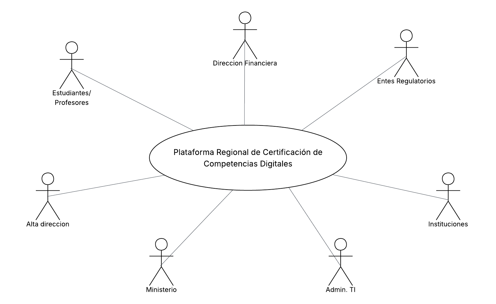
---

## 1.4 Primera descomposicion

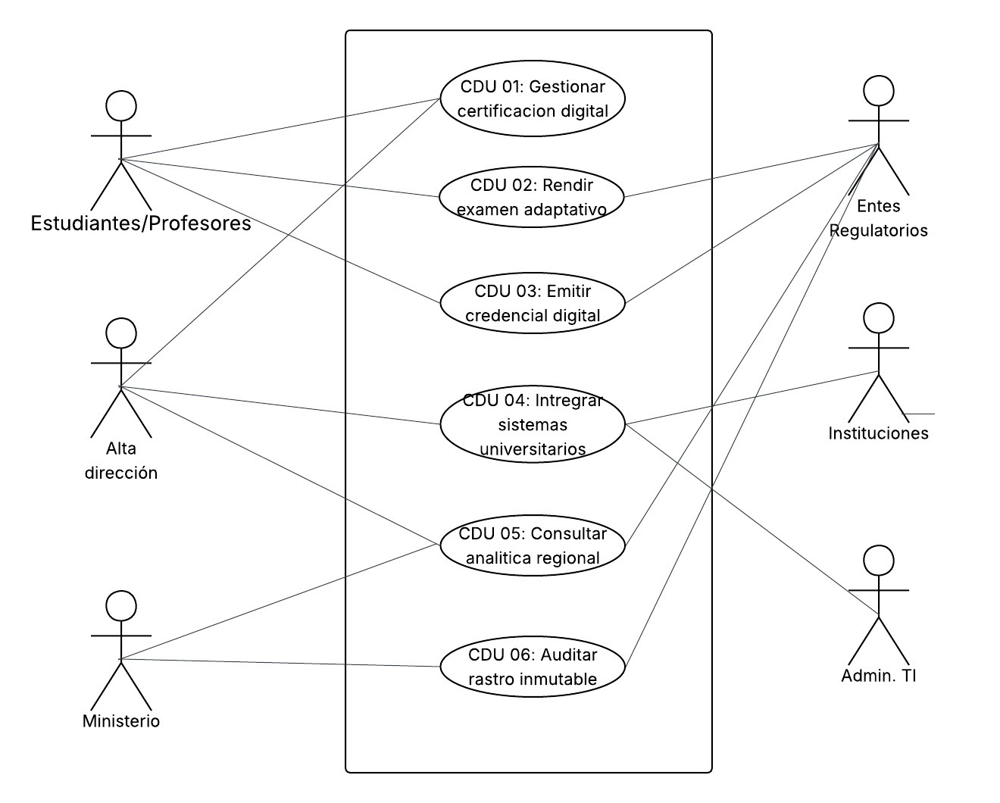

# 2. Caracteristicas del sistema y Drivers Arquitectonicos

## 2.1 Drivers RF - Requerimientos Funcionales

| ID    | Requisito Funcional                                                                                                                                                | Prioridad |
| ------- | -------------------------------------------------------------------------------------------------------------------------------------------------------------------- | ----------- |
| RF-01 | El sistema debe permitir la autenticacion federada mediante los protocolos LDAP, SAML y OAuth2 segun la institucion universitaria                                  | Alta      |
| RF-02 | El sistema debe ejecutar evaluaciones mediante un motor de examenes adaptativos que ajuste la dificultad en tiempo real segun las respuestas previas del candidato | Alta      |
| RF-03 | El sistema debe capturar y almacenar evidencia antifraude durante la evaluacion, incluyendo capturas de pantalla, logs de tecleo y rafagas de video                | Alta      |
| RF-04 | El sistema debe emitir certificados digitales verificables criptograficamente mediante PKI o Blockchain (Hyperledger)                                              | Alta      |
| RF-05 | El sistema debe mantener un rastro de auditoria inmutable por cada certificado emitido                                                                             | Alta      |
| RF-06 | El sistema debe importar y exportar datos academicos en formatos JSON, XML y CSV                                                                                   | Media     |
| RF-07 | El sistema debe integrarse nativamente con los sistemas de USAC, UCR y UES sin obligar a estas instituciones a cambiar su forma de operar                          | Alta      |
| RF-08 | El sistema debe generar dashboards analiticos segmentados por pais, carrera universitaria y genero                                                                 | Media     |
| RF-09 | El sistema debe anonimizar y agregar los datos antes de exponerlos en las interfaces gerenciales                                                                   | Alta      |
| RF-10 | El sistema debe permitir la verificacion externa de un certificado mediante codigo, QR o hash                                                                      | Media     |
| RF-11 | El sistema debe gestionar usuarios, roles y permisos por institucion                                                                                               | Media     |
| RF-12 | El sistema debe habilitar los periodos de certificacion exclusivamente durante la primera semana de cada mes                                                       | Alta      |

---

## 2.2 Drivers EaC - Escenarios de Atributos de Calidad

| ID     | Atributo          | Estimulo                                                | Entorno                                          | Respuesta esperada                                                       | Medida                                                     |
| -------- | ------------------- | --------------------------------------------------------- | -------------------------------------------------- | -------------------------------------------------------------------------- | ------------------------------------------------------------ |
| EaC-01 | Escalabilidad     | Miles de usuarios acceden simultaneamente               | Primera semana del mes, periodo de certificacion | El sistema escala sin degradar el servicio                               | Tiempo de respuesta < 3 seg con 5,000 usuarios simultaneos |
| EaC-02 | Disponibilidad    | Fallo de un componente interno                          | Periodo de certificacion activo                  | El sistema continua operando mediante redundancia                        | Disponibilidad >= 99.9%                                    |
| EaC-03 | Seguridad         | Intento de alteracion de una calificacion               | En cualquier momento                             | El sistema rechaza la alteracion y registra el intento                   | 0 modificaciones no autorizadas en la bitacora             |
| EaC-04 | Interoperabilidad | Universidad envia datos en CSV legacy                   | Integracion con sistema heredado                 | El sistema ingesta y normaliza los datos correctamente                   | 100% de registros procesados sin perdida                   |
| EaC-05 | Rendimiento       | Candidato responde una pregunta                         | Durante evaluacion activa                        | El motor adaptativo calcula y presenta la siguiente pregunta             | Tiempo de ajuste < 2 segundos                              |
| EaC-06 | Privacidad        | Solicitud de datos para dashboard gerencial             | Consulta analitica                               | El sistema expone solo datos agregados y anonimizados                    | 0 datos personales identificables expuestos                |
| EaC-07 | Auditabilidad     | Ministerio solicita verificar un certificado            | Post emision                                     | El sistema provee trazabilidad completa e inmutable                      | Tiempo de consulta de auditoria < 5 segundos               |
| EaC-08 | Mantenibilidad    | Se requiere agregar un nuevo protocolo de autenticacion | Evolucion del sistema                            | El sistema permite integrar el nuevo protocolo sin afectar otros modulos | Tiempo de integracion < 2 semanas                          |

---

## 2.3 Drivers de Restriccion

| ID   | Tipo        | Restriccion                                                                                                   |
| ------ | ------------- | --------------------------------------------------------------------------------------------------------------- |
| R-01 | Economica   | El presupuesto maximo para el piloto es de USD 180,000                                                        |
| R-02 | Tecnologica | Se debe priorizar el uso de tecnologias Open Source para optimizar costos de licenciamiento                   |
| R-03 | Operativa   | La primera version debe desplegarse on-premise reutilizando infraestructura existente del SICA                |
| R-04 | Tecnologica | La arquitectura debe estar preparada para migracion transparente a la nube en fases posteriores               |
| R-05 | Normativa   | Debe cumplir con GDPR y leyes locales de proteccion de datos de cada pais miembro                             |
| R-06 | Normativa   | La evidencia antifraude debe retenerse de forma inalterable por un minimo de 5 anos                           |
| R-07 | Normativa   | Cada certificado debe tener validez juridica transfronteriza respaldada por firma electronica avanzada        |
| R-08 | Operativa   | La arquitectura debe integrarse con sistemas legados sin obligar a las universidades a modificar sus procesos |
| R-09 | Temporal    | La primera version arquitectonica debe estar completamente definida y documentada en 3-4 semanas              |

---

## 2.4 Caracteristicas priorizadas del sistema

| Prioridad | Caracteristica                                          | Justificacion de impacto                                            |
| ----------- | --------------------------------------------------------- | --------------------------------------------------------------------- |
| 1         | Motor de evaluacion adaptativa                          | Es el nucleo funcional del negocio, sin esto no hay plataforma      |
| 2         | Emision de certificados verificables criptograficamente | Es la propuesta de valor principal ante ministerios e instituciones |
| 3         | Autenticacion federada e integracion universitaria      | Sin integracion con USAC/UCR/UES no hay usuarios en el sistema      |
| 4         | Auditoria antifraude inmutable                          | Requisito legal y de confianza institucional obligatorio            |
| 5         | Privacidad y cifrado de datos                           | Cumplimiento normativo no negociable (GDPR)                         |
| 6         | Dashboards analiticos anonimizados                      | Valor estrategico para ministerios de educacion y trabajo           |
| 7         | Escalabilidad en picos de trafico                       | Garantia de calidad de servicio durante certificaciones             |
| 8         | Preparacion para migracion a nube                       | Vision de evolucion tecnologica a largo plazo                       |

---

# 3. Diagramas de CDU expandidos

# CDU 01 — Gestionar Certificación Digital
## Plataforma Regional de Certificación de Competencias Digitales (PRCCD)

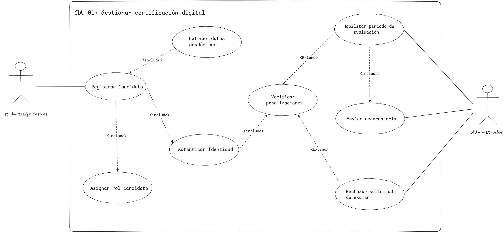

---
## UC-1.1 — Registrar Candidato

| | |
|---|---|
| **Nombre** | Registrar Candidato |
| **Actores** | Estudiantes / Profesores |
| **Propósito** | Permitir que un nuevo usuario se registre en la plataforma PRCCD para acceder a los procesos de certificación. |

**Resumen:** El caso de uso inicia cuando un candidato accede al formulario de registro. El sistema valida los datos académicos suministrados, verifica penalizaciones, asigna un rol y confirma el registro. Finaliza cuando el candidato recibe confirmación de su cuenta creada.

### Curso Normal de Eventos

| Acción del actor | Respuesta del proceso de negocio |
|---|---|
| 1. El candidato accede al formulario de registro e ingresa sus datos personales y académicos (nombre, carnet, universidad de origen, correo institucional). | 2. El sistema valida que el correo institucional corresponda a una de las universidades piloto (USAC, UCR, UES). |
| | 3. El sistema verifica que el candidato no tenga una cuenta activa previamente registrada. |
| | 4. El sistema invoca UC-1.3 «Extraer datos académicos» para confirmar la vigencia del candidato en su institución y extraer su perfil académico. |
| | 5. El sistema invoca UC-1.2 «Autenticar Identidad» para verificar las credenciales del candidato con su proveedor institucional. |
| 6. El candidato confirma los datos ingresados y envía el formulario. | 7. El sistema invoca UC-1.4 «Asignar rol candidato» y asigna el rol correspondiente según la institución. |
| | 8. El sistema crea la cuenta, genera un ID único de candidato y envía un correo de confirmación. |
| 9. El candidato recibe el correo y activa su cuenta. | 10. El sistema registra el evento de creación en la bitácora de auditoría y finaliza el caso de uso. |

### Cursos Alternos

| Condición | Acción |
|---|---|
| En el paso 2 — correo no institucional | El sistema muestra un mensaje de error indicando que el correo no corresponde a una institución registrada. El candidato puede corregirlo y reintentar. |
| En el paso 3 — cuenta duplicada | El sistema notifica que ya existe una cuenta asociada al correo. Ofrece la opción de recuperar contraseña o contactar soporte. |
| En el paso 4 — candidato inactivo o no encontrado | UC-1.3 retorna INVÁLIDO. El registro se interrumpe y se notifica al candidato. |

---

## UC-1.2 — Autenticar Identidad

| | |
|---|---|
| **Nombre** | Autenticar Identidad |
| **Actores** | Estudiantes / Profesores, Administrador |
| **Propósito** | Verificar la identidad del usuario mediante el protocolo de autenticación correspondiente a su institución antes de permitir el acceso al sistema. |

**Resumen:** El caso de uso inicia cuando un usuario intenta iniciar sesión o es invocado durante el registro. El sistema detecta el protocolo de autenticación de la institución (LDAP, SAML u OAuth2), delega la verificación, invoca la verificación de penalizaciones y genera un token unificado de sesión. Finaliza cuando el usuario accede al panel principal o es bloqueado.

### Curso Normal de Eventos

| Acción del actor | Respuesta del proceso de negocio |
|---|---|
| 1. El usuario ingresa sus credenciales (correo institucional y contraseña) en la pantalla de inicio de sesión. | 2. El sistema detecta la institución de origen del correo e identifica el protocolo de autenticación aplicable (LDAP para USAC, SAML para UCR, OAuth2 para UES). |
| | 3. El sistema aplica el patrón Strategy y redirige la solicitud al proveedor de identidad correspondiente. |
| 4. El usuario completa el flujo de autenticación con su proveedor de identidad institucional. | 5. El proveedor retorna la respuesta de autenticación al sistema. |
| | 6. El sistema valida la respuesta y genera un token JWT unificado con los atributos del usuario. |
| | 7. El sistema invoca UC-1.5 «Verificar penalizaciones» para comprobar que el usuario no tiene restricciones activas. |
| | 8. El sistema establece la sesión y registra el evento de inicio de sesión en la bitácora. |
| | 9. El sistema redirige al usuario a su panel principal. |

### Cursos Alternos

| Condición | Acción |
|---|---|
| En el paso 4 — credenciales incorrectas (intento 1 o 2) | El sistema muestra mensaje de error y permite al usuario reintentar. El contador de intentos fallidos se incrementa. |
| En el paso 4 — credenciales incorrectas (3er intento) | El sistema suspende la cuenta temporalmente por 30 minutos, registra el evento en bitácora con IP y timestamp, y notifica al usuario por correo. |
| En el paso 3 — proveedor de identidad no disponible | El sistema muestra mensaje de indisponibilidad temporal y registra el fallo en la bitácora para revisión por Administrador TI. |
| En el paso 7 — penalización activa encontrada | UC-1.5 invoca UC-1.8 «Rechazar solicitud de examen». El acceso es denegado y se notifica al candidato. |

---

## UC-1.3 — Extraer Datos Académicos

| | |
|---|---|
| **Nombre** | Extraer Datos Académicos |
| **Actores** | Estudiantes / Profesores *(indirecto — invocado por UC-1.1)* |
| **Propósito** | Confirmar con el sistema universitario externo que el candidato está activo y vigente en su institución de origen, y extraer su perfil académico para poblar la cuenta. |

**Resumen:** El caso de uso es invocado automáticamente durante el registro. El sistema consulta el conector de integración correspondiente mediante el patrón Adapter, verifica el estado del candidato y extrae su perfil académico. Finaliza retornando el resultado al proceso invocante.

### Curso Normal de Eventos

| Acción del actor | Respuesta del proceso de negocio |
|---|---|
| 1. El proceso UC-1.1 invoca este caso de uso con los datos del candidato (carnet, correo, institución). | 2. El sistema selecciona el adaptador correspondiente a la universidad indicada (CSVAdapter para USAC, XMLAdapter para UCR, JSONAdapter para UES). |
| | 3. El adaptador realiza la consulta al sistema universitario externo mediante el protocolo disponible (LDAP / SAML / OAuth2) y el formato de datos correspondiente (CSV / XML / JSON). |
| | 4. El sistema universitario externo retorna el estado del estudiante (activo, inactivo, egresado). |
| | 5. El sistema evalúa la respuesta: si el candidato está activo, el adaptador transforma los datos al modelo canónico interno (nombre, carrera, institución, estado académico). |
| | 6. El sistema retorna VÁLIDO junto con el perfil extraído al proceso UC-1.1, que continúa con la autenticación y asignación de rol. |

### Cursos Alternos

| Condición | Acción |
|---|---|
| En el paso 4 — candidato inactivo o no encontrado | El sistema retorna INVÁLIDO. UC-1.1 muestra al candidato el mensaje correspondiente e interrumpe el registro. |
| En el paso 3 — sistema universitario no disponible | El sistema retorna PENDIENTE y programa un reintento automático. El registro queda en estado provisional hasta confirmar la validación. |
| En el paso 4 — datos incompletos o formato inválido | El adaptador registra el error de transformación y retorna PENDIENTE. Se notifica al Administrador SICA. |

---

## UC-1.4 — Asignar Rol Candidato

| | |
|---|---|
| **Nombre** | Asignar Rol Candidato |
| **Actores** | Estudiantes / Profesores *(indirecto — invocado por UC-1.1)* |
| **Propósito** | Determinar y asignar el rol y permisos adecuados al candidato según su perfil institucional dentro de la plataforma PRCCD. |

**Resumen:** El caso de uso es invocado tras la validación exitosa de datos académicos y autenticación. El sistema determina el rol apropiado según los atributos retornados por la institución, asigna los permisos correspondientes y persiste la asignación. Finaliza retornando el rol asignado al proceso UC-1.1.

### Curso Normal de Eventos

| Acción del actor | Respuesta del proceso de negocio |
|---|---|
| 1. El proceso UC-1.1 invoca este caso de uso con los atributos del candidato validado (nivel académico, carrera, institución). | 2. El sistema evalúa los atributos: si el candidato es estudiante activo asigna rol `CANDIDATO_ESTUDIANTE`; si es egresado o profesional asigna rol `CANDIDATO_PROFESIONAL`. |
| | 3. El sistema carga el perfil de permisos asociado al rol asignado (acceso a exámenes, historial de certificaciones, descarga de credenciales). |
| | 4. El sistema persiste la asignación de rol en la base de datos de usuarios. |
| | 5. El sistema registra el evento de asignación en la bitácora y retorna el rol asignado al proceso invocante. |

### Cursos Alternos

| Condición | Acción |
|---|---|
| En el paso 2 — perfil no clasificable | El sistema asigna rol `CANDIDATO_PENDIENTE` y notifica al Administrador SICA para revisión manual del perfil. |

---

## UC-1.5 — Verificar Penalizaciones

| | |
|---|---|
| **Nombre** | Verificar Penalizaciones |
| **Actores** | Sistema *(automático — invocado por UC-1.2 y UC-1.6)* |
| **Propósito** | Comprobar si el candidato tiene penalizaciones activas que impidan el acceso al sistema o a un período de evaluación. |

**Resumen:** El caso de uso es invocado automáticamente durante la autenticación y durante la habilitación del período de evaluación. El sistema consulta el registro de penalizaciones del candidato y determina si puede continuar o si debe ser rechazado. Finaliza retornando el resultado al proceso invocante.

### Curso Normal de Eventos

| Acción del actor | Respuesta del proceso de negocio |
|---|---|
| 1. El proceso invocante (UC-1.2 o UC-1.6) envía el identificador del candidato. | 2. El sistema consulta el registro de penalizaciones activas asociadas al candidato. |
| | 3. El sistema evalúa tipo y vigencia de cada penalización (suspensión temporal, bloqueo por fraude, inhabilitación permanente). |
| | 4. Si no existen penalizaciones activas, el sistema retorna SIN_PENALIZACIONES al proceso invocante. |
| | 5. El sistema registra el resultado de la verificación en la bitácora de auditoría. |

### Cursos Alternos

| Condición | Acción |
|---|---|
| En el paso 3 — penalización activa encontrada | El sistema retorna CON_PENALIZACIONES e invoca UC-1.8 «Rechazar solicitud de examen». |
| En el paso 3 — penalización vencida | El sistema actualiza el estado a INACTIVA y continúa como si no hubiera penalización activa. |

---

## UC-1.6 — Habilitar Período de Evaluación

| | |
|---|---|
| **Nombre** | Habilitar Período de Evaluación |
| **Actores** | Administrador |
| **Propósito** | Activar el período de certificación mensual habilitando el acceso a los exámenes adaptativos para los candidatos registrados durante la primera semana de cada mes. |

**Resumen:** El caso de uso inicia cuando el Administrador solicita la habilitación del período. El sistema activa el período, verifica penalizaciones de candidatos, incluye el envío de recordatorios y registra la acción. Finaliza cuando el período queda activo y los candidatos elegibles han sido notificados.

### Curso Normal de Eventos

| Acción del actor | Respuesta del proceso de negocio |
|---|---|
| 1. El Administrador accede al panel de administración y solicita la habilitación del período de evaluación para el mes en curso. | 2. El sistema valida que no exista un período activo previo sin cerrar. |
| | 3. El sistema activa el período: establece fecha de inicio, fecha de cierre (7 días), cupos máximos y parámetros del examen adaptativo. |
| | 4. El sistema invoca UC-1.5 «Verificar penalizaciones» para revisar candidatos con restricciones activas antes de notificar. |
| | 5. El sistema invoca UC-1.7 «Enviar recordatorio» y envía avisos a todos los candidatos registrados con cuenta activa y sin penalizaciones. |
| | 6. El sistema registra el evento de habilitación en la bitácora con sello de tiempo y firma del actor responsable. |
| 7. El Administrador recibe confirmación del período habilitado con resumen de candidatos notificados. | |

### Cursos Alternos

| Condición | Acción |
|---|---|
| En el paso 2 — período activo previo sin cerrar | El sistema muestra alerta e impide habilitar un nuevo período hasta que el anterior sea cerrado formalmente. |
| En el paso 4 — candidatos con penalizaciones activas | El sistema los excluye de la lista de notificación e invoca UC-1.8 para registrar el rechazo individual. |
| En el paso 5 — envío de notificaciones falla parcialmente | El sistema registra los candidatos no notificados y programa reintento automático. El período se habilita de todas formas. |

---

## UC-1.7 — Enviar Recordatorio

| | |
|---|---|
| **Nombre** | Enviar Recordatorio |
| **Actores** | Sistema *(automático — invocado por UC-1.6)*, Administrador |
| **Propósito** | Notificar a los candidatos registrados sin penalizaciones activas que el período de evaluación ha sido habilitado y pueden acceder a su examen. |

**Resumen:** El caso de uso es invocado desde UC-1.6 al habilitar el período. El sistema identifica candidatos elegibles sin penalizaciones, genera y envía recordatorios personalizados. Finaliza cuando todos los recordatorios han sido enviados y registrados en la bitácora.

### Curso Normal de Eventos

| Acción del actor | Respuesta del proceso de negocio |
|---|---|
| 1. UC-1.6 invoca este caso de uso al activar el período de evaluación. | 2. El sistema consulta la lista de candidatos con cuenta activa, sin penalizaciones y con estado de examen = `NO_INICIADO`. |
| | 3. El sistema genera un mensaje de recordatorio personalizado que incluye: nombre del candidato, días restantes del período y enlace directo al examen. |
| | 4. El sistema envía el recordatorio por correo electrónico a cada candidato identificado. |
| | 5. El sistema registra en la bitácora la lista de candidatos notificados, timestamp y estado del envío (`ENVIADO` / `FALLIDO`). |
| 6. El Administrador puede consultar el reporte de recordatorios enviados desde el panel de administración. | |

### Cursos Alternos

| Condición | Acción |
|---|---|
| En el paso 4 — envío falla para un candidato | El sistema registra el fallo y programa un reintento en 2 horas. Si el reintento falla, el candidato queda marcado como `NO_NOTIFICADO` en el reporte. |
| Candidato no tiene correo activo | El sistema omite el envío y registra la incidencia. El Administrador puede gestionar el contacto de forma manual. |

---

## UC-1.8 — Rechazar Solicitud de Examen

| | |
|---|---|
| **Nombre** | Rechazar Solicitud de Examen |
| **Actores** | Sistema *(automático — «Extend» desde UC-1.5)* |
| **Propósito** | Impedir el acceso al examen de un candidato con penalizaciones activas, notificarlo del rechazo y registrar el evento en la bitácora inmutable. |

**Resumen:** El caso de uso se activa cuando UC-1.5 detecta penalizaciones activas en un candidato. El sistema bloquea el acceso al período de evaluación, notifica al candidato con el motivo del rechazo y registra el evento. Finaliza cuando el acceso ha sido denegado y el evento queda registrado de forma inmutable.

### Curso Normal de Eventos

| Acción del actor | Respuesta del proceso de negocio |
|---|---|
| 1. UC-1.5 invoca este caso de uso con el detalle de la penalización activa del candidato. | 2. El sistema bloquea el acceso al examen para el candidato identificado. |
| | 3. El sistema genera una notificación al candidato indicando: motivo del rechazo, tipo de penalización y fecha estimada de levantamiento. |
| | 4. El sistema registra el intento de acceso rechazado en la bitácora de auditoría con: candidatoId, timestamp, tipo de penalización e IP de origen. |
| | 5. El sistema retorna ACCESO_DENEGADO al proceso invocante. |

### Cursos Alternos

| Condición | Acción |
|---|---|
| En el paso 3 — candidato sin correo activo | El sistema omite la notificación por correo y registra la incidencia. El rechazo se mantiene activo. |
| Penalización de tipo inhabilitación permanente | El sistema escala la notificación al Administrador SICA para gestión manual del caso. |

---
---

# CDU 02 — Rendir Examen Adaptativo
## Plataforma Regional de Certificación de Competencias Digitales (PRCCD)

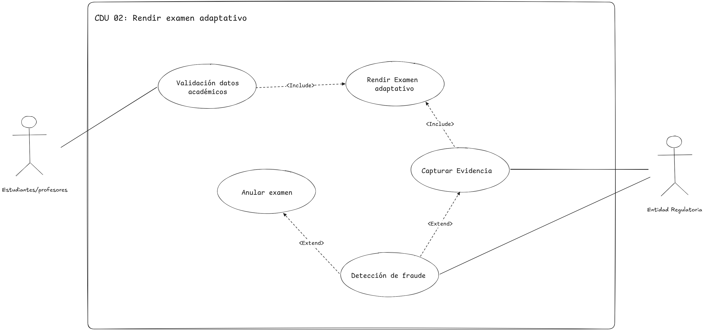

---

## UC-2.1 — Rendir Examen Adaptativo

| | |
|---|---|
| **Nombre** | Rendir Examen Adaptativo |
| **Actores** | Estudiantes / Profesores |
| **Propósito** | Permitir que el candidato realice una evaluación cuya dificultad se ajusta dinámicamente en tiempo real según sus respuestas previas. |

**Resumen:** El caso de uso inicia cuando el candidato accede al período de evaluación activo. El sistema valida sus datos académicos, inicia la sesión de examen, presenta preguntas adaptativas y captura evidencia durante todo el proceso. Finaliza cuando el candidato completa el examen o este es anulado por detección de fraude.

### Curso Normal de Eventos

| Acción del actor | Respuesta del proceso de negocio |
|---|---|
| 1. El candidato accede a la plataforma durante el período de evaluación activo y solicita iniciar el examen. | 2. El sistema invoca UC-2.2 «Validación datos académicos» para confirmar que el candidato sigue activo y vigente en su institución. |
| | 3. El sistema crea la sesión de examen con estado ACTIVA y registra el timestamp de inicio. |
| | 4. El sistema invoca UC-2.3 «Capturar Evidencia» en paralelo para registrar el comportamiento del candidato durante toda la evaluación. |
| 5. El candidato responde cada pregunta presentada. | 6. El motor adaptativo recibe la respuesta, actualiza la estimación de habilidad del candidato y selecciona la siguiente pregunta ajustando la dificultad en tiempo real. |
| | 7. El sistema repite los pasos 5 y 6 hasta que el motor determina que la evaluación debe finalizar (error estándar menor al umbral o preguntas agotadas). |
| | 8. El sistema calcula el resultado final, cierra la sesión con estado COMPLETADA y registra el evento en la bitácora de auditoría. |
| 9. El candidato recibe el resultado de su evaluación. | |

### Cursos Alternos

| Condición | Acción |
|---|---|
| En el paso 2 — candidato inactivo o no vigente | UC-2.2 retorna INVÁLIDO. El sistema impide el inicio del examen y notifica al candidato. |
| En el paso 5 — pérdida de conexión del candidato | El sistema pausa la sesión y la mantiene en estado SUSPENDIDA por un máximo de 10 minutos. Si el candidato reconecta, la sesión se reanuda desde la última pregunta guardada. |
| En el paso 6 — detección de fraude por UC-2.4 | UC-2.4 invoca UC-2.5 «Anular examen». La sesión se cierra con estado ANULADA y se notifica al candidato y a la Entidad Regulatoria. |

---

## UC-2.2 — Validación Datos Académicos

| | |
|---|---|
| **Nombre** | Validación Datos Académicos |
| **Actores** | Estudiantes / Profesores *(indirecto — invocado por UC-2.1)* |
| **Propósito** | Confirmar que el candidato continúa activo y vigente en su institución de origen antes de permitirle acceder al examen adaptativo. |

**Resumen:** El caso de uso es invocado automáticamente al inicio del examen. El sistema consulta el conector de integración de la universidad correspondiente mediante el patrón Adapter para verificar el estado académico actualizado del candidato. Finaliza retornando el resultado al proceso invocante.

### Curso Normal de Eventos

| Acción del actor | Respuesta del proceso de negocio |
|---|---|
| 1. El proceso UC-2.1 invoca este caso de uso con el identificador del candidato y su institución de origen. | 2. El sistema selecciona el adaptador correspondiente a la universidad (CSVAdapter para USAC, XMLAdapter para UCR, JSONAdapter para UES). |
| | 3. El adaptador consulta el sistema universitario externo mediante el protocolo y formato disponible (LDAP / SAML / OAuth2 y CSV / XML / JSON). |
| | 4. El sistema universitario retorna el estado académico actualizado del candidato. |
| | 5. El sistema evalúa la respuesta y retorna VÁLIDO al proceso UC-2.1 si el candidato está activo y vigente. |

### Cursos Alternos

| Condición | Acción |
|---|---|
| En el paso 4 — candidato inactivo, egresado o no encontrado | El sistema retorna INVÁLIDO. UC-2.1 impide el inicio del examen y muestra mensaje al candidato. |
| En el paso 3 — sistema universitario no disponible | El sistema retorna PENDIENTE. UC-2.1 permite el acceso de forma provisional y programa una revalidación posterior. |
| En el paso 4 — datos incompletos o formato inválido | El adaptador registra el error y retorna PENDIENTE. Se notifica al Administrador SICA para revisión. |

---

## UC-2.3 — Capturar Evidencia

| | |
|---|---|
| **Nombre** | Capturar Evidencia |
| **Actores** | Entidad Regulatoria, Sistema *(invocado por UC-2.1)* |
| **Propósito** | Registrar de forma continua el comportamiento del candidato durante la evaluación mediante capturas de pantalla, logs de tecleo y ráfagas de video para garantizar la integridad del proceso. |

**Resumen:** El caso de uso es invocado en paralelo al inicio del examen. El sistema captura evidencia de forma periódica durante toda la sesión, la cifra y almacena con política WORM. La Entidad Regulatoria puede consultar esta evidencia posteriormente. Finaliza cuando la sesión de examen termina.

### Curso Normal de Eventos

| Acción del actor | Respuesta del proceso de negocio |
|---|---|
| 1. UC-2.1 invoca este caso de uso al iniciar la sesión de examen. | 2. El sistema activa los módulos de captura: pantalla cada 30 segundos, log de tecleo continuo y ráfagas de video cada 2 minutos. |
| | 3. Cada pieza de evidencia capturada es cifrada con AES-256 antes de ser almacenada. |
| | 4. El sistema almacena la evidencia en MinIO con política WORM y registra los metadatos (tipo, timestamp, hash del archivo, sesionId) en la tabla EvidenciaAntifraude de PostgreSQL. |
| | 5. El sistema publica un evento al bus de mensajes por cada captura almacenada para que el servicio de detección de fraude lo analice. |
| | 6. El proceso continúa hasta que UC-2.1 indica el cierre de la sesión. |
| 7. La Entidad Regulatoria puede consultar la evidencia almacenada mediante acceso autenticado con rol autorizado. | |

### Cursos Alternos

| Condición | Acción |
|---|---|
| En el paso 2 — cámara o micrófono no disponible | El sistema registra la incidencia, continúa capturando los módulos disponibles y notifica a la Entidad Regulatoria. |
| En el paso 4 — fallo de almacenamiento en MinIO | El sistema reintenta el almacenamiento hasta 3 veces. Si persiste el fallo, registra el error en bitácora y marca la evidencia como PENDIENTE_ALMACENAMIENTO. |
| En el paso 5 — detección de fraude por UC-2.4 | UC-2.4 extiende el flujo e invoca UC-2.5 para anular el examen. La captura de evidencia continúa hasta que la sesión es cerrada. |

---

## UC-2.4 — Detección de Fraude

| | |
|---|---|
| **Nombre** | Detección de Fraude |
| **Actores** | Entidad Regulatoria, Sistema *(«Extend» desde UC-2.3)* |
| **Propósito** | Analizar en tiempo real la evidencia capturada para identificar comportamientos sospechosos que indiquen un intento de fraude durante la evaluación. |

**Resumen:** El caso de uso se activa cuando el sistema de captura publica un evento de evidencia. El motor de detección analiza los patrones de comportamiento del candidato y determina si existe un intento de fraude. Si se confirma, invoca UC-2.5 para anular el examen. La Entidad Regulatoria es notificada en todos los casos de alerta. Finaliza retornando el resultado del análisis.

### Curso Normal de Eventos

| Acción del actor | Respuesta del proceso de negocio |
|---|---|
| 1. UC-2.3 publica un evento de evidencia capturada al bus de mensajes. | 2. El sistema consume el evento y analiza la evidencia aplicando reglas de detección: cambios de ventana, ausencia de rostro, múltiples personas, patrones de tecleo inusuales. |
| | 3. El sistema calcula un índice de riesgo de fraude para la sesión en curso. |
| | 4. Si el índice de riesgo está dentro del rango aceptable, el sistema registra el análisis y finaliza sin interrumpir el examen. |
| | 5. El sistema registra el resultado del análisis en la bitácora de auditoría con timestamp y detalle de los indicadores evaluados. |
| 6. La Entidad Regulatoria puede consultar los reportes de detección de fraude por sesión desde su panel autorizado. | |

### Cursos Alternos

| Condición | Acción |
|---|---|
| En el paso 3 — índice de riesgo supera el umbral permitido | El sistema marca la sesión como SOSPECHOSA, notifica a la Entidad Regulatoria y extiende el flujo invocando UC-2.5 «Anular examen». |
| En el paso 2 — evidencia corrupta o ilegible | El sistema registra la incidencia como EVIDENCIA_INVÁLIDA y solicita una nueva captura a UC-2.3. |

---

## UC-2.5 — Anular Examen

| | |
|---|---|
| **Nombre** | Anular Examen |
| **Actores** | Sistema *(automático — «Extend» desde UC-2.4)* |
| **Propósito** | Interrumpir y anular la sesión de examen de un candidato cuando se confirma un intento de fraude, registrar el evento de forma inmutable y notificar a los actores correspondientes. |

**Resumen:** El caso de uso se activa automáticamente cuando UC-2.4 confirma fraude. El sistema cierra la sesión de examen, aplica una penalización al candidato, registra el evento de forma inmutable en la bitácora y notifica a la Entidad Regulatoria y al candidato. Finaliza cuando la sesión queda anulada y todos los registros han sido persistidos.

### Curso Normal de Eventos

| Acción del actor | Respuesta del proceso de negocio |
|---|---|
| 1. UC-2.4 invoca este caso de uso con el detalle del fraude detectado y el identificador de la sesión. | 2. El sistema cierra inmediatamente la sesión de examen con estado ANULADA y registra el timestamp de cierre. |
| | 3. El sistema aplica una penalización al candidato según el tipo de fraude detectado (suspensión temporal o inhabilitación según reincidencia). |
| | 4. El sistema registra el evento de anulación en la bitácora de auditoría de forma inmutable con: candidatoId, sesionId, tipo de fraude, timestamp e IP de origen. |
| | 5. El sistema notifica al candidato indicando que su examen ha sido anulado, el motivo y el período de penalización aplicado. |
| | 6. El sistema notifica a la Entidad Regulatoria con el reporte completo del incidente para revisión y validación. |

### Cursos Alternos

| Condición | Acción |
|---|---|
| En el paso 3 — candidato reincidente (más de 2 anulaciones) | El sistema aplica inhabilitación permanente y escala el caso al Administrador SICA para gestión manual. |
| En el paso 5 — candidato sin correo activo | El sistema omite la notificación por correo y registra la incidencia. La penalización se aplica de todas formas. |
| En el paso 6 — fallo en la notificación a la Entidad Regulatoria | El sistema programa un reintento automático y marca la notificación como PENDIENTE en la bitácora. |

---
# CDU 03 — Emitir Credencial Digital
## Plataforma Regional de Certificación de Competencias Digitales (PRCCD)

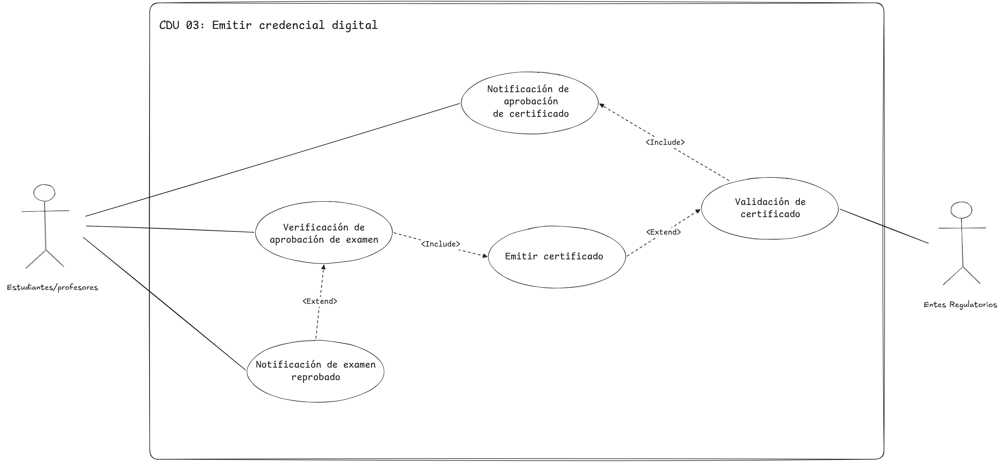

---
# CDU-03: Emitir Credencial Digital

---

## UC-3.1 — Verificación de Aprobación de Examen

| | |
|---|---|
| **Nombre** | Verificación de Aprobación de Examen |
| **Actores** | Estudiantes / Profesores |
| **Propósito** | Determinar si el candidato ha alcanzado el puntaje mínimo requerido para aprobar el examen adaptativo y proceder con la emisión del certificado digital o notificar la reprobación. |

**Resumen:** El caso de uso inicia automáticamente al cierre de la sesión de examen. El sistema evalúa el resultado final del candidato contra el umbral de aprobación definido. Si aprueba, invoca UC-3.4 «Emitir certificado». Si reprueba, extiende el flujo hacia UC-3.3 «Notificación de examen reprobado». Finaliza cuando el resultado ha sido procesado y notificado.

### Curso Normal de Eventos

| Acción del actor | Respuesta del proceso de negocio |
|---|---|
| 1. El sistema cierra la sesión de examen y calcula el puntaje final del candidato. | 2. El sistema compara el puntaje final contra el umbral mínimo de aprobación definido para la competencia evaluada. |
| | 3. El sistema registra el resultado (APROBADO / REPROBADO) en la tabla SesionExamen con el campo aprobado actualizado. |
| | 4. Si el candidato aprueba, el sistema invoca UC-3.4 «Emitir certificado» para generar la credencial digital. |
| | 5. El sistema registra el evento de verificación en la bitácora de auditoría con: candidatoId, sesionId, puntaje obtenido, umbral y resultado. |
| 6. El candidato recibe el resultado de su evaluación a través del panel de usuario. | |

### Cursos Alternos

| Condición | Acción |
|---|---|
| En el paso 2 — puntaje no alcanza el umbral mínimo | El sistema registra REPROBADO y extiende el flujo invocando UC-3.3 «Notificación de examen reprobado». No se emite certificado. |
| En el paso 1 — sesión cerrada con estado ANULADA | El sistema no procesa el resultado. La sesión anulada no genera verificación de aprobación ni emisión de certificado. |

---

## UC-3.2 — Notificación de Aprobación de Certificado

| | |
|---|---|
| **Nombre** | Notificación de Aprobación de Certificado |
| **Actores** | Estudiantes / Profesores |
| **Propósito** | Informar al candidato que su certificado digital ha sido emitido exitosamente, proporcionándole acceso a la credencial y al código QR de verificación. |

**Resumen:** El caso de uso inicia cuando UC-3.4 completa la emisión del certificado. El sistema genera la notificación personalizada con los datos del certificado emitido, el enlace de descarga y el QR de verificación. También invoca UC-3.5 para validar el certificado recién emitido antes de entregarlo. Finaliza cuando el candidato recibe la notificación y puede acceder a su credencial.

### Curso Normal de Eventos

| Acción del actor | Respuesta del proceso de negocio |
|---|---|
| 1. UC-3.4 completa la emisión del certificado y notifica a este caso de uso con los datos del certificado generado. | 2. El sistema invoca UC-3.5 «Validación de certificado» para verificar la integridad de la credencial recién emitida antes de entregarla al candidato. |
| | 3. Confirmada la validez, el sistema genera la notificación personalizada con: nombre del candidato, competencia certificada, fecha de emisión, enlace de descarga del certificado y código QR de verificación pública. |
| | 4. El sistema envía la notificación al correo institucional del candidato. |
| | 5. El sistema actualiza el panel del candidato con el certificado disponible para descarga. |
| | 6. El sistema registra el envío de la notificación en la bitácora con timestamp y estado (ENVIADO / FALLIDO). |
| 7. El candidato accede a su panel, descarga el certificado y puede compartir el QR para verificación externa. | |

### Cursos Alternos

| Condición | Acción |
|---|---|
| En el paso 2 — UC-3.5 detecta inconsistencia en el certificado | El sistema suspende la notificación, registra la incidencia y notifica al Administrador SICA para revisión manual antes de entregar la credencial. |
| En el paso 4 — fallo en el envío del correo | El sistema registra el fallo, programa un reintento automático en 2 horas y marca la notificación como PENDIENTE. |

---

## UC-3.3 — Notificación de Examen Reprobado

| | |
|---|---|
| **Nombre** | Notificación de Examen Reprobado |
| **Actores** | Sistema *(automático — «Extend» desde UC-3.1)* |
| **Propósito** | Informar al candidato que no alcanzó el puntaje mínimo requerido, indicarle el resultado obtenido y orientarlo sobre las opciones disponibles para reintentar en el siguiente período. |

**Resumen:** El caso de uso se activa automáticamente cuando UC-3.1 determina que el candidato reprobó. El sistema genera una notificación con el detalle del resultado, el puntaje obtenido versus el requerido y la información del próximo período de evaluación disponible. Finaliza cuando la notificación ha sido enviada y registrada.

### Curso Normal de Eventos

| Acción del actor | Respuesta del proceso de negocio |
|---|---|
| 1. UC-3.1 invoca este caso de uso con el resultado REPROBADO, el puntaje obtenido y el umbral requerido. | 2. El sistema genera una notificación personalizada que incluye: puntaje obtenido, puntaje mínimo requerido, competencia evaluada y fecha estimada del próximo período de certificación. |
| | 3. El sistema envía la notificación al correo institucional del candidato. |
| | 4. El sistema actualiza el panel del candidato con el resultado y el estado de la sesión como REPROBADA. |
| | 5. El sistema registra el evento de notificación en la bitácora con timestamp y estado del envío. |

### Cursos Alternos

| Condición | Acción |
|---|---|
| En el paso 3 — fallo en el envío del correo | El sistema registra el fallo y programa un reintento automático. El resultado queda visible en el panel del candidato de todas formas. |
| Candidato reprobado por tercera vez consecutiva | El sistema incluye en la notificación una alerta indicando que se requiere revisión del perfil académico por parte del Administrador SICA antes de habilitar un nuevo intento. |

---

## UC-3.4 — Emitir Certificado

| | |
|---|---|
| **Nombre** | Emitir Certificado |
| **Actores** | Sistema *(indirecto — invocado por UC-3.1)* |
| **Propósito** | Generar el certificado digital verificable criptográficamente mediante PKI y Blockchain para el candidato que aprobó la evaluación adaptativa. |

**Resumen:** El caso de uso es invocado automáticamente cuando UC-3.1 confirma la aprobación. El sistema aplica el patrón Facade para coordinar la firma digital via PKI, el registro en Hyperledger Fabric, el almacenamiento en base de datos y la generación del QR de verificación. Finaliza cuando el certificado queda emitido, firmado y registrado de forma inmutable.

### Curso Normal de Eventos

| Acción del actor | Respuesta del proceso de negocio |
|---|---|
| 1. UC-3.1 invoca este caso de uso con los datos de la sesión aprobada (candidatoId, sesionId, competencia, institución, puntaje). | 2. El sistema construye el payload del certificado con: identificador único, nombre de la competencia, institución de origen, fecha de emisión y puntaje obtenido. |
| | 3. El sistema calcula el hash SHA-256 del payload para garantizar la integridad del contenido. |
| | 4. El Servidor PKI firma el hash con la llave privada de la CA del SICA mediante RSA-2048 y emite el certificado en formato X.509. |
| | 5. El sistema publica el hashSHA256 del certificado en la red Hyperledger Fabric como registro inmutable de existencia. |
| | 6. El sistema genera el código QR que apunta al endpoint público de verificación del certificado. |
| | 7. El sistema persiste el certificado completo en la tabla Certificado de PostgreSQL con todos los campos: hashSHA256, firmaDigital, serialPKI, hashBlockchain y qrVerificacion. |
| | 8. El sistema registra el evento de emisión en la bitácora de auditoría de forma inmutable. |
| | 9. El sistema invoca UC-3.2 «Notificación de aprobación de certificado» para informar al candidato. |

### Cursos Alternos

| Condición | Acción |
|---|---|
| En el paso 4 — Servidor PKI no disponible | El sistema registra el fallo, coloca la emisión en estado PENDIENTE y programa un reintento automático. El candidato es notificado de la demora. |
| En el paso 5 — Hyperledger Fabric no disponible | El sistema emite el certificado por PKI de forma provisional, registra la incidencia y reintenta el registro en blockchain cuando el servicio se recupere. |
| En el paso 7 — error de persistencia en base de datos | El sistema revierte la operación completa, registra el error en bitácora y notifica al Administrador SICA. No se entrega ningún certificado parcial al candidato. |

---

## UC-3.5 — Validación de Certificado

| | |
|---|---|
| **Nombre** | Validación de Certificado |
| **Actores** | Entes Regulatorios, Sistema *(«Extend» desde UC-3.4 / «Include» desde UC-3.2)* |
| **Propósito** | Verificar la autenticidad e integridad de un certificado digital emitido mediante la validación de la firma PKI y la confirmación del registro en Hyperledger Fabric. |

**Resumen:** El caso de uso puede ser invocado automáticamente tras la emisión del certificado (como parte del flujo interno) o iniciado directamente por los Entes Regulatorios para auditar la validez de credenciales. El sistema verifica la firma digital contra la llave pública de la CA del SICA y confirma la existencia del hash en Hyperledger Fabric. Finaliza retornando el resultado de la validación.

### Curso Normal de Eventos

| Acción del actor | Respuesta del proceso de negocio |
|---|---|
| 1. El proceso invocante (UC-3.2 o Entes Regulatorios) envía el identificador del certificado, código QR o hash SHA-256. | 2. El sistema recupera el registro del certificado desde la tabla Certificado de PostgreSQL usando el identificador recibido. |
| | 3. El sistema verifica la firma digital del certificado usando la llave pública de la CA del SICA. Calcula el SHA-256 del payload y lo compara con la firma descifrada. |
| | 4. El sistema consulta Hyperledger Fabric con el hashBlockchain almacenado para confirmar la existencia histórica del registro. |
| | 5. Si ambas verificaciones son exitosas, el sistema retorna CERTIFICADO_VÁLIDO con el detalle completo: titular, competencia, institución, fecha de emisión y estado. |
| | 6. El sistema registra el evento de validación en la bitácora con: certificadoId, tipo de consulta, actor solicitante y resultado. |
| 7. Los Entes Regulatorios reciben el resultado de la validación para sus procesos de auditoría y cumplimiento normativo. | |

### Cursos Alternos

| Condición | Acción |
|---|---|
| En el paso 3 — firma digital no coincide | El sistema retorna CERTIFICADO_INVÁLIDO e indica que el contenido del certificado ha sido alterado. Registra el intento en la bitácora de seguridad. |
| En el paso 4 — hash no encontrado en Hyperledger | El sistema retorna CERTIFICADO_NO_REGISTRADO e indica que no existe evidencia histórica del certificado en blockchain. |
| En el paso 2 — certificado no encontrado en BD | El sistema retorna CERTIFICADO_INEXISTENTE. El solicitante recibe mensaje indicando que el código o hash no corresponde a ningún certificado emitido. |
| Certificado con estado REVOCADO | El sistema retorna CERTIFICADO_REVOCADO con la fecha y motivo de revocación, aunque la firma digital sea técnicamente válida. |

---
# CDU 04 — Integrar Sistemas Universitarios
## Plataforma Regional de Certificación de Competencias Digitales (PRCCD)

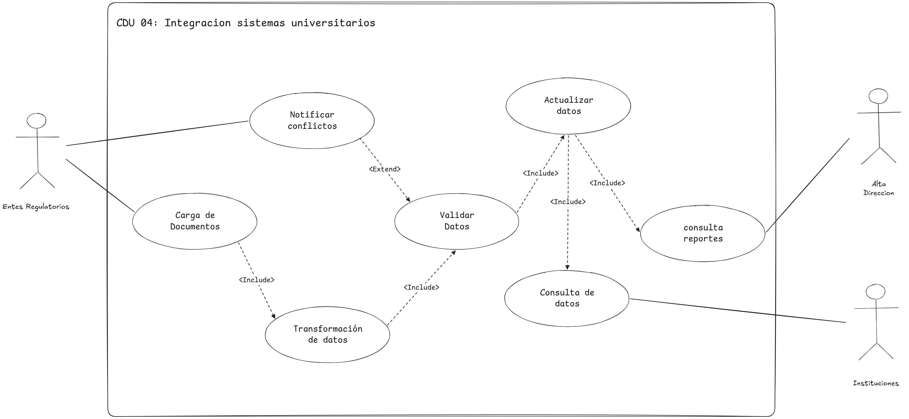

---

## UC-4.1 — Carga de Documentos

|               |                                                                                                                                                 |
|---------------|-------------------------------------------------------------------------------------------------------------------------------------------------|
| **Nombre**    | Carga de Documentos                                                                                                                             |
| **Actores**   | Entes Regulatorios                                                                                                                              |
| **Propósito** | Permitir que los Entes Regulatorios carguen documentos académicos e institucionales al sistema para su procesamiento e integración. |

**Resumen:** El caso de uso inicia cuando un Ente Regulatorio selecciona y envía uno o más documentos al sistema. La plataforma recibe los archivos, verifica que el formato sea soportado e invoca la transformación de datos. Finaliza cuando los documentos quedan registrados y disponibles para su procesamiento.

### Curso Normal de Eventos

| Acción del actor                                                                                   | Respuesta del proceso de negocio                                                                                               |
|----------------------------------------------------------------------------------------------------|-------------------------------------------------------------------------------------------------------------------------------|
| 1. El Ente Regulatorio accede al módulo de integración y selecciona los documentos a cargar.       | 2. El sistema recibe los documentos y verifica que el formato del archivo sea soportado.                                     |
|                                                                                                    | 3. El sistema registra la fecha, el origen y el responsable de la carga.                                                     |
| 4. El Ente Regulatorio confirma el envío de los documentos.                                        | 5. El sistema almacena temporalmente los archivos recibidos.                                                                  |
|                                                                                                    | 6. El sistema invoca UC-4.2 «Transformación de Datos».                                                                        |
|                                                                                                    | 7. El sistema registra el evento de carga en la bitácora de auditoría.                                                       |
| 8. El Ente Regulatorio recibe la confirmación de la carga realizada.                               |                                                                                                                               |

### Cursos Alternos

| Condición                                          | Acción                                                                                                                        |
|----------------------------------------------------|-------------------------------------------------------------------------------------------------------------------------------|
| En el paso 2 — formato no soportado                | El sistema rechaza la carga y muestra un mensaje con los formatos permitidos.                                                 |
| En el paso 5 — error de almacenamiento             | El sistema registra la incidencia y cancela la carga de documentos.                                                           |
| En el paso 6 — error de transformación             | El sistema marca el proceso como PENDIENTE y permite un reintento posterior.                                                  |

---

## UC-4.2 — Transformación de Datos

|               |                                                                                                                                                         |
|---------------|---------------------------------------------------------------------------------------------------------------------------------------------------------|
| **Nombre**    | Transformación de Datos                                                                                                                                 |
| **Actores**   | Sistema *(invocado por UC-4.1)*                                                                                                                         |
| **Propósito** | Convertir la información recibida en distintos formatos al modelo de datos interno de la plataforma para permitir su procesamiento uniforme. |

**Resumen:** El caso de uso es invocado automáticamente después de la carga de documentos. El sistema identifica el formato de origen, transforma la información al esquema interno e invoca la validación de datos. Finaliza cuando la información queda lista para ser procesada.

### Curso Normal de Eventos

| Acción del actor                                                                        | Respuesta del proceso de negocio                                                                                  |
|-----------------------------------------------------------------------------------------|------------------------------------------------------------------------------------------------------------------|
| 1. UC-4.1 invoca este caso de uso con los documentos cargados.                          | 2. El sistema identifica el formato de cada archivo recibido.                                                    |
|                                                                                         | 3. El sistema convierte la información al esquema canónico de la plataforma.                                     |
|                                                                                         | 4. El sistema elimina inconsistencias de formato y unifica la estructura de los datos.                           |
|                                                                                         | 5. El sistema invoca UC-4.3 «Validar Datos».                                                                     |
|                                                                                         | 6. El sistema registra el resultado de la transformación en la bitácora.                                         |

### Cursos Alternos

| Condición                                    | Acción                                                                                     |
|----------------------------------------------|---------------------------------------------------------------------------------------------|
| En el paso 2 — formato desconocido           | El sistema rechaza el archivo y genera un reporte de error.                                |
| En el paso 3 — datos corruptos               | El sistema marca el documento como inválido y notifica la incidencia.                      |
| En el paso 5 — error en la validación        | El sistema mantiene la información en estado PENDIENTE hasta resolver las inconsistencias. |

---

## UC-4.3 — Validar Datos

|               |                                                                                                                                                          |
|---------------|----------------------------------------------------------------------------------------------------------------------------------------------------------|
| **Nombre**    | Validar Datos                                                                                                                                           |
| **Actores**   | Sistema *(invocado por UC-4.2 y UC-4.5)*                                                                                                                 |
| **Propósito** | Verificar la integridad, consistencia y completitud de los datos antes de permitir su utilización dentro de la plataforma. |

**Resumen:** El caso de uso inicia cuando el sistema recibe información transformada o actualizada. Se verifican campos obligatorios, formatos y reglas de negocio. Si se detectan inconsistencias, se activa la notificación de conflictos. Finaliza cuando los datos son marcados como válidos o rechazados.

### Curso Normal de Eventos

| Acción del actor                                                                | Respuesta del proceso de negocio                                                                                 |
|---------------------------------------------------------------------------------|-----------------------------------------------------------------------------------------------------------------|
| 1. El proceso invocante envía los datos al sistema para validación.             | 2. El sistema verifica la existencia de todos los campos obligatorios.                                          |
|                                                                                 | 3. El sistema valida formatos, rangos y consistencia de la información.                                         |
|                                                                                 | 4. El sistema verifica que no existan registros duplicados.                                                     |
|                                                                                 | 5. El sistema marca la información como VÁLIDA y la retorna al proceso invocante.                               |
|                                                                                 | 6. El sistema registra el resultado de la validación en la bitácora.                                             |

### Cursos Alternos

| Condición                                          | Acción                                                                                                  |
|----------------------------------------------------|---------------------------------------------------------------------------------------------------------|
| En el paso 2 — campos obligatorios ausentes        | El sistema rechaza los datos y extiende el flujo hacia UC-4.4 «Notificar Conflictos».                  |
| En el paso 3 — formatos inválidos                  | El sistema registra el error y extiende el flujo hacia UC-4.4.                                          |
| En el paso 4 — registros duplicados                | El sistema genera una advertencia y notifica el conflicto detectado.                                    |

---

## UC-4.4 — Notificar Conflictos

|               |                                                                                                                                                              |
|---------------|--------------------------------------------------------------------------------------------------------------------------------------------------------------|
| **Nombre**    | Notificar Conflictos                                                                                                                                         |
| **Actores**   | Entes Regulatorios                                                                                                                                           |
| **Propósito** | Informar sobre inconsistencias, errores o conflictos encontrados durante el proceso de validación de la información cargada al sistema. |

**Resumen:** El caso de uso se activa cuando la validación de datos detecta inconsistencias. El sistema genera un reporte con el detalle de los errores encontrados y lo pone a disposición del Ente Regulatorio. Finaliza cuando la notificación queda registrada.

### Curso Normal de Eventos

| Acción del actor                                                              | Respuesta del proceso de negocio                                                                                 |
|-------------------------------------------------------------------------------|-----------------------------------------------------------------------------------------------------------------|
| 1. UC-4.3 detecta inconsistencias en la información recibida.                 | 2. El sistema genera un reporte detallado de conflictos encontrados.                                            |
|                                                                               | 3. El sistema clasifica los errores por tipo y severidad.                                                       |
|                                                                               | 4. El sistema notifica al Ente Regulatorio responsable.                                                         |
| 5. El Ente Regulatorio consulta el reporte generado.                          | 6. El sistema registra la consulta y mantiene el historial de incidencias.                                      |

### Cursos Alternos

| Condición                                     | Acción                                                                                  |
|-----------------------------------------------|------------------------------------------------------------------------------------------|
| En el paso 4 — falla la notificación          | El sistema programa un reintento automático y registra la incidencia.                    |
| El Ente Regulatorio no atiende el conflicto   | El sistema mantiene el reporte en estado PENDIENTE hasta su resolución.                  |

---

## UC-4.5 — Actualizar Datos

|               |                                                                                                                                                     |
|---------------|-----------------------------------------------------------------------------------------------------------------------------------------------------|
| **Nombre**    | Actualizar Datos                                                                                                                                    |
| **Actores**   | Sistema |
| **Propósito** | Incorporar modificaciones o nuevas versiones de información previamente registrada en la plataforma. |

**Resumen:** El caso de uso inicia cuando se requiere modificar información existente. El sistema consulta los registros actuales, aplica las actualizaciones e incluye la validación de la información antes de permitir su consulta y generación de reportes.

### Curso Normal de Eventos

| Acción del actor                                                 | Respuesta del proceso de negocio                                                                 |
|------------------------------------------------------------------|-------------------------------------------------------------------------------------------------|
| 1. Se detecta la necesidad de modificar información existente.    | 2. El sistema recupera los registros actuales.                                                  |
|                                                                  | 3. El sistema aplica las modificaciones solicitadas.                                            |
|                                                                  | 4. El sistema invoca UC-4.3 «Validar Datos».                                                    |
|                                                                  | 5. El sistema actualiza los registros en la base de datos.                                      |
|                                                                  | 6. El sistema registra la actualización realizada.                                              |
|                                                                  | 7. El sistema habilita la consulta de la información actualizada y su uso en reportes.          |

### Cursos Alternos

| Condición                                  | Acción                                                                                   |
|--------------------------------------------|-------------------------------------------------------------------------------------------|
| En el paso 4 — validación fallida          | El sistema revierte los cambios y registra la incidencia.                                |
| En el paso 5 — error de persistencia       | El sistema cancela la actualización y mantiene la versión anterior de los datos.         |

---

## UC-4.6 — Consulta de Datos

|               |                                                                                                                                                 |
|---------------|-------------------------------------------------------------------------------------------------------------------------------------------------|
| **Nombre**    | Consulta de Datos                                                                                                                               |
| **Actores**   | Instituciones                                                                                                                                   |
| **Propósito** | Permitir a las instituciones consultar la información académica e institucional integrada en la plataforma. |

**Resumen:** El caso de uso inicia cuando una institución solicita información almacenada en el sistema. La plataforma recupera y presenta los datos según los permisos del usuario. Finaliza cuando la información es mostrada.

### Curso Normal de Eventos

| Acción del actor                                                       | Respuesta del proceso de negocio                                                                  |
|------------------------------------------------------------------------|---------------------------------------------------------------------------------------------------|
| 1. La Institución accede al módulo de consulta.                        | 2. El sistema verifica los permisos de acceso del usuario.                                        |
|                                                                        | 3. El sistema recupera la información solicitada.                                                  |
|                                                                        | 4. El sistema organiza y presenta los datos al usuario.                                            |
| 5. La Institución revisa la información presentada.                    | 6. El sistema registra la consulta realizada en la bitácora.                                      |

### Cursos Alternos

| Condición                                  | Acción                                                                 |
|--------------------------------------------|-------------------------------------------------------------------------|
| En el paso 2 — permisos insuficientes      | El sistema deniega el acceso y registra el intento.                     |
| En el paso 3 — información no encontrada   | El sistema informa que no existen registros disponibles.                |

---

## UC-4.7 — Consulta Reportes

|               |                                                                                                                                                      |
|---------------|------------------------------------------------------------------------------------------------------------------------------------------------------|
| **Nombre**    | Consulta Reportes                                                                                                                                   |
| **Actores**   | Alta Dirección                                                                                                                                      |
| **Propósito** | Permitir a la Alta Dirección acceder a reportes consolidados e indicadores derivados de la información integrada en la plataforma. |

**Resumen:** El caso de uso inicia cuando la Alta Dirección solicita un reporte. El sistema genera la información consolidada y presenta estadísticas e indicadores para apoyar la toma de decisiones. Finaliza cuando el reporte es mostrado y queda disponible para futuras consultas.

### Curso Normal de Eventos

| Acción del actor                                                      | Respuesta del proceso de negocio                                                                 |
|-----------------------------------------------------------------------|-------------------------------------------------------------------------------------------------|
| 1. La Alta Dirección solicita un reporte del sistema.                 | 2. El sistema identifica el tipo de reporte solicitado.                                         |
|                                                                       | 3. El sistema recopila la información requerida.                                                |
|                                                                       | 4. El sistema genera estadísticas e indicadores consolidados.                                  |
|                                                                       | 5. El sistema presenta el reporte solicitado.                                                   |
| 6. La Alta Dirección consulta la información generada.                | 7. El sistema registra la consulta del reporte en la bitácora.                                 |

### Cursos Alternos

| Condición                                     | Acción                                                                 |
|-----------------------------------------------|-------------------------------------------------------------------------|
| En el paso 3 — datos insuficientes            | El sistema genera un reporte parcial e informa las limitaciones.        |
| En el paso 5 — error en la generación         | El sistema registra el incidente y permite reintentar la consulta.      |
---

# CDU 05 — Consultar Analítica Regional
## Plataforma Regional de Certificación de Competencias Digitales (PRCCD)

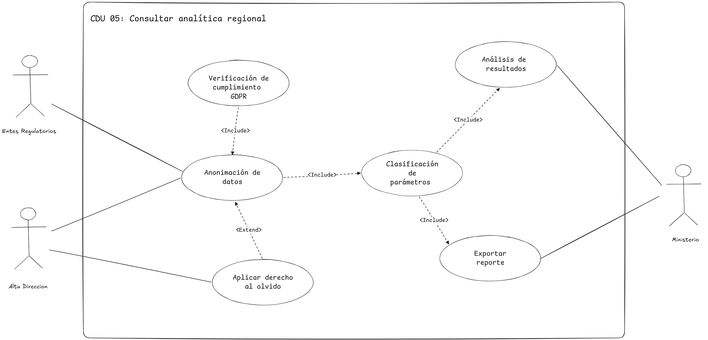

---
# CDU 05 — Consultar Analítica Regional

## Plataforma Regional de Certificación de Competencias Digitales (PRCCD)

---

## UC-5.1 — Anonimación de Datos

|               |                                                                                                                                                 |
|---------------|-------------------------------------------------------------------------------------------------------------------------------------------------|
| **Nombre**    | Anonimación de Datos                                                                                                                            |
| **Actores**   | Entes Regulatorios, Alta Dirección                                                                                                              |
| **Propósito** | Proteger la privacidad de la información utilizada en los procesos analíticos mediante la eliminación o sustitución de datos que permitan identificar a las personas. |

**Resumen:** El caso de uso inicia cuando se requiere utilizar información para análisis regionales. El sistema anonimiza los datos sensibles, verifica el cumplimiento de las políticas de protección de datos y genera un conjunto de datos apto para análisis. Finaliza cuando la información anonimizada queda disponible para su procesamiento.

### Curso Normal de Eventos

| Acción del actor                                                              | Respuesta del proceso de negocio                                                                 |
|-------------------------------------------------------------------------------|-------------------------------------------------------------------------------------------------|
| 1. El actor solicita utilizar información para fines analíticos.              | 2. El sistema identifica los datos sensibles y personales.                                      |
|                                                                               | 3. El sistema aplica técnicas de anonimización sobre la información.                            |
|                                                                               | 4. El sistema invoca UC-5.2 «Verificación de Cumplimiento GDPR».                                |
|                                                                               | 5. El sistema genera el conjunto de datos anonimizado.                                          |
|                                                                               | 6. El sistema invoca UC-5.3 «Clasificación de Parámetros».                                      |
| 7. El actor recibe la confirmación de disponibilidad de los datos.            |                                                                                                 |

### Cursos Alternos

| Condición                                             | Acción                                                                                  |
|-------------------------------------------------------|------------------------------------------------------------------------------------------|
| En el paso 2 — no existen datos disponibles           | El sistema informa que no hay información para procesar.                                 |
| En el paso 3 — error durante la anonimización         | El sistema cancela el proceso y registra la incidencia.                                 |
| En el paso 4 — incumplimiento de políticas GDPR       | El sistema bloquea el procesamiento de los datos hasta resolver la inconsistencia.       |

---

## UC-5.2 — Verificación de Cumplimiento GDPR

|               |                                                                                                                                             |
|---------------|---------------------------------------------------------------------------------------------------------------------------------------------|
| **Nombre**    | Verificación de Cumplimiento GDPR                                                                                                            |
| **Actores**   | Sistema *(invocado por UC-5.1)*                                                                                                              |
| **Propósito** | Verificar que la información utilizada en los procesos analíticos cumpla con las políticas de protección y tratamiento de datos personales. |

**Resumen:** El caso de uso es invocado durante el proceso de anonimización. El sistema revisa que el tratamiento de los datos cumpla con las políticas y restricciones de privacidad establecidas. Finaliza cuando se determina el cumplimiento o incumplimiento de las normas aplicables.

### Curso Normal de Eventos

| Acción del actor                                                   | Respuesta del proceso de negocio                                                   |
|--------------------------------------------------------------------|-------------------------------------------------------------------------------------|
| 1. UC-5.1 envía la información anonimizada para su verificación.    | 2. El sistema revisa las políticas de protección de datos aplicables.              |
|                                                                    | 3. El sistema verifica que los datos personales hayan sido tratados correctamente. |
|                                                                    | 4. El sistema determina el nivel de cumplimiento.                                  |
|                                                                    | 5. El sistema devuelve el resultado de la verificación al proceso invocante.        |

### Cursos Alternos

| Condición                                    | Acción                                                                           |
|----------------------------------------------|-----------------------------------------------------------------------------------|
| En el paso 3 — se detecta información sensible | El sistema rechaza el procesamiento y registra la incidencia.                     |
| En el paso 4 — incumplimiento normativo        | El sistema bloquea el proceso hasta que se resuelvan las observaciones.           |

---

## UC-5.3 — Clasificación de Parámetros

|               |                                                                                                                                          |
|---------------|------------------------------------------------------------------------------------------------------------------------------------------|
| **Nombre**    | Clasificación de Parámetros                                                                                                               |
| **Actores**   | Sistema *(invocado por UC-5.1)*                                                                                                           |
| **Propósito** | Organizar y clasificar la información anonimizada en categorías y parámetros que permitan la generación de análisis regionales y reportes. |

**Resumen:** El caso de uso inicia cuando el sistema recibe información anonimizada. Los datos son clasificados según criterios definidos para su análisis y posterior generación de reportes. Finaliza cuando la información queda organizada y disponible para su explotación analítica.

### Curso Normal de Eventos

| Acción del actor                                                   | Respuesta del proceso de negocio                                                               |
|--------------------------------------------------------------------|-------------------------------------------------------------------------------------------------|
| 1. UC-5.1 envía los datos anonimizados.                            | 2. El sistema identifica los parámetros y categorías aplicables.                               |
|                                                                    | 3. El sistema organiza la información según las reglas de clasificación definidas.             |
|                                                                    | 4. El sistema invoca UC-5.4 «Análisis de Resultados».                                           |
|                                                                    | 5. El sistema invoca UC-5.5 «Exportar Reporte».                                                 |
|                                                                    | 6. El sistema registra el resultado de la clasificación realizada.                             |

### Cursos Alternos

| Condición                                    | Acción                                                                 |
|----------------------------------------------|-------------------------------------------------------------------------|
| En el paso 2 — parámetros incompletos        | El sistema utiliza valores predeterminados o marca la información para revisión. |
| En el paso 3 — error de clasificación        | El sistema registra la incidencia y detiene el procesamiento.          |

---

## UC-5.4 — Análisis de Resultados

|               |                                                                                                                                       |
|---------------|---------------------------------------------------------------------------------------------------------------------------------------|
| **Nombre**    | Análisis de Resultados                                                                                                                |
| **Actores**   | Ministerio                                                                                                                            |
| **Propósito** | Generar información analítica e indicadores regionales que apoyen la toma de decisiones estratégicas. |

**Resumen:** El caso de uso inicia cuando la información clasificada se encuentra disponible. El sistema procesa los datos, genera métricas e indicadores y presenta los resultados al Ministerio. Finaliza cuando el análisis es mostrado y registrado.

### Curso Normal de Eventos

| Acción del actor                                              | Respuesta del proceso de negocio                                                       |
|---------------------------------------------------------------|-----------------------------------------------------------------------------------------|
| 1. El Ministerio solicita visualizar la analítica regional.   | 2. El sistema recupera la información clasificada.                                     |
|                                                               | 3. El sistema calcula indicadores y métricas regionales.                               |
|                                                               | 4. El sistema genera visualizaciones y resultados analíticos.                          |
| 5. El Ministerio consulta la información presentada.          | 6. El sistema registra la consulta realizada.                                          |

### Cursos Alternos

| Condición                                  | Acción                                                                 |
|--------------------------------------------|-------------------------------------------------------------------------|
| En el paso 2 — información insuficiente    | El sistema informa que no existen datos suficientes para el análisis.  |
| En el paso 3 — error de procesamiento      | El sistema registra la incidencia y genera un reporte parcial.         |

---

## UC-5.5 — Exportar Reporte

|               |                                                                                                                                     |
|---------------|-------------------------------------------------------------------------------------------------------------------------------------|
| **Nombre**    | Exportar Reporte                                                                                                                    |
| **Actores**   | Ministerio                                                                                                                          |
| **Propósito** | Permitir la generación y exportación de reportes derivados de la analítica regional para su consulta y distribución institucional. |

**Resumen:** El caso de uso inicia cuando el Ministerio solicita la generación de un reporte. El sistema compila la información clasificada, genera el documento correspondiente y permite su exportación. Finaliza cuando el reporte queda disponible para descarga.

### Curso Normal de Eventos

| Acción del actor                                              | Respuesta del proceso de negocio                                                         |
|---------------------------------------------------------------|-------------------------------------------------------------------------------------------|
| 1. El Ministerio solicita exportar un reporte analítico.      | 2. El sistema recupera la información clasificada.                                        |
|                                                               | 3. El sistema genera el reporte en el formato solicitado.                                |
|                                                               | 4. El sistema prepara el archivo para su descarga.                                       |
| 5. El Ministerio descarga el reporte generado.               | 6. El sistema registra la exportación realizada.                                         |

### Cursos Alternos

| Condición                                   | Acción                                                                  |
|---------------------------------------------|--------------------------------------------------------------------------|
| En el paso 2 — no existen datos disponibles | El sistema informa que no hay información para generar el reporte.      |
| En el paso 3 — error de generación          | El sistema registra la incidencia y permite reintentar la operación.    |
---

# CDU 06 — Auditar Rastro Inmutable
## Plataforma Regional de Certificación de Competencias Digitales (PRCCD)
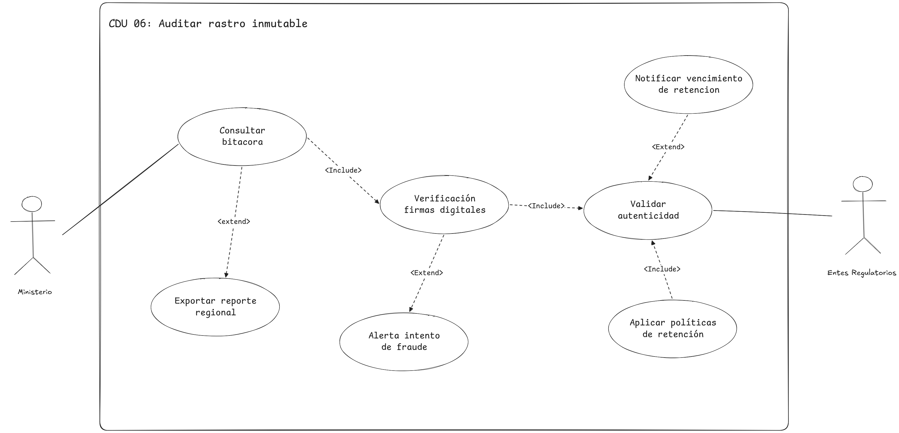

---

## UC-6.1 — Consultar Bitácora

|               |                                                                                                                                             |
|---------------|---------------------------------------------------------------------------------------------------------------------------------------------|
| **Nombre**    | Consultar Bitácora                                                                                                                          |
| **Actores**   | Ministerio                                                                                                                                  |
| **Propósito** | Permitir al Ministerio consultar el historial inmutable de eventos y operaciones registradas en la plataforma para fines de auditoría y seguimiento. |

**Resumen:** El caso de uso inicia cuando el Ministerio solicita consultar la bitácora de auditoría. El sistema recupera los registros almacenados, verifica las firmas digitales asociadas y presenta la información requerida. Finaliza cuando los registros son mostrados al usuario.

### Curso Normal de Eventos

| Acción del actor                                                 | Respuesta del proceso de negocio                                                             |
|------------------------------------------------------------------|-----------------------------------------------------------------------------------------------|
| 1. El Ministerio accede al módulo de auditoría.                  | 2. El sistema solicita los criterios de búsqueda de la bitácora.                             |
| 3. El Ministerio ingresa los filtros de consulta.                | 4. El sistema recupera los registros que cumplen con los criterios indicados.                |
|                                                                  | 5. El sistema invoca UC-6.2 «Verificación de Firmas Digitales».                              |
|                                                                  | 6. El sistema presenta los registros de auditoría encontrados.                              |
| 7. El Ministerio revisa la información presentada.               | 8. El sistema registra la consulta realizada en la bitácora.                                 |

### Cursos Alternos

| Condición                                  | Acción                                                                     |
|--------------------------------------------|-----------------------------------------------------------------------------|
| En el paso 4 — no existen registros        | El sistema informa que no se encontraron resultados.                       |
| En el paso 5 — falla la verificación       | El sistema muestra una advertencia sobre la integridad de los registros.   |

---

## UC-6.2 — Verificación de Firmas Digitales

|               |                                                                                                                                         |
|---------------|-----------------------------------------------------------------------------------------------------------------------------------------|
| **Nombre**    | Verificación de Firmas Digitales                                                                                                         |
| **Actores**   | Sistema *(invocado por UC-6.1)*                                                                                                          |
| **Propósito** | Verificar la integridad y validez de las firmas digitales asociadas a los registros de auditoría almacenados en la plataforma. |

**Resumen:** El caso de uso inicia cuando el sistema recibe registros de auditoría para su verificación. Se comprueba la autenticidad de las firmas digitales y, posteriormente, se valida la autenticidad de los registros. Finaliza cuando se determina el estado de integridad de la información.

### Curso Normal de Eventos

| Acción del actor                                               | Respuesta del proceso de negocio                                                        |
|----------------------------------------------------------------|------------------------------------------------------------------------------------------|
| 1. UC-6.1 envía los registros para verificación.               | 2. El sistema identifica las firmas digitales asociadas a cada registro.                |
|                                                                | 3. El sistema valida la integridad de las firmas digitales.                             |
|                                                                | 4. El sistema invoca UC-6.3 «Validar Autenticidad».                                     |
|                                                                | 5. El sistema registra el resultado de la verificación.                                 |

### Cursos Alternos

| Condición                                     | Acción                                                                     |
|-----------------------------------------------|-----------------------------------------------------------------------------|
| En el paso 2 — firma inexistente             | El sistema marca el registro como no verificable.                          |
| En el paso 3 — firma inválida                | El sistema genera una alerta de posible manipulación de la información.    |
| En el paso 4 — intento de fraude detectado   | El sistema extiende el flujo hacia UC-6.6 «Alerta Intento de Fraude».      |

---

## UC-6.3 — Validar Autenticidad

|               |                                                                                                                                     |
|---------------|-------------------------------------------------------------------------------------------------------------------------------------|
| **Nombre**    | Validar Autenticidad                                                                                                                 |
| **Actores**   | Entes Regulatorios                                                                                                                   |
| **Propósito** | Garantizar que los registros y evidencias almacenados en la plataforma sean auténticos y no hayan sido alterados. |

**Resumen:** El caso de uso inicia cuando el sistema recibe registros previamente verificados. Se comprueba la autenticidad de la información y se aplican las políticas de retención correspondientes. Finaliza cuando los registros son declarados auténticos o se identifica alguna inconsistencia.

### Curso Normal de Eventos

| Acción del actor                                               | Respuesta del proceso de negocio                                                        |
|----------------------------------------------------------------|------------------------------------------------------------------------------------------|
| 1. El sistema recibe los registros verificados.               | 2. El sistema analiza la autenticidad de los registros.                                 |
|                                                                | 3. El sistema verifica que no existan alteraciones o inconsistencias.                   |
|                                                                | 4. El sistema invoca UC-6.4 «Aplicar Políticas de Retención».                           |
|                                                                | 5. El sistema registra el resultado de la validación.                                   |
| 6. El Ente Regulatorio consulta el estado de autenticidad.     |                                                                                          |

### Cursos Alternos

| Condición                                         | Acción                                                                     |
|---------------------------------------------------|-----------------------------------------------------------------------------|
| En el paso 2 — autenticidad no comprobada        | El sistema marca el registro como sospechoso.                              |
| En el paso 3 — evidencia alterada                | El sistema registra la incidencia y restringe el acceso al registro.        |
| En el paso 4 — vencimiento de retención próximo  | El sistema extiende el flujo hacia UC-6.5 «Notificar Vencimiento de Retención». |

---

## UC-6.4 — Aplicar Políticas de Retención

|               |                                                                                                                                         |
|---------------|-----------------------------------------------------------------------------------------------------------------------------------------|
| **Nombre**    | Aplicar Políticas de Retención                                                                                                           |
| **Actores**   | Sistema *(invocado por UC-6.3)*                                                                                                          |
| **Propósito** | Aplicar las políticas institucionales de conservación y retención de registros de auditoría según las normas y periodos establecidos. |

**Resumen:** El caso de uso inicia cuando un registro ha sido validado. El sistema identifica la política de retención correspondiente y determina el tiempo de conservación aplicable. Finaliza cuando la política queda asociada al registro.

### Curso Normal de Eventos

| Acción del actor                                           | Respuesta del proceso de negocio                                                   |
|------------------------------------------------------------|-------------------------------------------------------------------------------------|
| 1. UC-6.3 solicita aplicar una política de retención.      | 2. El sistema identifica el tipo de registro y su normativa aplicable.             |
|                                                            | 3. El sistema determina el período de conservación correspondiente.                |
|                                                            | 4. El sistema asocia la política de retención al registro.                         |
|                                                            | 5. El sistema registra la operación realizada.                                     |

### Cursos Alternos

| Condición                                 | Acción                                                               |
|-------------------------------------------|-----------------------------------------------------------------------|
| En el paso 2 — normativa no definida      | El sistema aplica la política de retención predeterminada.           |
| En el paso 3 — error de configuración     | El sistema registra la incidencia y suspende la operación.           |

---

## UC-6.5 — Notificar Vencimiento de Retención

|               |                                                                                                                                      |
|---------------|--------------------------------------------------------------------------------------------------------------------------------------|
| **Nombre**    | Notificar Vencimiento de Retención                                                                                                    |
| **Actores**   | Sistema *(extensión de UC-6.3)*                                                                                                       |
| **Propósito** | Informar sobre la proximidad del vencimiento del período de conservación de un registro de auditoría. |

**Resumen:** El caso de uso se activa cuando un registro se encuentra próximo a finalizar su período de retención. El sistema genera una notificación y registra el evento para su seguimiento.

### Curso Normal de Eventos

| Acción del actor                                                | Respuesta del proceso de negocio                                                      |
|-----------------------------------------------------------------|----------------------------------------------------------------------------------------|
| 1. UC-6.3 detecta un próximo vencimiento de retención.          | 2. El sistema identifica los registros afectados.                                     |
|                                                                 | 3. El sistema genera una notificación de vencimiento.                                 |
|                                                                 | 4. El sistema registra la notificación emitida.                                       |
|                                                                 | 5. El sistema pone la notificación a disposición de los responsables.                 |

### Cursos Alternos

| Condición                                 | Acción                                                               |
|-------------------------------------------|-----------------------------------------------------------------------|
| En el paso 3 — error de notificación      | El sistema registra la incidencia y programa un nuevo intento.       |

---

## UC-6.6 — Alerta Intento de Fraude

|               |                                                                                                                                          |
|---------------|------------------------------------------------------------------------------------------------------------------------------------------|
| **Nombre**    | Alerta Intento de Fraude                                                                                                                  |
| **Actores**   | Sistema *(extensión de UC-6.2)*                                                                                                           |
| **Propósito** | Detectar y registrar posibles intentos de alteración, falsificación o manipulación de la información de auditoría. |

**Resumen:** El caso de uso se activa cuando el sistema identifica inconsistencias en las firmas digitales o evidencias de manipulación de registros. Se genera una alerta y se registra el incidente para su seguimiento.

### Curso Normal de Eventos

| Acción del actor                                                 | Respuesta del proceso de negocio                                                       |
|------------------------------------------------------------------|-----------------------------------------------------------------------------------------|
| 1. UC-6.2 detecta un posible intento de fraude.                  | 2. El sistema recopila la información relacionada con el incidente.                    |
|                                                                  | 3. El sistema genera una alerta de seguridad.                                          |
|                                                                  | 4. El sistema registra el incidente en la bitácora de auditoría.                       |
|                                                                  | 5. El sistema notifica a los responsables para su revisión.                            |

### Cursos Alternos

| Condición                                      | Acción                                                               |
|------------------------------------------------|-----------------------------------------------------------------------|
| En el paso 2 — información insuficiente        | El sistema registra un evento de advertencia para seguimiento.       |
| En el paso 5 — falla la notificación           | El sistema conserva la alerta en estado pendiente y reintenta posteriormente. |
---

## UC-6.7 — Exportar Reporte Regional

|               |                                                                                                                                      |
|---------------|--------------------------------------------------------------------------------------------------------------------------------------|
| **Nombre**    | Exportar Reporte Regional                                                                                                             |
| **Actores**   | Ministerio                                                                                                                           |
| **Propósito** | Permitir al Ministerio generar y descargar reportes regionales basados en la información de auditoría registrada en la plataforma. |

**Resumen:** El caso de uso se activa como una extensión de la consulta de bitácora, permitiendo generar un reporte consolidado con los registros obtenidos y exportarlo en un formato descargable.

### Curso Normal de Eventos

| Acción del actor                                               | Respuesta del proceso de negocio                                                       |
|----------------------------------------------------------------|-----------------------------------------------------------------------------------------|
| 1. El Ministerio solicita exportar el resultado de la consulta.| 2. El sistema recopila la información de la bitácora consultada.                       |
|                                                                | 3. El sistema genera el reporte regional en el formato solicitado.                     |
|                                                                | 4. El sistema prepara el archivo para su descarga.                                     |
| 5. El Ministerio descarga el reporte generado.                | 6. El sistema registra la exportación realizada.                                       |

### Cursos Alternos

| Condición                                  | Acción                                                                 |
|--------------------------------------------|-------------------------------------------------------------------------|
| En el paso 2 — no existen datos            | El sistema informa que no hay información para exportar.               |
| En el paso 3 — error de generación         | El sistema registra la incidencia y permite reintentar la operación.   |

---

# 4. Matrices de trazabilidad

## 4.1 Stakeholders vs Requerimientos

La matriz de trazabilidad Stakeholders vs Requerimientos permite identificar qué actores del negocio exigen, validan o se ven impactados por cada requisito funcional del sistema. Su objetivo es demostrar que los requerimientos definidos para la Plataforma Regional de Certificación de Competencias Digitales (PRCCD) responden directamente a necesidades reales de los involucrados, evitando requisitos aislados o sin justificación dentro del caso de negocio.

Esta matriz también facilita el análisis de impacto: si cambia un requisito funcional, el equipo puede identificar rápidamente qué stakeholder debe ser consultado o qué área del negocio se verá afectada. Por esa razón, se utiliza como evidencia de alineación entre las necesidades del negocio, la arquitectura propuesta y los requisitos funcionales definidos para la solución.

## Stakeholders considerados

| ID | Stakeholder | Interés o preocupación principal |
|---|---|---|
| ST-01 | Secretaría General del SICA | Impulsa la iniciativa regional y requiere que la plataforma unifique la certificación de competencias digitales en la región. |
| ST-02 | Alta dirección del SICA | Exige una solución estratégica, escalable y justificable que pueda integrarse regionalmente sin afectar la operación de las instituciones. |
| ST-03 | Dirección financiera | Controla el presupuesto del piloto, prioriza costos, licenciamiento y sostenibilidad económica de la solución. |
| ST-04 | Administradores de TI / Soporte operativo | Se encargan de la operación, soporte, despliegue on-premise, seguridad técnica y administración de usuarios. |
| ST-05 | Universidades integradas: USAC, UCR y UES | Proveen identidad, datos académicos e integración con sistemas heredados sin cambiar sus protocolos internos. |
| ST-06 | Ministerios de educación | Consumen información analítica y validan el impacto educativo de las competencias digitales certificadas. |
| ST-07 | Ministerios de trabajo | Requieren información confiable sobre competencias laborales y certificados verificables para el ecosistema laboral. |
| ST-08 | Candidatos / estudiantes / profesionales | Utilizan la plataforma para autenticarse, evaluarse y obtener una certificación digital verificable. |
| ST-09 | Entes reguladores y autoridades de protección de datos | Velan por el cumplimiento normativo, privacidad, derecho al olvido, retención e integridad de la evidencia. |
| ST-10 | Auditores | Revisan evidencia antifraude, trazabilidad, bitácoras inmutables y validez de certificados emitidos. |
| ST-11 | Verificadores externos de certificados | Consultan la autenticidad de certificados mediante código, QR o hash. |

## Requerimientos funcionales trazados

| ID | Requerimiento funcional | Prioridad |
|---|---|---|
| RF-01 | El sistema debe permitir la autenticación federada mediante los protocolos LDAP, SAML y OAuth2 según la institución universitaria. | Alta |
| RF-02 | El sistema debe ejecutar evaluaciones mediante un motor de exámenes adaptativos que ajuste la dificultad en tiempo real según las respuestas previas del candidato. | Alta |
| RF-03 | El sistema debe capturar y almacenar evidencia antifraude durante la evaluación, incluyendo capturas de pantalla, logs de tecleo y ráfagas de video. | Alta |
| RF-04 | El sistema debe emitir certificados digitales verificables criptográficamente mediante PKI o Blockchain (Hyperledger). | Alta |
| RF-05 | El sistema debe mantener un rastro de auditoría inmutable por cada certificado emitido. | Alta |
| RF-06 | El sistema debe importar y exportar datos académicos en formatos JSON, XML y CSV. | Media |
| RF-07 | El sistema debe integrarse nativamente con los sistemas de USAC, UCR y UES sin obligar a estas instituciones a cambiar su forma de operar. | Alta |
| RF-08 | El sistema debe generar dashboards analíticos segmentados por país, carrera universitaria y género. | Media |
| RF-09 | El sistema debe anonimizar y agregar los datos antes de exponerlos en las interfaces gerenciales. | Alta |
| RF-10 | El sistema debe permitir la verificación externa de un certificado mediante código, QR o hash. | Media |
| RF-11 | El sistema debe gestionar usuarios, roles y permisos por institución. | Media |
| RF-12 | El sistema debe habilitar los períodos de certificación exclusivamente durante la primera semana de cada mes. | Alta |

## Matriz Stakeholders vs Requerimientos

| Stakeholder | RF-01 | RF-02 | RF-03 | RF-04 | RF-05 | RF-06 | RF-07 | RF-08 | RF-09 | RF-10 | RF-11 | RF-12 |
|---|---|---|---|---|---|---|---|---|---|---|---|---|
| ST-01 - Secretaría General del SICA | X | X | X | X | X | X | X | X | X | X | X | X |
| ST-02 - Alta dirección del SICA | X | X | X | X | X | X | X | X | X | X | X | X |
| ST-03 - Dirección financiera |  |  |  | X | X |  |  | X | X | X | X | X |
| ST-04 - Administradores de TI / Soporte operativo | X | X | X | X| X | X | X |  | X | X | X | X |
| ST-05 - Universidades integradas: USAC, UCR y UES | X | X |  |  |  | X | X | X | X |  | X | X |
| ST-06 - Ministerios de educación |  |  |  | X | X |  |  | X | X | X |  |  |
| ST-07 - Ministerios de trabajo |  |  |  | X | X |  |  | X | X | X |  |  |
| ST-08 - Candidatos / estudiantes / profesionales | X | X | X | X |  |  |  |  |  | X |  | X |
| ST-09 - Entes reguladores y autoridades de protección de datos |  |  | X | X | X |  |  | X | X | X |  |  |
| ST-10 - Auditores |  |  | X | X | X |  |  |  | X | X |  |  |
| ST-11 - Verificadores externos de certificados |  |  |  | X | X |  |  |  |  | X |  |  |

## Justificación de trazabilidad

| Stakeholder | Requerimientos relacionados | Justificación |
|---|---|---|
| ST-01 / ST-02 | RF-02, RF-04, RF-07, RF-08, RF-12 | Estos stakeholders impulsan la plataforma regional, por lo que exigen evaluación adaptativa, certificación verificable, integración universitaria, analítica y control de períodos de certificación. |
| ST-03 | RF-05, RF-08, RF-09, RF-10, RF-11, RF-12 | La dirección financiera necesita control, auditoría, evidencia de valor institucional, administración de accesos y trazabilidad para justificar el piloto. |
| ST-04 | RF-01, RF-03, RF-05, RF-06, RF-07, RF-11, RF-12 | El área operativa se ve impactada por autenticación, integración, usuarios, seguridad, evidencia y operación de períodos de certificación. |
| ST-05 | RF-01, RF-06, RF-07 | Las universidades exigen interoperabilidad real, autenticación federada y compatibilidad con formatos heterogéneos sin modificar sus procesos internos. |
| ST-06 / ST-07 | RF-04, RF-05, RF-08, RF-09, RF-10 | Los ministerios necesitan certificados confiables, auditoría y dashboards con datos agregados y anonimizados para tomar decisiones regionales. |
| ST-08 | RF-01, RF-02, RF-04, RF-10, RF-12 | Los candidatos necesitan acceder, evaluarse en períodos habilitados, obtener certificación y poder demostrar su validez ante terceros. |
| ST-09 | RF-03, RF-05, RF-09 | Los reguladores impactan directamente los requisitos de evidencia, auditoría, privacidad y anonimización. |
| ST-10 | RF-03, RF-05, RF-10 | Los auditores requieren evidencia antifraude, bitácora inmutable y mecanismos de verificación. |
| ST-11 | RF-10 | Los verificadores externos dependen principalmente de la consulta pública de autenticidad del certificado. |

## Lectura de la matriz

La matriz evidencia que los requisitos funcionales de mayor prioridad se encuentran asociados con los stakeholders más críticos del proyecto. Por ejemplo, la autenticación federada y la integración universitaria se relacionan directamente con las universidades USAC, UCR y UES, debido a que el enunciado establece que cada institución trabaja con protocolos y formatos distintos. Asimismo, la emisión de certificados verificables, la auditoría inmutable y la verificación externa se relacionan con ministerios, auditores, entes reguladores y verificadores externos, debido a la necesidad de garantizar validez jurídica, trazabilidad y prevención de fraude académico.

También se observa que los requisitos de analítica y anonimización están ligados principalmente a los ministerios y autoridades regulatorias, ya que los dashboards deben mostrar información segmentada sin exponer datos personales identificables. Finalmente, los requisitos relacionados con el motor de evaluación adaptativa y los períodos de certificación impactan directamente a los candidatos y a la alta dirección del SICA, porque representan el núcleo funcional de la plataforma y la condición operativa principal del negocio.

---

## 4.2 Stakeholders vs CDU

La presente matriz de trazabilidad relaciona los stakeholders identificados para la Plataforma Regional de Certificación de Competencias Digitales (PRCCD) con los Casos de Uso del Sistema (CDU). Su propósito es demostrar que cada funcionalidad implementada responde a necesidades específicas de los actores involucrados y que todos los stakeholders relevantes tienen representación dentro de la solución arquitectónica.

Esta matriz complementa la trazabilidad Stakeholders vs Requerimientos al mostrar cómo dichas necesidades se materializan en funcionalidades concretas del sistema.

### Matriz Stakeholders vs Casos de Uso del Sistema

| Stakeholder                           | CUS-01 | CUS-02 | CUS-03 | CUS-03.1 | CUS-04 | CUS-05 | CUS-06 | CUS-07 | CUS-07.1 | CUS-08 | CUS-09 | CUS-10 | CUS-11 | CUS-12 |
| ------------------------------------- | ------ | ------ | ------ | -------- | ------ | ------ | ------ | ------ | -------- | ------ | ------ | ------ | ------ | ------ |
| ST-01 Secretaría General del SICA     | X      | X      | X      | X        | X      | X      | X      | X      | X        | X      | X      | X      | X      | X      |
| ST-02 Alta Dirección del SICA         | X      | X      | X      | X        | X      | X      | X      | X      | X        | X      | X      | X      | X      | X      |
| ST-03 Dirección Financiera            |        | X      |        |          |        | X      | X      |        |          |        | X      | X      | X      | X      |
| ST-04 Administradores TI / Operativos | X      | X      | X      | X        | X      | X      | X      | X      | X        | X      |        |        | X      | X      |
| ST-05 Universidades USAC / UCR / UES  | X      |        | X      |          |        |        |        | X      | X        | X      |        |        |        |        |
| ST-06 Ministerios de Educación        |        |        |        |          |        | X     | X      |        |          |        | X      | X      | X      |        |
| ST-07 Ministerios de Trabajo          |        |        |        |          |        | X     | X      |        |          |        | X      | X      | X      |        |
| ST-08 Candidatos / Profesionales      | X      |        | X      |          | X      | X      |        |        |          |        |        |        | X      | X      |
| ST-09 Entes Regulatorios              |        |        |        |          | X      | X      | X      |        |          |        | X      | X      | X      |        |
| ST-10 Auditores                       |        |        |        |          | X      | X      | X      |        |          |        |        | X      | X      |        |
| ST-11 Verificadores Externos          |        |        |        |          |        |        |        |        |          |        |        |        | X      |        |

### Resumen de Participación por Stakeholder

| Stakeholder                 | Casos de uso principales                                                                                                                         |
| --------------------------- | ------------------------------------------------------------------------------------------------------------------------------------------------ |
| Secretaría General del SICA | Ejecutar evaluación adaptativa, emitir certificados, auditoría inmutable, dashboards, sincronización universitaria y administración de períodos. |
| Alta Dirección del SICA     | Certificación regional, evaluación adaptativa, integración universitaria, analítica y control operativo.                                         |
| Dirección Financiera        | Auditoría, certificación, verificación y control institucional.                                                                                  |
| Administradores TI          | Autenticación, gestión de usuarios, integración universitaria, sincronización y administración de períodos.                                      |
| Universidades               | Autenticación federada, importación/exportación de datos y sincronización institucional.                                                         |
| Ministerios de Educación    | Dashboards, anonimización, auditoría y verificación de certificados.                                                                             |
| Ministerios de Trabajo      | Dashboards, anonimización, auditoría y verificación de certificados.                                                                             |
| Candidatos / Profesionales  | Autenticación, evaluación adaptativa, captura de evidencia y emisión de certificados.                                                            |
| Entes Regulatorios          | Auditoría, privacidad, anonimización y cumplimiento normativo.                                                                                   |
| Auditores                   | Evidencia antifraude, auditoría inmutable y validación de certificados.                                                                          |
| Verificadores Externos      | Verificación pública de certificados mediante código, QR o hash.                                                                                 |

### Análisis de Cobertura

La matriz evidencia que todos los stakeholders identificados durante el análisis del negocio poseen participación directa o indirecta en al menos un Caso de Uso del Sistema. Los candidatos y profesionales interactúan principalmente con las funcionalidades de autenticación, evaluación y certificación, mientras que las universidades se relacionan con los procesos de interoperabilidad e integración de datos. Por otra parte, los ministerios, auditores y entes reguladores participan principalmente en los procesos de auditoría, verificación, anonimización y explotación analítica de la información.

Asimismo, se observa que los casos de uso más estratégicos para el negocio son CUS-03 Ejecutar evaluación adaptativa, CUS-05 Emitir certificado digital, CUS-06 Registrar auditoría inmutable y CUS-07.1 Sincronizar sistemas universitarios, debido a que concentran la mayor cantidad de stakeholders interesados y representan el núcleo funcional de la Plataforma Regional de Certificación de Competencias Digitales (PRCCD).

### Cobertura CDU vs Stakeholders

| CDU                                          | Stakeholders Relacionados                                     |
| -------------------------------------------- | ------------------------------------------------------------- |
| CUS-01 Autenticar usuario                    | ST-01, ST-02, ST-04, ST-05, ST-08                             |
| CUS-02 Gestionar usuarios y roles            | ST-01, ST-02, ST-03, ST-04                                    |
| CUS-03 Ejecutar evaluación adaptativa        | ST-01, ST-02, ST-05, ST-08                                    |
| CUS-03.1 Gestionar banco de preguntas        | ST-01, ST-02, ST-04                                           |
| CUS-04 Capturar evidencia antifraude         | ST-01, ST-02, ST-08, ST-09, ST-10                             |
| CUS-05 Emitir certificado digital            | ST-01, ST-02, ST-03, ST-06, ST-07, ST-08, ST-09, ST-10        |
| CUS-06 Registrar auditoría inmutable         | ST-01, ST-02, ST-03, ST-06, ST-07, ST-09, ST-10               |
| CUS-07 Importar datos académicos             | ST-01, ST-02, ST-04, ST-05                                    |
| CUS-07.1 Sincronizar sistemas universitarios | ST-01, ST-02, ST-04, ST-05                                    |
| CUS-08 Exportar datos académicos             | ST-01, ST-02, ST-04, ST-05                                    |
| CUS-09 Generar dashboards analíticos         | ST-01, ST-02, ST-03, ST-06, ST-07, ST-09                      |
| CUS-10 Anonimizar y agregar datos            | ST-03, ST-06, ST-07, ST-09, ST-10                             |
| CUS-11 Verificar certificado                 | ST-01, ST-02, ST-03, ST-04, ST-06, ST-07, ST-09, ST-10, ST-11 |
| CUS-12 Administrar períodos de certificación | ST-01, ST-02, ST-03, ST-04, ST-08                             |

---

## 4.3 Requerimientos vs CDU

La matriz de trazabilidad Requerimientos vs Casos de Uso del Sistema (CDU) permite verificar que todos los requerimientos funcionales identificados durante el análisis del negocio se encuentran implementados mediante uno o más casos de uso del sistema. Su objetivo principal es garantizar la cobertura funcional completa de la solución y demostrar que no existen requisitos sin representación dentro del modelo funcional de la Plataforma Regional de Certificación de Competencias Digitales (PRCCD).

Esta matriz constituye un mecanismo de validación arquitectónica que facilita la identificación de requisitos no implementados, casos de uso redundantes o funcionalidades sin justificación de negocio.

### Leyenda

| Símbolo   | Significado                                                                |
| --------- | -------------------------------------------------------------------------- |
| X         | El caso de uso implementa total o parcialmente el requerimiento funcional. |
| *(vacío)* | No existe relación directa.                                                |

---

### Matriz Requerimientos Funcionales vs Casos de Uso

| RF / CDU                                            | CUS-01 | CUS-02 | CUS-03 | CUS-03.1 | CUS-04 | CUS-05 | CUS-06 | CUS-07 | CUS-07.1 | CUS-08 | CUS-09 | CUS-10 | CUS-11 | CUS-12 |
| --------------------------------------------------- | ------ | ------ | ------ | -------- | ------ | ------ | ------ | ------ | -------- | ------ | ------ | ------ | ------ | ------ |
| RF-01 Autenticación federada LDAP/SAML/OAuth2       | X      |        |        |          |        |        |        |        |          |        |        |        |        |        |
| RF-02 Evaluación adaptativa                         |        |        | X      | X        |        |        |        |        |          |        |        |        |        |        |
| RF-03 Evidencia antifraude                          |        |        |        |          | X      |        |        |        |          |        |        |        |        |        |
| RF-04 Certificados verificables criptográficamente  |        |        |        |          |        | X      |        |        |          |        |        |        |        |        |
| RF-05 Auditoría inmutable                           |        |        |        |          |        |        | X      |        |          |        |        |        |        |        |
| RF-06 Importación y exportación de datos académicos |        |        |        |          |        |        |        | X      |          | X      |        |        |        |        |
| RF-07 Integración con USAC, UCR y UES               | X      |        |        |          |        |        |        | X      | X        |        |        |        |        |        |
| RF-08 Dashboards analíticos                         |        |        |        |          |        |        |        |        |          |        | X      |        |        |        |
| RF-09 Anonimización y agregación de datos           |        |        |        |          |        |        |        |        |          |        |        | X      |        |        |
| RF-10 Verificación externa de certificados          |        |        |        |          |        |        |        |        |          |        |        |        | X      |        |
| RF-11 Gestión de usuarios, roles y permisos         | X      | X      |        |          |        |        |        |        |          |        |        |        |        |        |
| RF-12 Administración de períodos de certificación   |        |        | X      |          |        |        |        |        |          |        |        |        |        | X      |

---

### Resumen de Cobertura de Requerimientos

| Requerimiento | Casos de Uso Asociados   |
| ------------- | ------------------------ |
| RF-01         | CUS-01                   |
| RF-02         | CUS-03, CUS-03.1         |
| RF-03         | CUS-04                   |
| RF-04         | CUS-05                   |
| RF-05         | CUS-06                   |
| RF-06         | CUS-07, CUS-08           |
| RF-07         | CUS-01, CUS-07, CUS-07.1 |
| RF-08         | CUS-09                   |
| RF-09         | CUS-10                   |
| RF-10         | CUS-11                   |
| RF-11         | CUS-01, CUS-02           |
| RF-12         | CUS-03, CUS-12           |

---

### Resumen de Cobertura de Casos de Uso

| Caso de Uso                                  | Requerimientos Cubiertos |
| -------------------------------------------- | ------------------------ |
| CUS-01 Autenticar usuario                    | RF-01, RF-07, RF-11      |
| CUS-02 Gestionar usuarios, roles y permisos  | RF-11                    |
| CUS-03 Ejecutar evaluación adaptativa        | RF-02, RF-12             |
| CUS-03.1 Gestionar banco de preguntas        | RF-02                    |
| CUS-04 Capturar evidencia antifraude         | RF-03                    |
| CUS-05 Emitir certificado digital            | RF-04                    |
| CUS-06 Registrar auditoría inmutable         | RF-05                    |
| CUS-07 Importar datos académicos             | RF-06, RF-07             |
| CUS-07.1 Sincronizar sistemas universitarios | RF-07                    |
| CUS-08 Exportar datos académicos             | RF-06                    |
| CUS-09 Generar dashboards analíticos         | RF-08                    |
| CUS-10 Anonimizar y agregar datos            | RF-09                    |
| CUS-11 Verificar certificado                 | RF-10                    |
| CUS-12 Administrar períodos de certificación | RF-12                    |

---

### Validación de Cobertura

El análisis de trazabilidad evidencia que los doce requerimientos funcionales definidos para la Plataforma Regional de Certificación de Competencias Digitales (PRCCD) se encuentran completamente representados por uno o más Casos de Uso del Sistema. No se identificaron requerimientos sin implementación funcional ni casos de uso sin justificación de negocio.

Asimismo, se observa que ciertos requerimientos estratégicos poseen cobertura múltiple debido a su impacto transversal dentro de la arquitectura. Destacan RF-07 Integración con universidades, implementado mediante los casos de uso de autenticación federada, importación de datos y sincronización institucional; RF-11 Gestión de usuarios, cubierto por autenticación y administración de roles; y RF-12 Gestión de períodos de certificación, que afecta tanto la ejecución de evaluaciones como la administración operativa del sistema.

La matriz confirma que la solución propuesta mantiene alineación completa entre las necesidades del negocio, los requerimientos funcionales definidos y las funcionalidades representadas en el modelo de casos de uso del sistema, garantizando consistencia arquitectónica y trazabilidad de extremo a extremo.

---

# 5. Seleccion arquitectonica

## 5.1 Analisis de estilos candidatos

Para seleccionar el estilo arquitectonico del PRCCD se evaluaron los estilos mas representativos considerando los drivers identificados, en especial los picos de trafico de la primera semana del mes, la integracion con tres universidades de protocolos distintos y el requisito de auditoria inmutable.

### Monolitico

Concentra toda la logica del sistema en una sola aplicacion desplegable. Es la opcion mas simple de desarrollar al inicio, pero presenta limitaciones criticas para este proyecto: no permite escalar partes especificas del sistema de forma independiente, lo que lo hace incompatible con los picos de miles de usuarios simultaneos durante los periodos de certificacion. Ademas, una falla en cualquier modulo puede comprometer todo el sistema. Descartado.

### SOA - Arquitectura Orientada a Servicios

Organiza el sistema en servicios de negocio que se comunican a traves de un bus central (ESB). Ofrece buena separacion de responsabilidades y es un estilo probado en entornos gubernamentales. Sin embargo, el bus central representa un cuello de botella cuando se presentan los picos de trafico del PRCCD, y la gobernanza centralizada dificulta la integracion con los protocolos heterogeneos de USAC, UCR y UES. No se descarta completamente, pero por si solo no es suficiente.

### Microservicios

Divide el sistema en servicios pequeños, autonomos y desplegables de forma independiente. Cada servicio tiene su propia base de datos y se comunica con los demas a traves de APIs. Este estilo responde directamente al problema de escalabilidad: durante la primera semana del mes se puede escalar unicamente el servicio del motor de examenes sin tocar el resto del sistema. Tambien facilita integrar cada universidad como un adaptador independiente sin afectar los demas.

### Orientacion a Eventos - EDA

Los componentes del sistema se comunican mediante eventos asincronos a traves de un bus de mensajes. Este estilo es especialmente util para registros de auditoria inmutables, captura de evidencia antifraude y cualquier proceso que no requiera una respuesta inmediata. El candidato responde una pregunta, se emite un evento, y el sistema de auditoria lo registra de forma independiente sin bloquear el flujo del examen.

---

## 5.2 Estilo seleccionado

**Arquitectura hibrida: Microservicios con Orientacion a Eventos**

La arquitectura del PRCCD combina ambos estilos porque cada uno resuelve un problema diferente del sistema:

Los microservicios abordan la escalabilidad y la integracion heterogenea. Cada dominio del negocio, como evaluaciones, certificados, integracion universitaria o analitica, es un servicio independiente que puede escalar, desplegarse y mantenerse por separado. Esto permite que durante los periodos de certificacion el servicio de examenes soporte la carga sin arrastrar a los demas modulos.

La orientacion a eventos aborda la auditoria inmutable y la captura de evidencia antifraude. Cada accion relevante del sistema genera un evento que se publica en un bus de mensajes. Estos eventos son consumidos por el servicio de auditoria, que los registra de forma inmutable sin interferir con el flujo principal del examen ni con la emision de certificados.

### Justificacion por driver

| Driver                               | Como lo atiende la arquitectura seleccionada                                               |
| -------------------------------------- | -------------------------------------------------------------------------------------------- |
| EaC-01 Escalabilidad 5,000 usuarios  | El servicio de examenes escala horizontalmente de forma independiente                      |
| EaC-02 Disponibilidad 99.9%          | Cada microservicio tiene redundancia propia; un fallo no compromete el sistema completo    |
| EaC-03 Seguridad auditoria inmutable | Los eventos de auditoria se registran de forma asincrona e inmutable en el bus de mensajes |
| EaC-04 Integracion con CSV legacy    | Un microservicio de integracion dedicado por universidad maneja cada protocolo y formato   |
| EaC-05 Rendimiento motor adaptativo  | El motor de examenes es un servicio aislado, sin dependencias que puedan degradarlo        |
| EaC-08 Agregar nuevo protocolo       | Se agrega un nuevo adaptador sin modificar los servicios existentes                        |
| R-02 Open Source                     | Todos los componentes seleccionados tienen alternativas Open Source viables                |
| R-03 On-premise                      | Los microservicios se contendorizan con Docker y se orquestan con Kubernetes on-premise    |
| R-04 Migracion a nube                | La contenedorizacion permite mover los servicios a cualquier proveedor cloud sin rediseno  |

---

# 6. Vistas Arquitectonicas - Nivel de Sistema

## 6.1 Diagrama de bloques

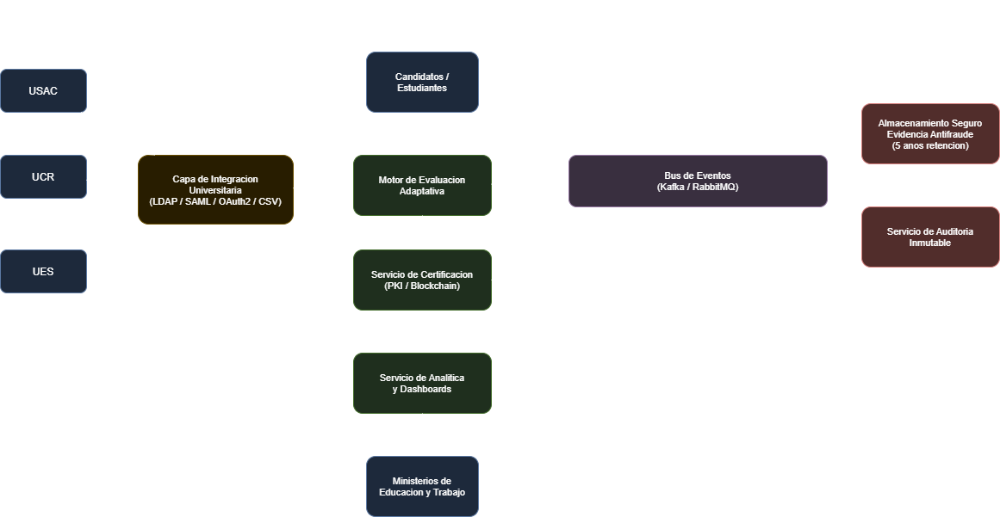

## 6.2 Descripcion del diagrama de bloques

El diagrama representa la arquitectura del PRCCD organizada en tres zonas funcionales.

**Zona de integracion**

A la izquierda se ubican las tres universidades piloto: USAC, UCR y UES. Cada una se conecta a la Capa de Integracion Universitaria, que es el unico punto de entrada al sistema para instituciones externas. Esta capa traduce los distintos protocolos de autenticacion (LDAP, SAML, OAuth2) y formatos de datos (JSON, XML, CSV) a un formato interno estandarizado, de modo que cada universidad puede seguir operando con sus propios sistemas sin modificarlos.

**Zona de procesamiento**

En el centro opera el nucleo del negocio. El Motor de Evaluacion Adaptativa recibe al candidato, gestiona el examen en tiempo real y ajusta la dificultad de las preguntas segun las respuestas previas. La comunicacion con el candidato es bidireccional: el motor le presenta preguntas y recibe sus respuestas de forma continua durante la evaluacion. Al aprobar, el Servicio de Certificacion genera el certificado digital con respaldo criptografico mediante PKI o Blockchain. El Servicio de Analitica consume eventos del bus para construir los dashboards destinados a los ministerios, asegurando que los datos expuestos sean siempre agregados y anonimizados.

**Zona de eventos y persistencia**

A la derecha el Bus de Eventos actua como columna vertebral asincrona del sistema. Recibe eventos del motor de examenes y del servicio de certificacion, y los distribuye al Servicio de Auditoria Inmutable y al Almacenamiento Seguro de Evidencia Antifraude. Este diseno garantiza que ninguna accion relevante pueda modificarse o eliminarse, cumpliendo con el requisito de retencion de 5 anos establecido por el GDPR y las legislaciones locales.

Los Ministerios de Educacion y Trabajo acceden al sistema por dos vias: a traves del Servicio de Analitica para consultar dashboards con metricas regionales, y a traves del Servicio de Auditoria para verificar la validez de certificados emitidos.

---

# 7. Vistas Arquitectonicas - Nivel de Infraestructura

## 7.1 Diagrama de componentes

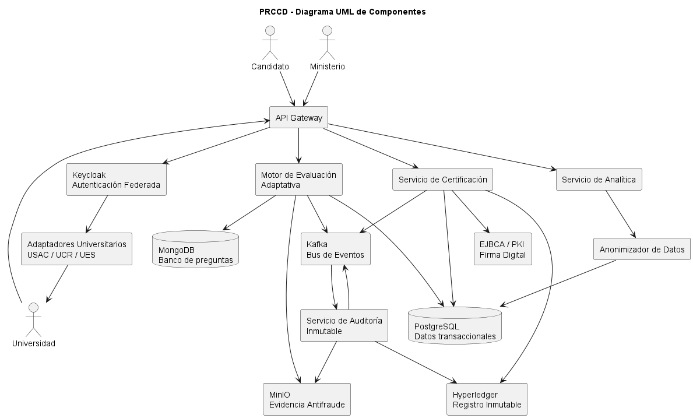

## 7.2 Diagrama de despliegue

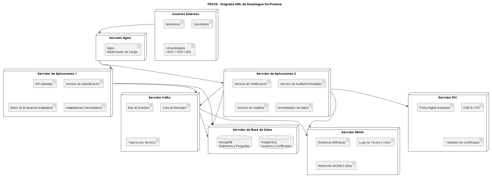

## 7.3 Diagrama de distribucion

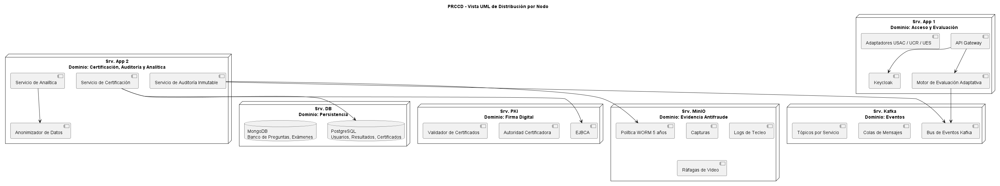

## 7.4 Justificacion de tecnologias y frameworks

| Tecnologia         | Rol en el sistema                      | Justificacion                                                                                                                                   |
| -------------------- | ---------------------------------------- | ------------------------------------------------------------------------------------------------------------------------------------------------- |
| Docker             | Contenedorizacion de microservicios    | Permite desplegar cada servicio de forma independiente on-premise y facilita la migracion a nube sin redisenar la arquitectura (R-03, R-04)     |
| Kubernetes         | Orquestacion de contenedores           | Gestiona el escalado automatico de servicios durante los picos de la primera semana del mes (EaC-01)                                            |
| Kafka              | Bus de eventos                         | Maneja grandes volumenes de mensajes de forma asincrona, garantiza que los eventos de auditoria no se pierdan ni se modifiquen (EaC-03, EaC-07) |
| Nginx              | Balanceador de carga                   | Distribuye el trafico entre instancias durante los picos de certificacion. Open Source y ampliamente probado en produccion (R-02)               |
| PostgreSQL         | Base de datos relacional               | Almacena usuarios, certificados y registros de auditoria. Open Source, robusto y con soporte de transacciones ACID (R-02)                       |
| MongoDB            | Base de datos documental               | Almacena las preguntas y resultados de examenes por su estructura flexible y variable (R-02)                                                    |
| Hyperledger Fabric | Blockchain para certificados           | Implementa el registro distribuido e inmutable de certificados emitidos con validez juridica transfronteriza (RF-04, R-07)                      |
| Keycloak           | Gestion de identidad federada          | Maneja autenticacion con LDAP, SAML y OAuth2 desde un solo punto sin obligar a las universidades a cambiar sus sistemas (RF-01, R-08)           |
| MinIO              | Almacenamiento de evidencia antifraude | Almacenamiento de objetos Open Source compatible con politicas WORM para retencion inmutable de 5 anos (R-06)                                   |

---

# 8. Diseño de Datos
---

# DER

## 8.1 Entidades principales del modelo de datos

El modelo de datos del PRCCD se derive directamente de los servicios definidos en el diagrama de distribucion: Servidor de Base de Datos (PostgreSQL y MongoDB), Servidor PKI, y Servidor de Almacenamiento Antifraude (MinIO). Se identificaron 14 entidades agrupadas en cinco dominios funcionales.

### Dominio de identidad y acceso

| Entidad | Atributos principales | Descripcion |
|---|---|---|
| Usuario | id (PK), nombre, apellido, email, hashContrasena, fechaCreacion, estado, institucionId (FK) | Toda persona con acceso al sistema: candidatos, administradores y personal ministerial. |
| Rol | id (PK), nombre, descripcion | Niveles de acceso: candidato, evaluador, administrador institucional, administrador SICA, analista ministerial. |
| Permiso | id (PK), recurso, accion | Accion concreta que un rol puede ejecutar sobre un recurso del sistema. |
| RolPermiso | rolId (FK), permisoId (FK) | Relacion muchos a muchos entre roles y permisos. |
| Institucion | id (PK), nombre, pais, protocoloAuth, endpointAuth, formatoDatos, activa | Registra cada universidad con su protocolo de autenticacion (LDAP, SAML, OAuth2) y formato de datos. |

### Dominio de evaluacion

| Entidad | Atributos principales | Descripcion |
|---|---|---|
| Evaluacion | id (PK), titulo, descripcion, competencia, periodoInicio, periodoFin, estado, dificultadBase | Examen disponible durante la primera semana del mes. El campo estado controla la habilitacion del periodo de certificacion (RF-12). |
| Pregunta | id (PK), evaluacionId (FK), enunciado, tipo, nivelDificultad, parametroIRT_a, parametroIRT_b, parametroIRT_c | Pregunta del banco con parametros IRT (discriminacion, dificultad, adivinanza) usados por el motor adaptativo para ajuste en tiempo real (RF-02). |
| SesionExamen | id (PK), usuarioId (FK), evaluacionId (FK), fechaInicio, fechaFin, estado, puntajeFinal, aprobado, habilidadEstimada | Sesion activa de un candidato. El campo habilidadEstimada es actualizado por el algoritmo IRT tras cada respuesta (EaC-05). |
| Respuesta | id (PK), sesionId (FK), preguntaId (FK), contenido, esCorrecta, tiempoRespuestaMs, timestamp | Cada respuesta individual del candidato, con marca de tiempo para el motor adaptativo y para auditorias antifraude (RF-03). |

### Dominio de certificacion

| Entidad | Atributos principales | Descripcion |
|---|---|---|
| Certificado | id (PK), sesionId (FK), usuarioId (FK), competencia, institucionId (FK), fechaEmision, hashSHA256, firmaDigital, algoritmoFirma, serialPKI, hashBlockchain, estado, qrVerificacion | Certificado digital emitido tras la aprobacion. El hashSHA256 garantiza integridad del contenido. La firmaDigital provee no-repudio. El campo hashBlockchain almacena la referencia al registro en Hyperledger Fabric (RF-04, R-07). |
| RegistroAuditoria | id (PK), entidad, entidadId, accion, usuarioId, ipOrigen, timestamp, hashEvento, inmutable | Registro de toda accion relevante. El campo inmutable indica que la fila es de solo escritura: no admite UPDATE ni DELETE (RF-05, EaC-03). |

### Dominio de evidencia antifraude

| Entidad | Atributos principales | Descripcion |
|---|---|---|
| EvidenciaAntifraude | id (PK), sesionId (FK), usuarioId (FK), tipo, urlStorage, sizeBytes, hashArchivo, timestampCaptura, cifrado, retencionHasta | Metadatos de la evidencia almacenada en MinIO. El archivo fisico se guarda con cifrado AES-256 y politica WORM. El campo retencionHasta garantiza conservacion por 5 anos (RF-03, R-06). |

### Dominio analitico

| Entidad | Atributos principales | Descripcion |
|---|---|---|
| MetricaAgregada | id (PK), pais, carrera, genero, competencia, totalEvaluados, totalAprobados, tasaAprobacion, periodoMes, periodoAnio, generadaEn | Tabla de solo lectura poblada por el proceso de anonimizacion. Nunca contiene datos individuales identificables. Es la unica fuente de los dashboards ministeriales (RF-08, RF-09, EaC-06). |

---

## 8.2 Diseno del esquema: modelo hibrido relacional y documental

La arquitectura establece tres motores de persistencia conforme al diagrama de distribucion:

### PostgreSQL — datos transaccionales (Servidor de Base de Datos)

Almacena las entidades de identidad, evaluacion y certificacion: Usuario, Rol, Permiso, RolPermiso, Institucion, Evaluacion, SesionExamen, Respuesta, Certificado, RegistroAuditoria y MetricaAgregada.

**Justificacion:** Estas entidades tienen relaciones complejas y requieren integridad referencial y transacciones ACID. El esquema relacional permite consultas de trazabilidad completa desde un usuario hasta su certificado emitido, necesario para cumplir EaC-07 (tiempo de consulta de auditoria menor a 5 segundos) y EaC-03 (cero modificaciones no autorizadas en la bitacora).

### MongoDB — banco de preguntas (Servidor de Base de Datos)

El banco de preguntas de cada evaluacion se almacena en MongoDB como documentos JSON con los parametros IRT embebidos. Esto permite al motor adaptativo recuperar y filtrar preguntas por nivel de dificultad con latencia menor a 2 segundos sin necesidad de joins relacionales durante la evaluacion activa.

**Justificacion:** El esquema de preguntas varia segun el tipo (opcion multiple, verdadero/falso, codigo, respuesta libre). Un modelo documental flexible elimina columnas nulas y permite evolucionar el formato de pregunta sin migraciones de esquema, cumpliendo EaC-05 (tiempo de ajuste del motor menor a 2 segundos) y EaC-08 (agregar nuevo protocolo sin afectar otros modulos).

### MinIO — evidencia antifraude (Servidor de Almacenamiento Antifraude)

Los archivos fisicos de capturas de pantalla, rafagas de video y logs de tecleo se almacenan en MinIO con politica WORM (Write Once Read Many). Los metadatos se registran en la tabla EvidenciaAntifraude de PostgreSQL.

**Justificacion:** El almacenamiento de objetos binarios en una base de datos relacional elevaria significativamente el costo operativo. MinIO, como solucion Open Source compatible con S3, permite cifrado por objeto (AES-256), retencion configurable y politica de inmutabilidad a nivel de bucket. Cumple R-02 (Open Source), R-06 (retencion inalterable 5 anos) y R-05 (GDPR).

---

## 8.3 Estrategia de auditoria e inmutabilidad

El cumplimiento de R-06 (retencion 5 anos), R-07 (firma electronica avanzada) y EaC-03 (cero modificaciones no autorizadas) requiere una estrategia que va mas alla del diseno de tabla.

### Inmutabilidad a nivel de base de datos

La tabla RegistroAuditoria se configura con las siguientes restricciones en PostgreSQL:

- **Solo INSERT permitido:** se revoca el privilegio UPDATE y DELETE al usuario de aplicacion sobre esta tabla. Unicamente el usuario de sistema con privilegio de auditoria puede ejecutar INSERT.
- **Trigger de verificacion:** un trigger de PostgreSQL calcula el hashSHA256 de cada fila al momento de insercion y lo almacena en el campo hashEvento. Cualquier intento de modificacion posterior rompe la cadena de hashes y es detectable de inmediato.
- **Particionamiento mensual:** la tabla se particiona por mes. Las particiones del mes anterior se marcan como de solo lectura una vez cerrado el periodo, evitando modificaciones retroactivas.

### Retencion de evidencia biometrica

El Servidor de Almacenamiento Antifraude utiliza MinIO con politica de bucket configurada en modo WORM con retencion minima de 1,825 dias (5 anos). Ningun proceso de aplicacion puede eliminar objetos dentro del periodo de retencion, incluso con credenciales de administrador. El campo retencionHasta en EvidenciaAntifraude permite al sistema alertar antes de que venza la retencion legal.

### Cumplimiento normativo

| Requisito | Mecanismo implementado |
|---|---|
| GDPR — derecho al olvido | Campo estadoBorrado en tabla Usuario con borrado logico. Los datos personales se reemplazan por tokens anonimizados. El certificado permanece valido pero desvinculado del titular. |
| GDPR — retencion 5 anos | Politica WORM en MinIO y campo retencionHasta en EvidenciaAntifraude. |
| Ley de Acceso a la Informacion Publica de Guatemala | Los registros de auditoria son accesibles mediante API autenticada para entes regulatorios con rol autorizado. |
| Inmutabilidad de calificaciones | El campo puntajeFinal de SesionExamen es de solo escritura una vez que el estado cambia a CERRADA. Un trigger de base de datos rechaza cualquier UPDATE posterior. |

---

## 8.4 Estrategia de interoperabilidad

El PRCCD debe integrarse con USAC, UCR y UES sin obligar a ninguna institucion a modificar sus sistemas (R-08, RF-07). La estrategia se basa en el patron de microservicio adaptador por institucion, visible en el diagrama de componentes donde se definen los adaptadores USAC (LDAP), UCR (SAML) y UES (OAuth2/CSV).

### Microservicio adaptador por universidad

Cada universidad tiene un adaptador dedicado que actua como capa anticorrupcion entre el protocolo externo y el modelo interno del PRCCD:

| Adaptador | Universidad | Protocolo de autenticacion | Formato de datos soportado |
|---|---|---|---|
| Adaptador USAC | USAC | LDAP | JSON / CSV |
| Adaptador UCR | UCR | SAML 2.0 | XML |
| Adaptador UES | UES | OAuth2 | JSON / CSV |

Cada adaptador es responsable de tres funciones:

1. Traducir el protocolo de autenticacion externo a un token JWT interno valido para el API Gateway.
2. Transformar los datos academicos entrantes al formato canonico interno del PRCCD, independientemente de si llegan como JSON, XML o archivos planos CSV.
3. Exponer un endpoint de sincronizacion periodica que el sistema invoca para importar novedades academicas de cada institucion mediante Apache Camel como motor de integracion.

### Flujo de integracion de datos

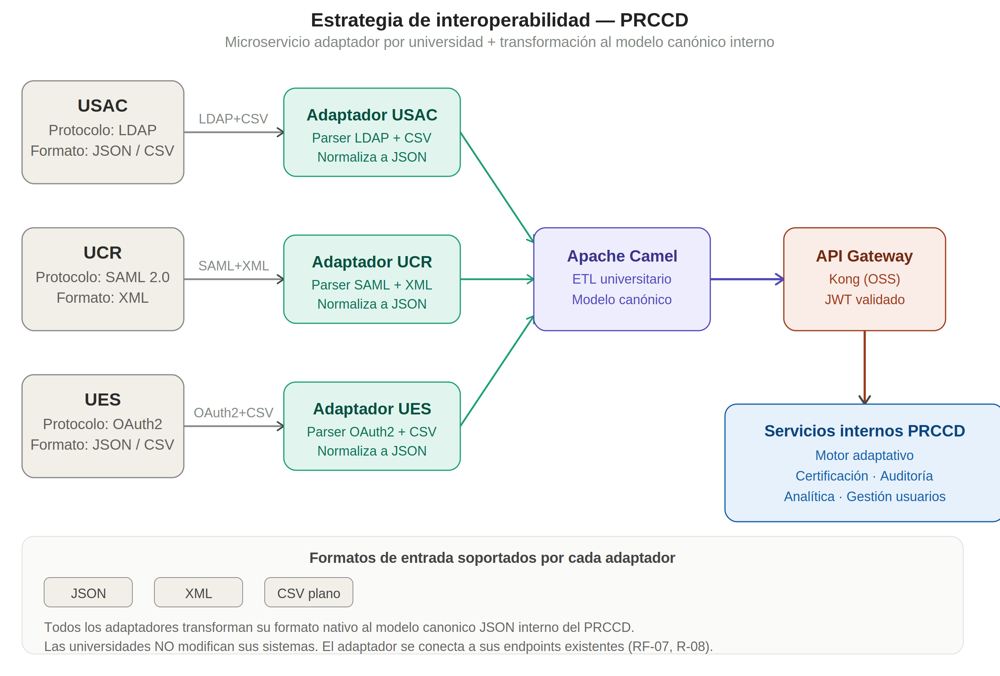

### Cumplimiento de drivers

| Driver | Como lo atiende esta estrategia |
|---|---|
| RF-06 (JSON/XML/CSV) | Cada adaptador implementa un parser especifico para el formato de su institucion. |
| RF-07 (integracion sin cambios) | Las universidades no modifican nada; el adaptador se conecta a sus endpoints existentes. |
| EaC-04 (CSV legacy) | El Adaptador USAC incluye un procesador de archivos planos con validacion de columnas y manejo de registros malformados. |
| EaC-08 (nuevo protocolo en menos de 2 semanas) | Agregar una nueva universidad implica crear un nuevo microservicio adaptador sin tocar los existentes. |

---

## 8.5 Autenticacion federada

El PRCCD implementa autenticacion federada mediante Keycloak como Identity Broker centralizado, tecnologia ya definida en la seccion 7.4. Keycloak actua como intermediario unico entre los tres protocolos universitarios y el sistema interno.

### Flujo por institucion

**USAC — LDAP:**
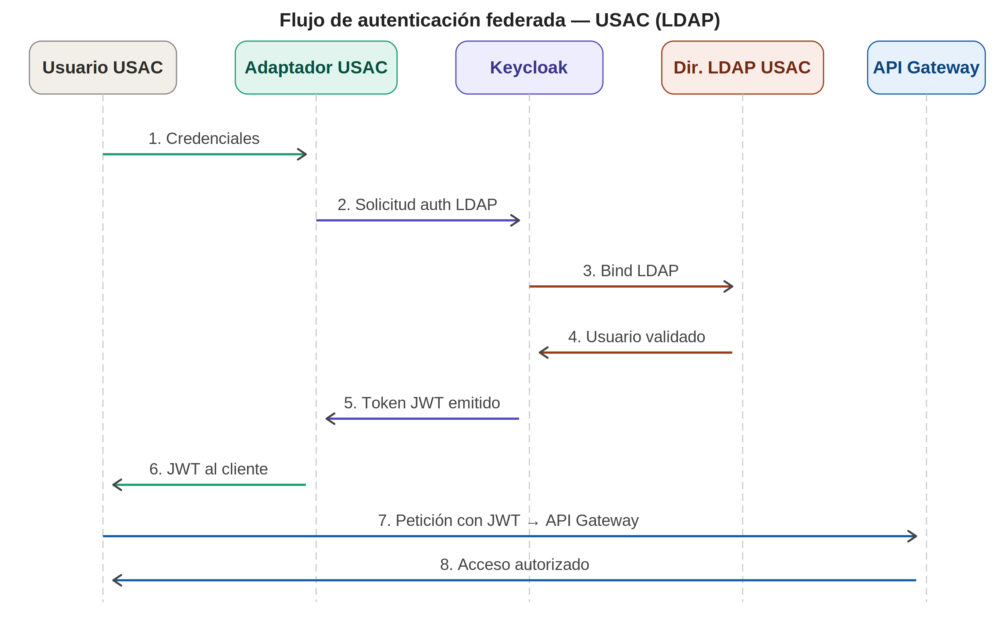

**UCR — SAML 2.0:**
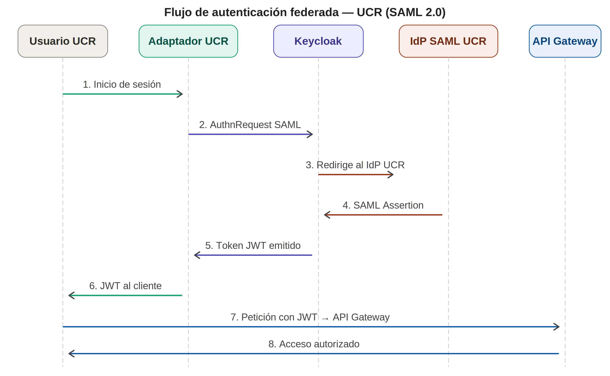

**UES — OAuth2:**
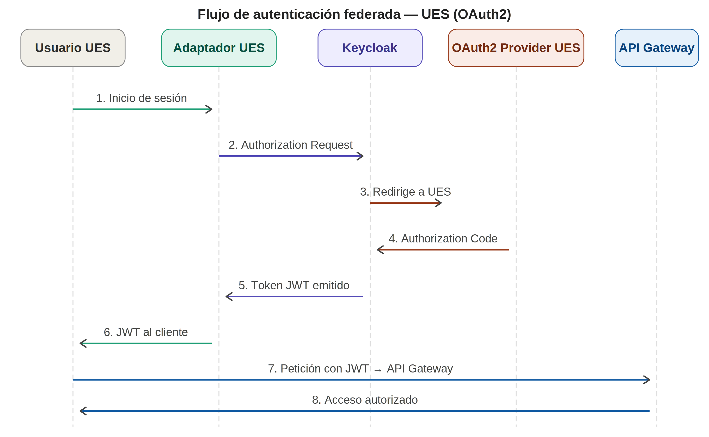

### Resultado unificado

Independientemente de la institucion de origen, el sistema siempre trabaja con un Token JWT firmado por Keycloak que contiene: usuarioId, institucionId, rol y expiracion. El resto de microservicios del PRCCD no conocen el protocolo original de cada universidad; solo validan el JWT contra la llave publica de Keycloak. Esto cumple RF-01 y R-08 sin requerir cambios en los sistemas universitarios.

---
## 8.6 Estrategia de privacidad y cifrado

El cumplimiento del GDPR y las legislaciones locales (R-05) impone cuatro requisitos que la arquitectura de datos atiende de forma explicita.

### Cifrado en transito

Toda comunicacion entre componentes utiliza TLS 1.3. Esto aplica a:

- Conexiones externas: universidades hacia API Gateway, candidatos hacia API Gateway, ministerios hacia API Gateway.
- Comunicacion interna: entre microservicios dentro de la Red Interna SICA.
- Conexiones a base de datos: aplicaciones hacia PostgreSQL, aplicaciones hacia MongoDB.

### Cifrado en reposo

| Capa | Mecanismo | Estandar |
|---|---|---|
| PostgreSQL — datos transaccionales | Cifrado de columnas sensibles con pgcrypto | AES-256 |
| MinIO — evidencia antifraude | Cifrado por objeto en bucket | AES-256-SSE |
| Servidor PKI — llaves privadas CA | Cifrado de volumen del servidor | AES-256 |

### Derecho al olvido

El borrado de datos personales se implementa en dos fases:

1. **Fase 1 — Anonimizacion inmediata:** al recibir la solicitud, los campos identificables del Usuario (nombre, email, datos de contacto) se reemplazan por tokens no reversibles. El usuarioId permanece como referencia tecnica para mantener integridad referencial con certificados y registros de auditoria.
2. **Fase 2 — Purga programada:** una tarea programada verifica semanalmente si han vencido los periodos de retencion legal. Los certificados asociados a un usuario con solicitud de olvido se marcan como REVOCADO pero conservan el hashSHA256 y el hashBlockchain para permitir verificacion de autenticidad historica sin revelar identidad.

### Anonimizacion para dashboards

El proceso de anonimizacion ejecuta agregaciones sobre SesionExamen y Certificado antes de insertar filas en MetricaAgregada. Las reglas aplicadas son:

- Solo se exponen grupos con un minimo de 10 registros para evitar re-identificacion estadistica.
- Los campos de genero y carrera se aplican como dimensiones de agrupamiento, nunca como identificadores individuales.
- El servicio de analitica solo puede leer de MetricaAgregada, nunca directamente de tablas transaccionales, cumpliendo EaC-06 (cero datos personales identificables expuestos).

---

## 8.7 Certificados verificables: PKI con respaldo en Hyperledger Fabric

El enunciado establece que los certificados deben ser verificables criptograficamente mediante PKI o Blockchain (Hyperledger). La arquitectura del PRCCD implementa ambos en dos capas complementarias, alineadas con las tecnologias definidas en la seccion 7.4.

### Capa 1 — PKI con firma digital (Servidor PKI)

La capa base de firma utiliza el Servidor PKI dedicado. El proceso de emision es el siguiente:

1. El candidato aprueba el examen. El servicio de certificacion construye el payload con: identificador unico, nombre de la competencia, institucion, fecha de emision y puntaje obtenido.
2. Se genera el hash SHA-256 del payload. Esta huella garantiza que cualquier alteracion posterior al contenido sea detectable.
3. El Servidor PKI firma el hash con la llave privada de la CA del SICA utilizando RSA-2048 o ECDSA-P256.
4. Se emite el certificado en formato X.509, el estandar internacional de infraestructura de llave publica.
5. El candidato recibe el certificado con un codigo QR que apunta al endpoint de verificacion publica, donde cualquier tercero puede validar la autenticidad usando la llave publica de la CA del SICA (RF-10).

### Capa 2 — Registro inmutable en Hyperledger Fabric

Una vez emitido el certificado X.509, el Servicio de Certificacion publica el hashSHA256 del certificado en la red Hyperledger Fabric. Este registro distribuido actua como bitacora inmutable adicional que demuestra la existencia del certificado desde el momento de su emision.

El campo hashBlockchain en la tabla Certificado almacena la referencia a la transaccion en Hyperledger Fabric. Esto permite que ministerios y empresas verificadoras confirmen tanto la validez de la firma digital (via PKI) como la existencia historica del registro (via Hyperledger), satisfaciendo el requisito de validez juridica transfronteriza (R-07).

### Proceso completo de emision
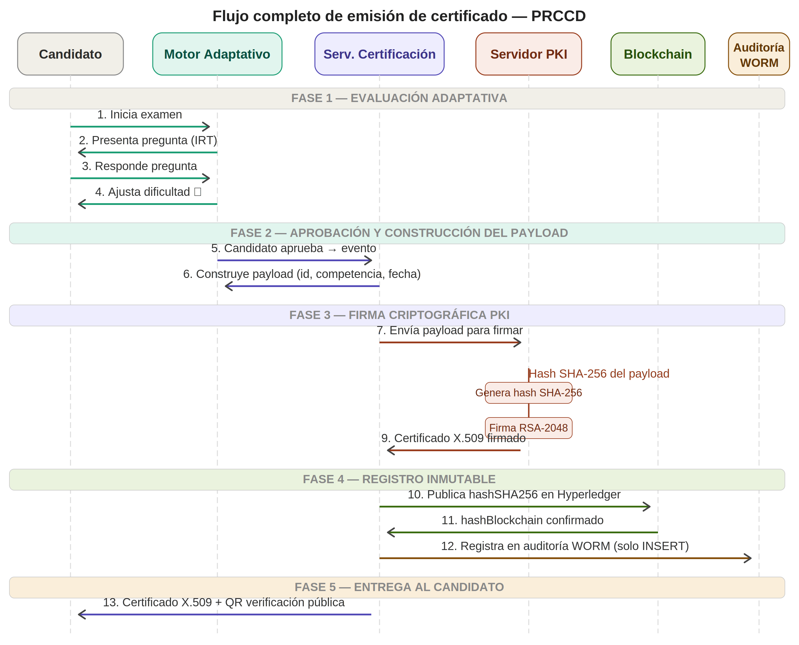

### Cumplimiento de drivers

| Driver | Como lo atiende esta estrategia |
|---|---|
| RF-04 (certificados verificables criptograficamente) | Firma digital sobre hash SHA-256 via PKI + registro en Hyperledger Fabric. |
| RF-05 (rastro de auditoria inmutable) | Registro en tabla RegistroAuditoria de solo INSERT y registro en blockchain. |
| RF-10 (verificacion externa por QR/hash) | Endpoint publico que valida firma contra llave publica CA del SICA. |
| R-02 (Open Source) | Keycloak (Apache 2.0), MinIO (AGPL), PostgreSQL (PostgreSQL License), Hyperledger Fabric (Apache 2.0). |
| R-07 (validez juridica transfronteriza) | X.509 reconocido internacionalmente; Hyperledger Fabric como registro distribuido adicional. |
| EaC-03 (cero modificaciones no autorizadas) | La firma digital hace detectable cualquier alteracion del certificado. El blockchain hace irrefutable la existencia del registro original. |
| EaC-07 (consulta de auditoria menor a 5 segundos) | Consulta indexada por certificadoId o hashSHA256 en PostgreSQL. |

---

# 9. Diseño de Interfaces UI/UX

### Definicion de perfiles de usuario y pantallas del sistema

* #### Candidato
  Usuario que realiza el proceso de inscripcion, autenticacion y evaluacion dentro de la plataforma.
  ##### Pantallas
  * Registro de usuario
  * Inicio de sesión federado
  * Dashboard del candidato
  * Selección de evaluación
  * Verificación de identidad
  * Ejecución de examen adaptativo
  * Visualización de resultados
  * Descarga de certificado
  * Historial de evaluaciones
  
* #### Administrador SICA
  Usuario encargado de administracion general de certificaciones, instituciones y configuraciones del sistema.
  ##### Pantallas
  * Inicio de sesión administrativo
  * Dashboard administrativo
  * Gestión de certificaciones
  * Gestión de usuarios
  * Gestión de instituciones
  * Gestión de evaluaciones
  * Auditoría y monitoreo
  * Configuración del sistema

* #### Universidad
  Institucion academica integrada al sistema federado para sincronizacion y validacion de informacion academica.
  ##### Pantallas
  * Inicio de sesión institucional
  * Dashboard universitario
  * Gestión de estudiantes
  * Validación de candidatos
  * Sincronización de datos académicos
  * Gestión de períodos académicos
  * Estado de integraciones
  * Reportes institucionales
  
* #### Ministerio/Dashboard General
  Entidad encargada de supervisar métricas nacionales, indicadores y estadisticas agregadas del sistema.
  ##### Pantallas
  * Dashboard gerencial
  * Métricas por país
  * Estadísticas por carrera universitaria
  * Indicadores por género
  * Reportes agregados y anonimizados
  * Visualización de tendencias
  * Exportación de reportes
  
* #### Auditor
  Usuario encargado de supervisar trazabilidad, integridad y cumplimiento de procesos dentro de la plataforma.
  ##### Pantalla
  * Inicio de sesión de auditoría
  * Dashboard de auditoría
  * Historial de certificaciones
  * Verificación de integridad
  * Validación de transacciones blockchain
  * Reportes de auditoría
  * Monitoreo de actividad

* #### Verificador Externo  
  Usuario externo encargado de validar la autenticidad de certificados emitidos por la plataforma.
  ##### Pantalla
  * Consulta de certificado
  * Escaneo de código QR
  * Verificación mediante hash o código
  * Estado de autenticidad
  * Visualización pública del certificado

---
## Prototipos de Interfaces UI/UX

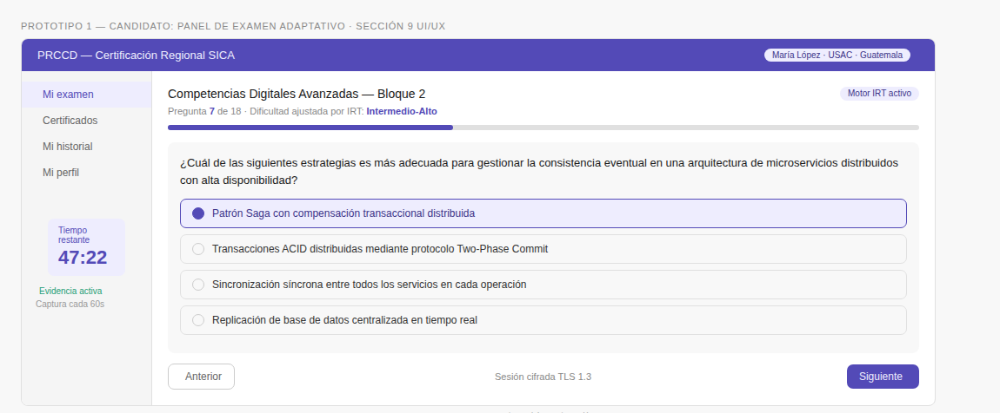

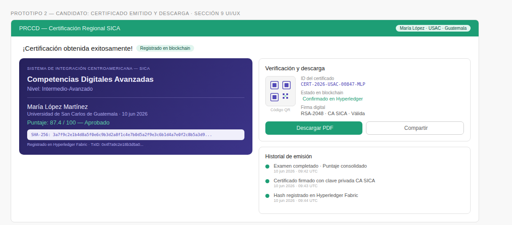

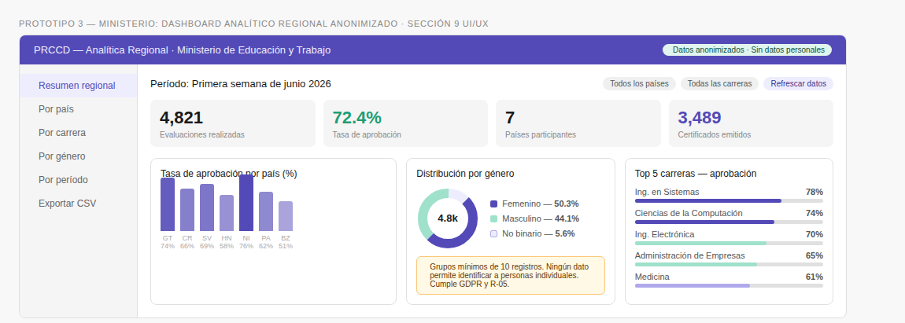

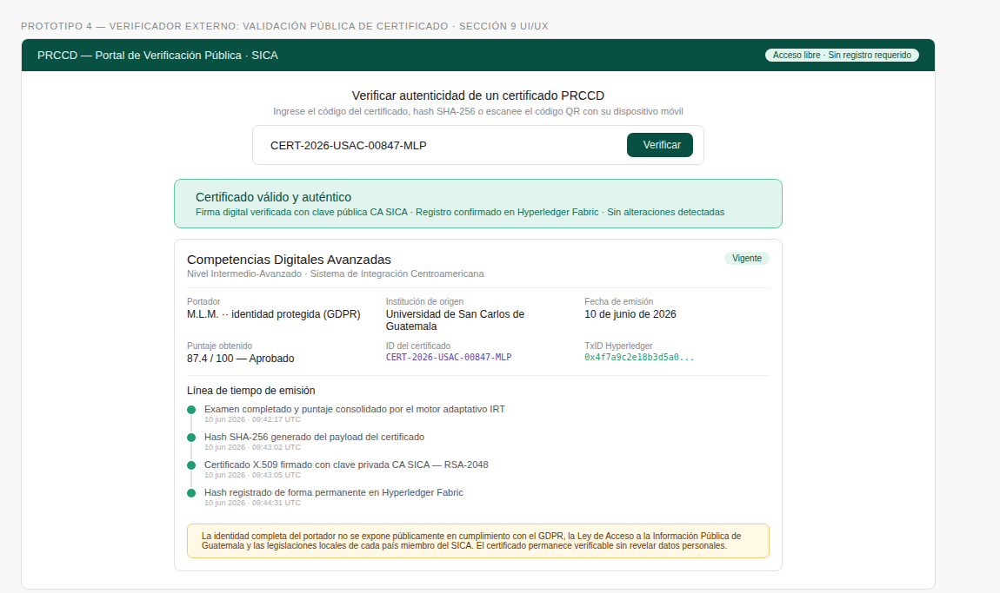

---

# 10. Patrones de Diseño

### Patrón 1 — Strategy *(Comportamiento)*

**Descripción**  
 Es un patron de diseño de comportamiento que permite definir una familia de algoritmos, colocar cada uno de ellos en una clase separada y hacer sus objetos intercambiables.

**Aplicación en el proyecto**  
En el proyecto se aplica en el sistema de autentificacion federada para manejar los distintos protocolos universitarios como LDAP, SAML y Outh2.

**Justificación**  
Permite cambiar el metodo de autenticacion según la universidad sin modificar el nucleo del sistema. Facilitando agregar nuevas instituciones y reduce el acoplamiento. 

**Diagrama**
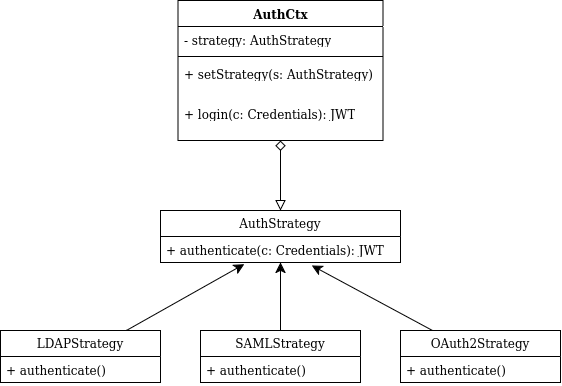

### Patrón 2 — Adapter *(Estructural)*

**Descripción**  
Adapter es un patron de diseño estructural que permite la colaboracion entre objetos con interfaces incompatibles. Es decir que se puede crear un objeto especial que convierte la interfaz de un objeto, de forma que otro objeto pueda comprenderla.

**Aplicación en el proyecto**  
En el proyecto se implementa en los microservicios de integracion para transformar formatos externos (CSV, XML, JSON) al modelo canonico interno del PRCCD

**Justificación**  
Cada universidad maneja tecnologias, protocolos y formatos distintos. Adapter permite integrar esos sistemas al modelo interno del proyecto sin o+ pbligarlos a las instituciones a modificar su infraestructura existente. Ademas facilita el mantenimiento, la escalabilidad y la incorporacion de nuevas universidades o tecnologias futuras.

**Diagrama**
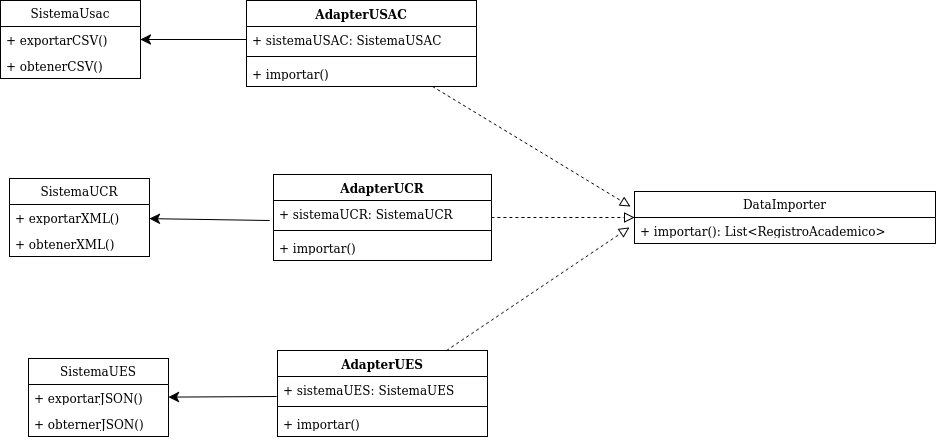

### Patrón 3 — Decorator *(Estructural)*

**Descripción**  
Es un patron de diseño estructural que permite añadir funcionalidades a objetos colocando estos objetos dentro de objetos encapsuladores especiales que contienen estas funcionalidades.

**Aplicación en el proyecto**  
Se usa en el modulo de analitica para aplicar capas de anonimizacion y transformacion a los datos antes de mostrar en dashboards ministeriales.

**Justificación**  
Permite agregar reglas de privacidad de formam modular y combinable, evitando clases monoliticas y facilitando extensiones.

**Diagrama**
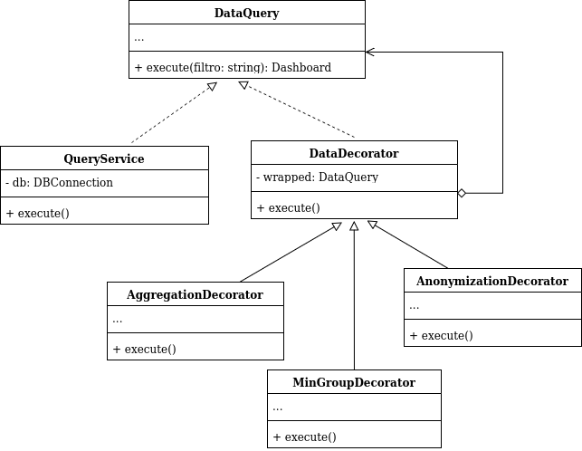

### Patrón 4 — Facade *(Estructural)*

**Descripción**  
Es un patron de diseño estructural que proporciona una interfaz simplificada a una biblioteca, un framework o cualquier otro grupo complejo de clases.

**Aplicación en el proyecto**  
se utiliza en el proceso de emision de certificados, coordinando servicios como PKI, blockchain, auditoria y notificaciones.

**Justificación**  
Simplifica el acceso a un flujo complejo, reduciendo el acoplamiento entre el controlador y multiples servicios internos.

**Diagrama**
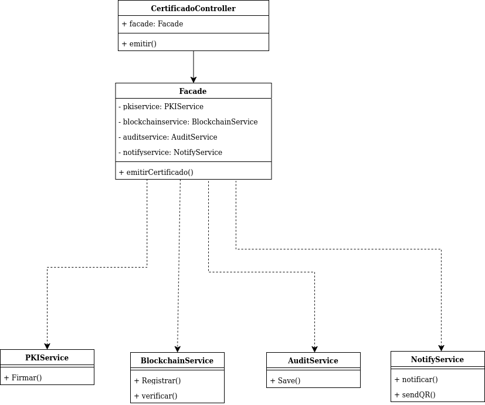

### Patrón 5 — Chain of Responsability *(Comportamiento)*

**Descripción**  
Es un patron de diseño de comportamiento que permite pasar solicitudes a lo largo de una cadena de manejadores. Al recibir una solicitud, cada manejador decide si la procesa o si la pasa al siguiente manejador de la cadena.

**Aplicación en el proyecto**  
Se implementa en el flujo de validacion previo al acceso de examenes, verificando JWT, periodo activo y restricciones antifraude antes de permitir el ingreso del usuario.

**Justificación**  
Cada validacion se mantiene independiente y desacoplada, facilitando agregar o modificar reglas sin afectar el resto del flujo principal de validacion.

**Diagrama**
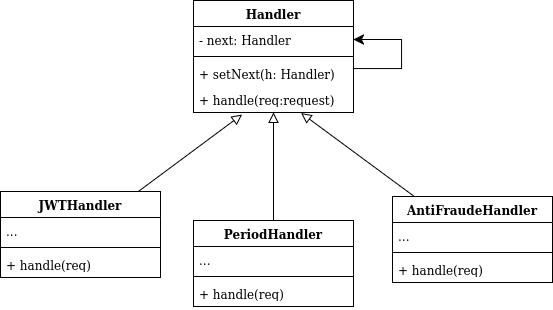
---

# 11. Gestion del Proyecto

> *Tablero Kanban: https://trello.com/b/XWZkVwXY*

> *Repositorio: AYD2\_A\_1S2026\_PROYECTO\_G6*
> 

---

## 11.1 Control de Versiones y Flujo Git Flow

Para el desarrollo de la fase uno del proyecto se utilizará una estrategia de ramas basada en Git Flow, con el objetivo de mantener un control ordenado de los cambios, separar el trabajo de cada integrante y asegurar que la documentación avance de forma controlada, revisable y coherente.

### Ramas principales

#### main

La rama `main` representa la versión estable y final del proyecto. En esta rama solo se integrarán entregables revisados, aprobados y listos para ser presentados. No se debe trabajar directamente sobre esta rama.

#### release

La rama `release` se utilizará para preparar versiones candidatas de entrega. En esta rama se realizarán ajustes finales de redacción, formato, numeración, referencias internas y validación general antes de integrar los cambios a `main`.

#### develop

La rama `develop` será la rama principal de integración del trabajo del equipo. Todas las ramas de tipo `feature` deberán partir desde `develop` y, al finalizar una tarea, deberán integrarse nuevamente mediante Pull Request.

#### docs

La rama `docs` se utilizará como rama de integración específica para la documentación del proyecto. En esta rama se consolidarán los avances documentales antes de integrarlos a ramas principales del flujo de trabajo.

### Ramas de trabajo para documentación

Para cada tarea específica de documentación se utilizarán ramas con el formato `feature/docs-*`. Estas ramas deberán crearse a partir de `develop` o de `docs`, según la organización definida por el equipo.

Ejemplos de ramas:

- `feature/docs-gitflow`
- `feature/docs-kanban`
- `feature/docs-stakeholders`
- `feature/docs-arquitectura`
- `feature/docs-revision`
- `feature/docs-consolidacion`

### Regla de commits

Cada commit deberá utilizar el siguiente formato:

`carnet: mensaje del cambio`

Ejemplo:

`201801391: documentar flujo git flow para la fase uno`

El mensaje del commit debe ser claro, breve y representar el cambio realizado. No se deben utilizar mensajes genéricos como “cambios”, “avance” o “documento final”.

### Flujo de trabajo

El flujo de trabajo será el siguiente:

1. Actualizar la rama base con los últimos cambios del repositorio remoto.
2. Crear una rama `feature/docs-*` para la tarea asignada.
3. Realizar los cambios correspondientes en la documentación, diagramas o evidencias.
4. Confirmar los cambios mediante commits con el formato establecido.
5. Subir la rama al repositorio remoto.
6. Crear un Pull Request hacia `docs` o `develop`, según corresponda.
7. Solicitar revisión de al menos un integrante del equipo.
8. Corregir observaciones si existieran.
9. Integrar los cambios mediante merge.
10. Eliminar la rama `feature` una vez integrada.

### Criterios para integrar cambios

Una rama podrá integrarse cuando cumpla con los siguientes criterios:

- La sección asignada está completa.
- El contenido está alineado con el enunciado del proyecto.
- No existen conflictos con otras secciones.
- El formato es consistente con el documento principal.
- El commit respeta el formato definido.
- El Pull Request fue revisado por otro integrante del equipo.

---

## 11.1 Control de Versiones y Flujo Git Flow

Para el desarrollo de la fase uno del proyecto se utilizará una estrategia de ramas basada en Git Flow, con el objetivo de mantener un control ordenado de los cambios, separar el trabajo de cada integrante y asegurar que la documentación avance de forma controlada, revisable y coherente.

### Ramas principales

#### main

La rama `main` representa la versión estable y final del proyecto. En esta rama solo se integrarán entregables revisados, aprobados y listos para ser presentados. No se debe trabajar directamente sobre esta rama.

#### release

La rama `release` se utilizará para preparar versiones candidatas de entrega. En esta rama se realizarán ajustes finales de redacción, formato, numeración, referencias internas y validación general antes de integrar los cambios a `main`.

#### develop

La rama `develop` será la rama principal de integración del trabajo del equipo. Todas las ramas de tipo `feature` deberán partir desde `develop` y, al finalizar una tarea, deberán integrarse nuevamente mediante Pull Request.

#### docs

La rama `docs` se utilizará como rama de integración específica para la documentación del proyecto. En esta rama se consolidarán los avances documentales antes de integrarlos a ramas principales del flujo de trabajo.

### Ramas de trabajo para documentación

Para cada tarea específica de documentación se utilizarán ramas con el formato `feature/docs-*`. Estas ramas deberán crearse a partir de `develop` o de `docs`, según la organización definida por el equipo.

Ejemplos de ramas:

- `feature/docs-gitflow`
- `feature/docs-kanban`
- `feature/docs-stakeholders`
- `feature/docs-arquitectura`
- `feature/docs-revision`
- `feature/docs-consolidacion`

### Regla de commits

Cada commit deberá utilizar el siguiente formato:

`carnet: mensaje del cambio`

Ejemplo:

`201801391: documentar flujo git flow para la fase uno`

El mensaje del commit debe ser claro, breve y representar el cambio realizado. No se deben utilizar mensajes genéricos como “cambios”, “avance” o “documento final”.

### Flujo de trabajo

El flujo de trabajo será el siguiente:

1. Actualizar la rama base con los últimos cambios del repositorio remoto.
2. Crear una rama `feature/docs-*` para la tarea asignada.
3. Realizar los cambios correspondientes en la documentación, diagramas o evidencias.
4. Confirmar los cambios mediante commits con el formato establecido.
5. Subir la rama al repositorio remoto.
6. Crear un Pull Request hacia `docs` o `develop`, según corresponda.
7. Solicitar revisión de al menos un integrante del equipo.
8. Corregir observaciones si existieran.
9. Integrar los cambios mediante merge.
10. Eliminar la rama `feature` una vez integrada.

### Criterios para integrar cambios

Una rama podrá integrarse cuando cumpla con los siguientes criterios:

- La sección asignada está completa.
- El contenido está alineado con el enunciado del proyecto.
- No existen conflictos con otras secciones.
- El formato es consistente con el documento principal.
- El commit respeta el formato definido.
- El Pull Request fue revisado por otro integrante del equipo.