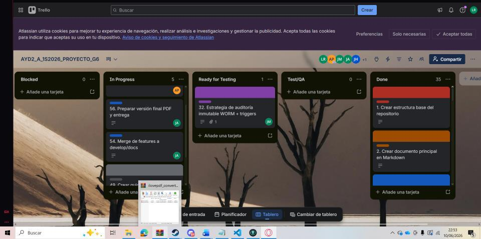
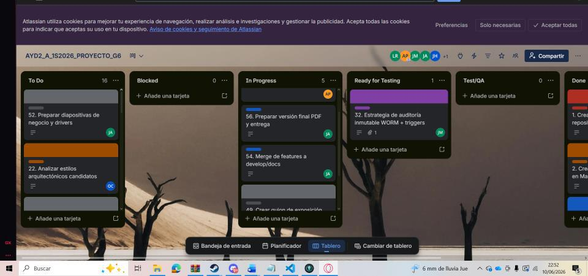

## Fase 1: Plataforma Regional de Certificación de Competencias Digitales - SICA

**Universidad:** Universidad de San Carlos de Guatemala  
**Facultad:** Facultad de Ingeniería  
**Escuela:** Escuela de Ciencias y Sistemas
**Curso:** Análisis y Diseño de Sistemas II
**Período:** Escuela de vacaciones junio de 2026  
**Modalidad:** Proyecto en grupo  
**Enfoque de trabajo:** Documentación y justificación arquitectónica de la solución  

---

## Evolucion documental Fase 1 -> Fase 2 -> Fase 3

La documentacion del proyecto evoluciono de una propuesta arquitectonica inicial hacia evidencia ejecutable, validable y alineada con Git Flow. Esta tabla resume como cada fase agrego valor tecnico, arquitectonico y academico al ecosistema PRCCD/SICA.

| Fase | Enfoque documental | Artefactos consolidados | Evidencia de evolucion |
|---|---|---|---|
| Fase 1 | Definicion arquitectonica y analisis del caso PRCCD/SICA. | Stakeholders, drivers, atributos de calidad, requisitos, casos de uso, vistas UML, decisiones arquitectonicas y trazabilidad inicial. | Se establecio la vision del sistema, el alcance regional y la arquitectura objetivo basada en microservicios, seguridad, auditoria y analitica. |
| Fase 2 | Construccion del MVP y validacion tecnica de la arquitectura. | Microservicios, dashboard BI, certificados, telemetria, evidencia antifraude, adaptadores universitarios, SCRUM, dailies, retrospectiva y burndown. | La documentacion dejo de ser solo conceptual y paso a respaldar codigo ejecutable, decisiones de integracion y evidencia de sprint. |
| Fase 3 | Cierre final, endurecimiento tecnico, automatizacion y pruebas. | Kafka, notificaciones, voz a texto, CI/CD, pruebas unitarias, pruebas de integracion, pruebas de aceptacion, dashboard F3 y backlog final. | Se agrego trazabilidad entre arquitectura, calidad, validacion automatizada, operabilidad y evidencia final para defensa. |

### Criterio de cierre documental

| Nivel | Evidencia |
|---|---|
| Intencion | Fase 1 define que se quiere construir y por que. |
| Ejecucion | Fase 2 demuestra que el diseno puede materializarse en un MVP funcional. |
| Validacion | Fase 3 comprueba el comportamiento mediante pruebas, integracion, CI/CD y evidencia SCRUM. |

---

## Cuadro de roles del grupo

| Integrante | Carnet | Rol propuesto | Responsabilidad principal |
|---|---:|---|---|
| Luis Fernando Gómez Rendón | 201801391 | Scrum Master / Coordinador de repositorio | Organizar el flujo de trabajo, validar estructura del repositorio, coordinar merges, revisar que se cumpla Git Flow y consolidar avances. |
| Ander Gilberto Popol Porón | 201801518 | Product Owner / Analista de negocio | Asegurar que la solución responda al caso SICA, stakeholders, preocupaciones, core del negocio y priorización de características. |
| Jencer Hamilton Hernández Alonzo | 202002141 | Arquitecto de drivers y calidad | Identificar requisitos funcionales, escenarios de atributos de calidad, restricciones y su relación con el problema. |
| Oswaldo Antonio Choc Cuteres | 201901844 | Arquitecto de sistema e infraestructura | Diseñar vistas arquitectónicas, diagrama de bloques, componentes, despliegue y distribución física. |
| Javier Andrés Monjes Solórzano | 202100081 | Diseñador de datos e integración | Elaborar diseño de datos, auditoría, almacenamiento, interoperabilidad, APIs, autenticación y formatos externos. |
| Juan José Gerardi Hernández | 201900532 | Diseñador UI/UX y patrones | Prototipos de interfaces, patrones de diseño, diagramas UML de clases y apoyo en presentación final. |

---

## Consideraciones para el trabajo en Git

El equipo trabajará bajo una estrategia de Git Flow adaptada a la fase documental. La rama principal de trabajo documental será:

```bash
develop/docs
```


A partir de esta rama podrán generarse ramas específicas por sección o entregable, por ejemplo:

```bash
feature/docs-stakeholders
feature/docs-drivers
feature/docs-cdu
feature/docs-trazabilidad
feature/docs-arquitectura
feature/docs-infraestructura
feature/docs-datos
feature/docs-uiux
feature/docs-patrones
feature/docs-kanban
feature/docs-presentacion
```

Cada commit deberá respetar el formato indicado en el enunciado:

```bash
carnet: mensaje
```

Ejemplos:

```bash
201801518: crear estructura base de documentacion
201801391: agregar stakeholders y caso de negocio
202002141: agregar drivers arquitectonicos del sistema
201901844: agregar vistas arquitectonicas de sistema e infraestructura
202100081: agregar diseno de datos e integracion
201900532: agregar prototipos y patrones de diseno
```

---

# Evidencia del Tablero Kanban

Para la gestión ágil del proyecto se utiliza un tablero Kanban en Trello correspondiente al proyecto AYD2_A_1S2026_PROYECTO_G6.

## Herramienta utilizada

Trello.

## Columnas configuradas

El tablero cuenta con las columnas mínimas requeridas para evidenciar el flujo de trabajo del proyecto:

- To Do
- Blocked
- In Progress
- Ready for Testing
- Test/QA
- Done

## Evidencia

La evidencia visual del tablero Kanban se muestra a continuación:





## Observación

El tablero debe utilizarse para representar historias de usuario y tareas relacionadas con el desarrollo arquitectónico de la Plataforma Regional de Certificación de Competencias Digitales. Se debe evitar que el backlog principal esté compuesto únicamente por tareas documentales.
