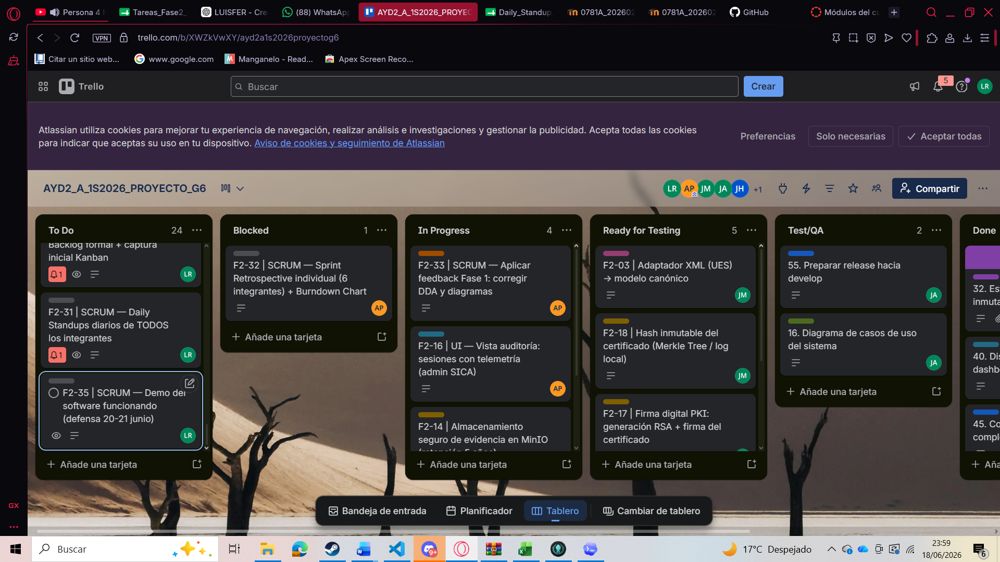
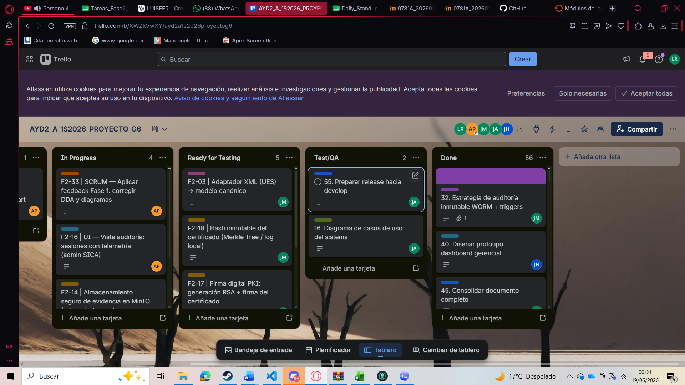
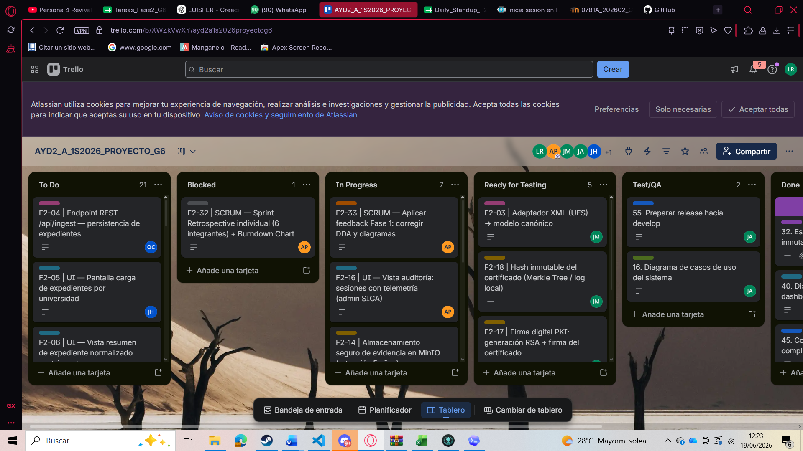

# Sprint Planning y Gestion del Backlog - Fase 2

**Proyecto:** Plataforma Regional de Certificacion de Competencias Digitales (PRCCD/SICA)

**Grupo:** 6

**Sprint:** 15 al 19 de junio de 2026

**Responsable de la gestion SCRUM:** Luis Fernando Gomez Rendon - 201801391

**Rama de trabajo sugerida:** `feature/scrum-docs`

## Objetivo del Sprint

Materializar la arquitectura definida en Fase 1 mediante un MVP funcional que demuestre el flujo core del negocio: ingesta estandarizada de expedientes academicos heredados, ejecucion del examen adaptativo, auditoria, emision/verificacion de certificados digitales, dashboard BI e infraestructura local de soporte.

## Alcance de Sprint Planning

El backlog seleccionado prioriza tareas que conectan directamente con el enunciado de Fase 2: implementacion arquitectonica, gestion agil, integracion heterogenea, trazabilidad, seguridad, operacion on-premise y evidencia de software funcionando. Tambien incluye tareas SCRUM para demostrar dailies, Kanban, retrospectiva y control del avance.

## Equipo y carga asignada

| Integrante | Carnet | Rol Fase 1 | Rol Fase 2 | Modulos asignados | Tareas | Notas clave |
|---|---|---|---|---|---:|---|
| Luis Fernando Gomez | 201801391 | Scrum Master | SM + Dev Frontend | E (Dashboard): tareas 24-25 G (SCRUM): tareas 30-31, 34-35 | 6 | SM NO exento de codigo. Lidera tablero Kanban y dailies. Commits de codigo obligatorios. |
| Ander Gilberto Popol | 201801518 | Product Owner | PO + Dev Frontend | C (vista auditoria): tarea 16 G (SCRUM): tareas 32-33 | 4 | PO debe codificar. Responsable de retrospectiva y aplicacion de feedback Fase 1. |
| Jencer Hamilton Hernandez | 202002141 | Arq. Drivers | Dev Backend (motor) | B (Examen): tareas 7-9 Apoyo en: 5, 11, 18 | 3+apoyo | Lead del algoritmo adaptativo. Toda la logica del motor de evaluacion. |
| Oswaldo Antonio Choc | 201901844 | Arq. Sistema | Dev Backend + Infra | A: tarea 4 B: tarea 10 C: tarea 15 D: tarea 19 E: tareas 22-23 F: tareas 26-27, 29 | 8 | Lead de infraestructura. Endpoints REST, docker-compose, DB migrations y API Gateway. |
| Javier Andres Monjes | 202100081 | Datos e Integracion | Dev Backend (integracion/seguridad) | A: tareas 1-3 C: tareas 13-14 D: tareas 17-18 F: tarea 28 | 8 | Lead de integraciones y seguridad. Adaptadores CSV/JSON/XML, PKI, telemetria, auth federada. |
| Juan Jose Gerardi | 201900532 | UI/UX y Patrones | Dev Frontend (lead) | A: tareas 5-6 B: tareas 11-12 D: tareas 20-21 | 6 | Lead de frontend. Flujos completos: carga expedientes, examen, certificado, verificador. |

## Cronograma del Sprint

| Dia | Fecha | Foco principal | Tareas a completar | Responsables | Daily registrado | Kanban actualizado | Notas |
|---|---|---|---|---|---|---|---|
| Lun | 15/06 | Sprint Planning + Setup infra | Sprint Backlog, docker-compose base, ramas Git Flow creadas (tarea 26,30) | Luis, Oswaldo | Si | Si | Captura inicial del Kanban hoy |
| Mar | 16/06 | Backend: Ingesta + Motor examen | Adaptadores CSV/JSON/XML, banco preguntas, algoritmo adaptativo (tareas 1-3, 7-9) | Javier, Jencer | Si | Si | Daily de todos por la manana |
| Mie | 17/06 | Backend: APIs + Antifraude + PKI | Endpoints REST (tarea 4,10,15,19), telemetria, firma PKI, MinIO (tareas 13-14, 17-18) | Oswaldo, Javier | Si | Si | Integrar ramas feature a develop |
| Jue | 18/06 | Frontend completo + Dashboard + BI | Todas las vistas UI (tareas 5-6,11-12,16,20-21,24-25), agregacion BI (tareas 22-23) | Juan Jose, Luis, Ander | Si | Si | Daily + merge a develop |
| Vie | 19/06 | Integracion final + SCRUM docs + Entrega | Auth federada, API Gateway, retrospectiva, Burndown, PR a main (tareas 28-29,32-35) | Todos | Si | Si | ENTREGA 19/06 - PR a main antes de medianoche |

## Sprint Backlog formal

| ID | Modulo MVP | Tarea tecnica | Tipo | Responsable principal | Apoyo | Rama Git | Commit sugerido | Drivers / EaC | Estado inicial | Relacion con feedback / MVP |
|---:|---|---|---|---|---|---|---|---|---|---|
| F2-01 | A. Ingesta Datos | Disenar e implementar adaptador CSV (USAC) -> modelo canonico | Backend | Javier 202100081 | Oswaldo | `feature/ingesta-usac` | 202100081: implementar adaptador CSV USAC a modelo canonico | RF-integracion, EaC-interop | To Do | Materializa la integracion heterogenea definida en Fase 1 mediante adaptadores y modelo canonico. |
| F2-02 | A. Ingesta Datos | Disenar e implementar adaptador JSON (UCR) -> modelo canonico | Backend | Javier 202100081 | Oswaldo | `feature/ingesta-ucr` | 202100081: implementar adaptador JSON UCR a modelo canonico | RF-integracion, EaC-interop | To Do | Materializa la integracion heterogenea definida en Fase 1 mediante adaptadores y modelo canonico. |
| F2-03 | A. Ingesta Datos | Disenar e implementar adaptador XML (UES) -> modelo canonico | Backend | Javier 202100081 | Oswaldo | `feature/ingesta-ues` | 202100081: implementar adaptador XML UES a modelo canonico | RF-integracion, EaC-interop | To Do | Materializa la integracion heterogenea definida en Fase 1 mediante adaptadores y modelo canonico. |
| F2-04 | A. Ingesta Datos | Crear endpoint REST /api/ingest para recibir expedientes y persistir en DB | Backend | Oswaldo 201901844 | Javier | `feature/api-ingesta` | 201901844: agregar endpoint REST de ingesta de expedientes | RF-integracion, EaC-rendimiento | To Do | Materializa la integracion heterogenea definida en Fase 1 mediante adaptadores y modelo canonico. |
| F2-05 | A. Ingesta Datos | Pantalla frontend: carga de archivo por universidad (CSV/JSON/XML) | Frontend | Juan Jose 201900532 | Jencer | `feature/ui-ingesta` | 201900532: agregar vista de carga de expedientes universitarios | RF-integracion, UX | To Do | Materializa la integracion heterogenea definida en Fase 1 mediante adaptadores y modelo canonico. |
| F2-06 | A. Ingesta Datos | Validar y mostrar resumen de expediente normalizado post-ingesta | Frontend | Juan Jose 201900532 | Javier | `feature/ui-ingesta` | 201900532: mostrar resumen de expediente normalizado en UI | RF-integracion, EaC-usabilidad | To Do | Materializa la integracion heterogenea definida en Fase 1 mediante adaptadores y modelo canonico. |
| F2-07 | B. Examen Adaptativo | Implementar servicio de banco de preguntas (carga desde Google Sheets / JSON local) | Backend | Jencer 202002141 | Oswaldo | `feature/banco-preguntas` | 202002141: implementar servicio de banco de preguntas por nivel | RF-evaluacion, EaC-rendimiento | To Do | Implementa el flujo core del negocio: examen adaptativo, persistencia de sesiones y evaluacion. |
| F2-08 | B. Examen Adaptativo | Implementar algoritmo adaptativo: inicio Intermedio -> sube/baja segun acierto | Backend | Jencer 202002141 | Javier | `feature/motor-adaptativo` | 202002141: implementar logica adaptativa de seleccion de preguntas | RF-evaluacion, EaC-rendimiento | To Do | Implementa el flujo core del negocio: examen adaptativo, persistencia de sesiones y evaluacion. |
| F2-09 | B. Examen Adaptativo | Implementar calculo de ponderacion y dictamen Aprobado/Reprobado al completar 10 preguntas | Backend | Jencer 202002141 | Oswaldo | `feature/motor-adaptativo` | 202002141: implementar calculo de ponderacion y dictamen final | RF-evaluacion, EaC-exactitud | To Do | Implementa el flujo core del negocio: examen adaptativo, persistencia de sesiones y evaluacion. |
| F2-10 | B. Examen Adaptativo | Endpoint REST /api/exam/start y /api/exam/answer para flujo en tiempo real | Backend | Oswaldo 201901844 | Jencer | `feature/api-examen` | 201901844: agregar endpoints REST del motor de examen adaptativo | RF-evaluacion, EaC-rendimiento | To Do | Implementa el flujo core del negocio: examen adaptativo, persistencia de sesiones y evaluacion. |
| F2-11 | B. Examen Adaptativo | Pantalla frontend: flujo completo del examen (10 preguntas, timer, feedback inmediato) | Frontend | Juan Jose 201900532 | Jencer | `feature/ui-examen` | 201900532: agregar vista de ejecucion de examen adaptativo | RF-evaluacion, EaC-usabilidad | To Do | Implementa el flujo core del negocio: examen adaptativo, persistencia de sesiones y evaluacion. |
| F2-12 | B. Examen Adaptativo | Pantalla de resultado: dictamen + desglose por nivel + boton emision certificado | Frontend | Juan Jose 201900532 | Javier | `feature/ui-examen` | 201900532: agregar pantalla de resultado y dictamen del examen | RF-evaluacion, UX | To Do | Implementa el flujo core del negocio: examen adaptativo, persistencia de sesiones y evaluacion. |
| F2-13 | C. Antifraude | Servicio de captura de telemetria: logs de tecleo y eventos de pantalla durante examen | Backend | Javier 202100081 | Jencer | `feature/telemetria` | 202100081: implementar servicio de captura de telemetria antifraude | RF-auditoria, EaC-seguridad | To Do | Asegura trazabilidad operativa y evidencia antifraude mediante auditoria y telemetria. |
| F2-14 | C. Antifraude | Almacenamiento seguro de evidencia en MinIO/S3-local con metadatos de retencion 5 anos | Backend | Javier 202100081 | Oswaldo | `feature/evidencia-storage` | 202100081: agregar almacenamiento seguro de evidencia en MinIO | RF-auditoria, EaC-retencion | To Do | Asegura trazabilidad operativa y evidencia antifraude mediante auditoria y telemetria. |
| F2-15 | C. Antifraude | Endpoint REST /api/audit/trail para consultar rastro de auditoria por sesion | Backend | Oswaldo 201901844 | Javier | `feature/api-auditoria` | 201901844: agregar endpoint de consulta de rastro de auditoria | RF-auditoria, EaC-auditabilidad | To Do | Asegura trazabilidad operativa y evidencia antifraude mediante auditoria y telemetria. |
| F2-16 | C. Antifraude | Vista de auditoria: listado de sesiones con telemetria y estado (admin SICA) | Frontend | Ander 201801518 | Javier | `feature/ui-auditoria` | 201801518: agregar vista de auditoria de sesiones de examen | RF-auditoria, EaC-auditabilidad | To Do | Asegura trazabilidad operativa y evidencia antifraude mediante auditoria y telemetria. |
| F2-17 | D. Credencial Inmutable | Implementar firma digital PKI: generacion par RSA, firma del certificado con clave privada | Backend | Javier 202100081 | Oswaldo | `feature/pki-certificado` | 202100081: implementar firma PKI de certificado aprobado | RF-certificacion, EaC-integridad | To Do | Materializa la emision y verificacion de credenciales digitales con seguridad y PKI. |
| F2-18 | D. Credencial Inmutable | Almacenar hash del certificado en log inmutable (simulacion Hyperledger o Merkle Tree local) | Backend | Javier 202100081 | Jencer | `feature/blockchain-log` | 202100081: registrar hash inmutable de certificado emitido | RF-certificacion, EaC-inmutabilidad | To Do | Materializa la emision y verificacion de credenciales digitales con seguridad y PKI. |
| F2-19 | D. Credencial Inmutable | Endpoint REST /api/certificate/issue y /api/certificate/verify | Backend | Oswaldo 201901844 | Javier | `feature/api-certificado` | 201901844: agregar endpoints de emision y verificacion de certificado | RF-certificacion, EaC-integridad | To Do | Materializa la emision y verificacion de credenciales digitales con seguridad y PKI. |
| F2-20 | D. Credencial Inmutable | Pantalla de certificado: descarga PDF + QR verificable + hash publico | Frontend | Juan Jose 201900532 | Javier | `feature/ui-certificado` | 201900532: agregar vista de certificado verificable con QR | RF-certificacion, UX | To Do | Materializa la emision y verificacion de credenciales digitales con seguridad y PKI. |
| F2-21 | D. Credencial Inmutable | Pantalla verificador externo: consulta de validez por codigo/hash | Frontend | Juan Jose 201900532 | Ander | `feature/ui-verificador` | 201900532: agregar pantalla de verificacion externa de certificado | RF-certificacion, EaC-transparencia | To Do | Materializa la emision y verificacion de credenciales digitales con seguridad y PKI. |
| F2-22 | E. Dashboard BI | Servicio de agregacion y anonimizacion de datos operativos (por pais, carrera, genero) | Backend | Oswaldo 201901844 | Javier | `feature/bi-agregacion` | 201901844: implementar servicio de agregacion anonima para BI | RF-analitica, EaC-privacidad | To Do | Aporta analitica gerencial y usabilidad para consulta de metricas del MVP. |
| F2-23 | E. Dashboard BI | Endpoint REST /api/dashboard/stats (metricas gerenciales pre-calculadas) | Backend | Oswaldo 201901844 | Jencer | `feature/api-dashboard` | 201901844: agregar endpoint de estadisticas gerenciales del dashboard | RF-analitica, EaC-rendimiento | To Do | Aporta analitica gerencial y usabilidad para consulta de metricas del MVP. |
| F2-24 | E. Dashboard BI | Dashboard gerencial: graficas competencias por pais, carrera y genero | Frontend | Luis 201801391 | Oswaldo | `feature/ui-dashboard` | 201801391: implementar dashboard gerencial con graficas de competencias | RF-analitica, EaC-usabilidad | To Do | Aporta analitica gerencial y usabilidad para consulta de metricas del MVP. |
| F2-25 | E. Dashboard BI | Filtros interactivos en dashboard (selector pais / carrera / genero / rango fechas) | Frontend | Luis 201801391 | Juan Jose | `feature/ui-dashboard` | 201801391: agregar filtros interactivos al dashboard gerencial | RF-analitica, EaC-usabilidad | To Do | Aporta analitica gerencial y usabilidad para consulta de metricas del MVP. |
| F2-26 | F. Infraestructura | Configurar docker-compose: PostgreSQL + MongoDB + MinIO + backend + frontend | Infra | Oswaldo 201901844 | Luis | `feature/infra-docker` | 201901844: agregar docker-compose completo del entorno MVP | EaC-portabilidad, EaC-rendimiento | To Do | Soporta despliegue local on-premise, seguridad de acceso y operacion integrada. |
| F2-27 | F. Infraestructura | Crear scripts de migracion BD: tablas Candidato, Evaluacion, Certificado, Auditoria | Infra | Oswaldo 201901844 | Javier | `feature/infra-db` | 201901844: agregar scripts de migracion de base de datos | RF-persistencia, EaC-mantenibilidad | To Do | Soporta despliegue local on-premise, seguridad de acceso y operacion integrada. |
| F2-28 | F. Infraestructura | Configurar autenticacion federada local (Keycloak/mock SAML) para 3 universidades | Infra | Javier 202100081 | Oswaldo | `feature/auth-federada` | 202100081: configurar autenticacion federada local para universidades | RF-autenticacion, EaC-seguridad | To Do | Soporta despliegue local on-premise, seguridad de acceso y operacion integrada. |
| F2-29 | F. Infraestructura | Configurar API Gateway (Kong / Nginx reverse proxy) con rutas a microservicios | Infra | Oswaldo 201901844 | Luis | `feature/infra-gateway` | 201901844: configurar api gateway y enrutamiento de microservicios | EaC-escalabilidad, EaC-seguridad | To Do | Soporta despliegue local on-premise, seguridad de acceso y operacion integrada. |
| F2-30 | G. SCRUM | Crear Sprint Backlog formal (tabla) + captura inicial tablero Kanban | SCRUM | Luis 201801391 | Todos | `feature/scrum-docs` | 201801391: agregar sprint backlog inicial y captura kanban fase dos | Gestion agil | To Do | Formaliza Sprint Planning y trazabilidad de tareas contra el enunciado de Fase 2. |
| F2-31 | G. SCRUM | Registrar Daily Standups de TODOS los integrantes (diario, en Markdown) | SCRUM | Luis 201801391 | Todos | `feature/scrum-docs` | 201801391: registrar dailies del sprint de desarrollo | Gestion agil, metodologia | To Do | Evidencia ejecucion diaria de SCRUM y seguimiento tecnico individual. |
| F2-32 | G. SCRUM | Redactar Sprint Retrospective individual (6 integrantes) + Burndown Chart | SCRUM | Ander 201801518 | Luis | `feature/scrum-docs` | 201801518: agregar retrospectiva del sprint y burndown chart | Gestion agil, reflexion | To Do | Documenta cierre del sprint, aprendizaje arquitectonico y avance real del equipo. |
| F2-33 | G. SCRUM | Aplicar feedback Fase 1: corregir DDA y diagramas si aplica | SCRUM | Ander 201801518 | Todos | `feature/feedback-f1` | 201801518: aplicar correcciones de feedback de fase uno | Retroalimentacion academica | To Do | Resuelve observaciones de Fase 1 en DDA y diagramas antes de consolidar entrega. |
| F2-34 | G. SCRUM | Actualizar Kanban Trello con tarjetas Fase 2 (columnas obligatorias) | SCRUM | Luis 201801391 | Ander | `feature/scrum-docs` | 201801391: actualizar tablero kanban con tareas de fase dos | Gestion agil | To Do | Formaliza Sprint Planning y trazabilidad de tareas contra el enunciado de Fase 2. |
| F2-35 | G. SCRUM | Preparar demostracion del software funcionando (todos presentes en defensa) | SCRUM | Todos | - | `develop` | 201801391: preparar demo del mvp para defensa final | Entrega, comunicacion | To Do | Prepara evidencia de software funcionando y entrega final del MVP. |

## Evidencia del tablero Kanban

El tablero Kanban se gestiono con las columnas obligatorias solicitadas en el enunciado: `To Do`, `Blocked`, `In Progress`, `Ready for Testing`, `Test/QA` y `Done`. Las capturas siguientes documentan el estado registrado durante la planificacion y seguimiento del sprint.

## Criterios de gestion

- Cada tarjeta del tablero debe reflejar una tarea tecnica, arquitectonica o SCRUM trazable al MVP.
- Los estados del Kanban deben actualizarse diariamente durante el sprint.
- Las tareas de documentacion SCRUM no sustituyen los aportes tecnicos de codigo requeridos para cada integrante.
- Las observaciones de Fase 1 deben reflejarse en tareas de correccion de DDA, diagramas o implementacion, especialmente en las tareas asociadas a feedback y trazabilidad.
- La evidencia final del sprint debe complementarse con retrospectiva, captura final del Kanban y burndown chart o resumen de completadas vs pendientes.

## Estado de esta documentacion

Este documento cubre el apartado **Sprint Planning y Gestion del Backlog** solicitado por el enunciado de Fase 2. Los apartados de Daily Standup y Sprint Retrospective/Burndown se mantienen como documentos o secciones complementarias dentro de la bitacora SCRUM del repositorio.
