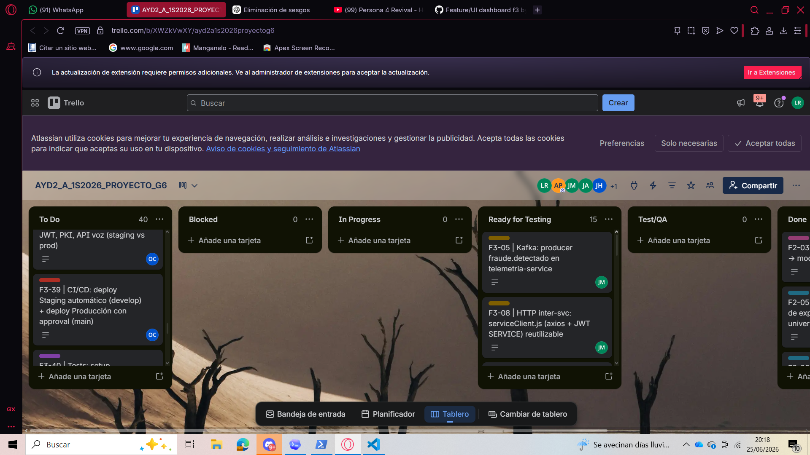
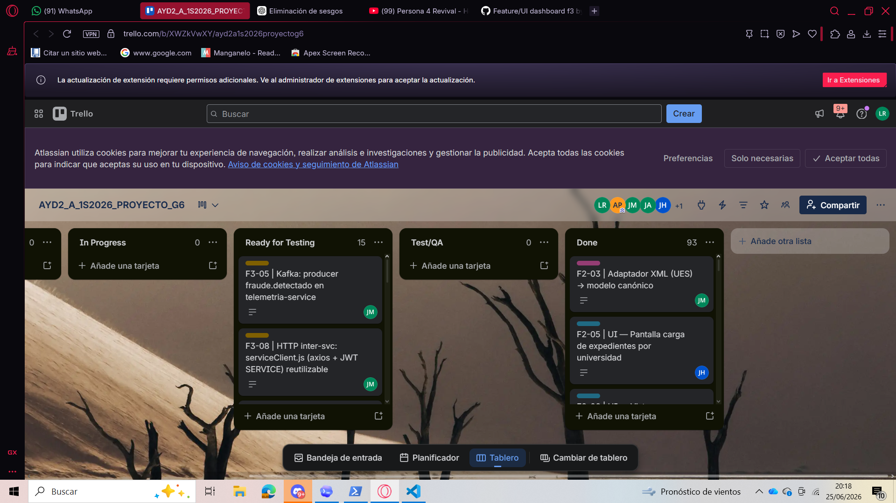

# Sprint Planning y Gestión del Backlog - Fase 3

**Proyecto:** Plataforma Regional de Certificación de Competencias Digitales (PRCCD/SICA)  
**Grupo:** 6  
**Curso:** Análisis y Diseño de Sistemas 2 - Sección A  
**Escuela de Vacaciones:** Junio 2026  
**Sprint:** 22 al 26 de junio de 2026  
**Calificación:** 27 y 28 de junio de 2026  
**Responsable de la gestión SCRUM:** Luis Fernando Gómez Rendón - 201801391  

---

## 1. Objetivo del Sprint

Cerrar la Fase 3 del MVP de la **Plataforma Regional de Certificación de Competencias Digitales (PRCCD/SICA)** integrando mejoras de arquitectura, comunicación asíncrona con Kafka, servicio transversal de notificaciones, procesamiento de respuestas por voz desde dispositivos móviles, pruebas automatizadas, pipeline de integración y despliegue continuo, actualización del dashboard, verificación pública sin autenticación y evidencia formal de gestión ágil.

El Sprint se enfoca en que el sistema deje de ser únicamente un MVP funcional de Fase 2 y pase a ser un ecosistema más operable, verificable, mantenible y defendible técnicamente. La evolución se realiza sin romper los flujos core ya construidos: ingesta, examen adaptativo, antifraude, certificación digital, auditoría y dashboard gerencial.

---

## 2. Alcance de Sprint Planning Fase 3

El backlog seleccionado prioriza tareas que responden directamente al enunciado de Fase 3 y al feedback recibido en Fase 2. En esta fase ya no se busca repetir la construcción inicial del MVP, sino evolucionarlo con capacidades de producción, accesibilidad, integración asíncrona y validación de calidad.

### Alcance técnico principal

| Hito | Descripción |
|---|---|
| Verificador público | El endpoint y la pantalla de verificación deben funcionar sin requerir sesión o token. |
| Kafka y eventos | Se incorporan eventos asíncronos para examen completado, certificado emitido y fraude detectado. |
| HTTP inter-service | Se eliminan consultas cruzadas directas entre servicios y se reemplazan por endpoints internos seguros. |
| Notificaciones | Se abstrae un servicio transversal para correos y alertas a candidatos, universidades y auditores. |
| Voz a texto | Se incorpora un flujo para que el candidato responda por voz desde móvil y la transcripción alimente el motor adaptativo. |
| Frontend F3 | Se actualizan pantallas públicas, dashboard, certificado, alertas y experiencia móvil. |
| CI/CD | Se implementa pipeline con fases Test, Build y Deploy hacia Staging y Producción. |
| Pruebas | Se documentan pruebas unitarias, integración y aceptación con evidencia en video. |
| MinIO y evidencia | Se amplía la capacidad de captura de evidencia y se documenta el contrato de captura desde frontend. |
| DDA y SCRUM | Se actualiza la arquitectura, endpoints, README evolutivo, dailies, retrospective, Burndown y feedback. |

---

## 3. Actualización respecto al Planning Backlog de Fase 2

En Fase 2 el Sprint se concentró en materializar la arquitectura base mediante el MVP: ingesta, examen adaptativo, antifraude, credenciales, dashboard, infraestructura local y documentación Scrum. Para Fase 3, el backlog se actualiza con una lógica de cierre y endurecimiento técnico.

| Elemento Fase 2 | Evolución en Fase 3 |
|---|---|
| Ingesta, examen y certificados funcionales | Se conectan con eventos Kafka, notificaciones y pruebas de integración. |
| Verificación de certificados | Se corrige para que el verificador público no exija autenticación. |
| Auditoría y antifraude | Se refuerza con eventos `fraude.detectado`, alertas y evidencia ampliada en MinIO. |
| Dashboard BI | Se actualiza con indicadores de Fase 3 y estado de despliegue CI/CD. |
| Infraestructura local | Se extiende hacia pipeline CI/CD, Staging y Producción. |
| Documentación SCRUM | Se mantiene la bitácora diaria, retrospectiva y Burndown, ahora vinculada con cierre de Fase 3. |
| DDA de arquitectura | Se actualiza para justificar voz, pipes and filters, Kafka, notificaciones y evolución multi-entorno. |

---

## 4. Equipo y carga asignada

| Integrante | Carnet | Rol Fase 3 | Tareas asignadas | # | Tipo | Descripción |
| --- | --- | --- | --- | --- | --- | --- |
| Javier Andrés Monjes | 202100081 | Backend Integración/Seg. + CI/CD Test |  HOTFIX: tareas 1<br>A. Kafka: tareas 4,5,6,7<br>B. HTTP Inter-svc: tareas 8,9,10,12,13,16<br>C. Notificaciones: tareas 19,20<br>F. CI/CD: tareas 37<br>H. MinIO: tareas 48 | 15 | Hotfix + Backend + CI/CD | Tareas: 1, 4, 5, 6, 7, 8, 9, 10, 12, 13, 16, 19, 20, 37, 48 |
| Oswaldo Antonio Choc | 201901844 | Backend Infra + CI/CD Build/Deploy | A. Kafka: tareas 3<br>B. HTTP Inter-svc: tareas 11,14<br>C. Notificaciones: tareas 17,18<br>F. CI/CD: tareas 38,39,40,41 | 9 | Infra + Backend + CI/CD | Tareas: 3, 11, 14, 17, 18, 38, 39, 40, 41 |
| Jencer Hamilton Hernández | 202002141 | Backend Motor + Testing | B. HTTP Inter-svc: tareas 15<br>D. Voz-a-Texto: tareas 23,24,25<br>G. Pruebas: tareas 43,44,45,46 | 8 | Backend + Testing | Tareas: 15, 23, 24, 25, 43, 44, 45, 46 |
| Juan José Gerardi | 201900532 | Frontend Lead |  HOTFIX: tareas 2<br>D. Voz-a-Texto: tareas 26,27,28<br>E. Frontend F3: tareas 29,30,35<br>H. MinIO: tareas 49 | 8 | Hotfix + Frontend + Documentación | Tareas: 2, 26, 27, 28, 29, 30, 35, 49 |
| Luis Fernando Gómez | 201801391 | SM + Frontend + Testing | C. Notificaciones: tareas 21<br>E. Frontend F3: tareas 33,34<br>G. Pruebas: tareas 42,47<br>I. DDA: tareas 52<br>J. SCRUM: tareas 53,54 | 8 | Infra + Frontend + Testing + Documentación + SCRUM | Tareas: 21, 33, 34, 42, 47, 52, 53, 54 |
| Ander Gilberto Popol | 201801518 | PO + Frontend + Testing + Doc | D. Voz-a-Texto: tareas 22<br>E. Frontend F3: tareas 31,32,36<br>I. DDA: tareas 50,51<br>J. SCRUM: tareas 55,56 | 8 | Arquitectura + Frontend + Documentación + SCRUM | Tareas: 22, 31, 32, 36, 50, 51, 55, 56 |

---

## 5. Resumen por módulo del backlog

| Módulo | Cantidad de tareas | Propósito dentro de Fase 3 |
| --- | --- | --- |
| HOTFIX | 2 | Corrige el acceso público al verificador externo y resuelve una observación funcional crítica de Fase 2. |
| A. Kafka | 5 | Introduce comunicación asíncrona para desacoplar eventos de examen, certificación y fraude. |
| B. HTTP Inter-svc | 9 | Elimina dependencias cruzadas directas entre servicios y mejora la mantenibilidad del ecosistema. |
| C. Notificaciones | 5 | Materializa el servicio transversal de alertas solicitado para candidatos, universidades y auditores. |
| D. Voz-a-Texto | 7 | Responde al nuevo requisito de accesibilidad: contestar el examen adaptativo por voz desde móvil. |
| E. Frontend F3 | 8 | Actualiza la experiencia de usuario para verificación pública, alertas, dashboard y certificado. |
| F. CI/CD | 5 | Automatiza pruebas, build y despliegue multi-entorno para Staging y Producción. |
| G. Pruebas | 6 | Asegura calidad mediante pruebas unitarias, integración y aceptación documentadas. |
| H. MinIO | 2 | Fortalece la captura y almacenamiento de evidencia antifraude de mayor tamaño. |
| I. DDA | 3 | Actualiza la documentación arquitectónica con decisiones de Fase 3 y evolución entre fases. |
| J. SCRUM | 4 | Formaliza la gestión ágil, evidencias, dailies, retrospectiva y feedback de la iteración. |

---

## 6. Resumen por tipo de tarea

| Tipo de tarea | Cantidad |
| --- | --- |
| Hotfix | 2 |
| Infra | 2 |
| Backend | 21 |
| Arquitectura | 1 |
| Frontend | 11 |
| CI/CD | 5 |
| Testing | 6 |
| Documentación | 4 |
| SCRUM | 4 |

---

## 7. Cronograma del Sprint

| Día | Fecha | Foco del día | Tareas | Responsables | Daily | Kanban | Notas críticas |
| --- | --- | --- | --- | --- | --- | --- | --- |
| Dom | 22/06 |  HOTFIXES + Planning + Kafka base + Setup | Hotfix backend verify (1), Hotfix UI verificador (2), Kafka docker-compose (3), topics.js (4), Setup Jest (42), Sprint Backlog (53) | Javier, Juan José, Oswaldo, Luis | ☑ | ☑ | HOTFIXES primero — son 2 líneas de código. Planning HOY. Captura Kanban ANTES de codificar. |
| Lun | 23/06 | Kafka producers + HTTP inter-svc + migración + endpoints internos | Producers kafka (5-7), migración email+modelo (8,9), serviceClient (10), endpoints stats+suspender (11,14,15), lecturas cruzadas (12,13,16) | Javier, Oswaldo, Jencer | ☑ | ☑ | Mayor carga de código. Javier y Oswaldo en paralelo todo el día. |
| Mar | 24/06 | Notificaciones + Voz-service + UI voz + UI verificador + CI/CD Test+Build | Scaffold+mailer (17,18), handlers Kafka (19,20), docker notif (21), voz-service (23-25), UI voz (26-28), UI verificador (29,30), CI/CD test+build (37,38), DDA voz (22) | Oswaldo, Javier, Luis, Jencer, Juan José, Ander | ☑ | ☑ | Merge features listas a develop. Todos codifican hoy. |
| Mié | 25/06 | CI/CD deploy + UI dashboard+notif+certificado + 5 unitarias + Videos integración | CI/CD staging+prod+secrets (39,40,41), UI dashboard F3 (33,34), UI toast+alerta (31,32), botón compartir (35), UX feedback (36), 5 unitarias (43), videos integración (44,45,46), DDA+API docs (50,51) | Oswaldo, Luis, Ander, Juan José, Javier, Jencer | ☑ | ☑ | Videos de pruebas se graban hoy. DDA actualizado por Ander. |
| Jue | 26/06 | Video aceptación + MinIO + README + Retrospectiva + ENTREGA | Video aceptación (47), MinIO (48,49), README evolución (52), Retrospectiva+feedback (55,56), Dailies (54), merge a main | Luis, Javier, Juan José, Ander | ☑ | ☑ | ENTREGA 26/06. PR a main antes de medianoche. Captura Kanban final TODO en Done. |

---

## 8. Flujo Kanban obligatorio

El tablero Trello del equipo mantiene las columnas solicitadas para la gestión Scrum/Kanban. Cada tarjeta debe moverse según evidencia real de avance y no únicamente por intención de trabajo.

| Columna | Uso dentro del Sprint |
|---|---|
| To Do | Tareas priorizadas pendientes de iniciar. |
| Blocked | Tareas detenidas por dependencia técnica, acceso, ambiente o decisión pendiente. |
| In Progress | Trabajo activo en desarrollo, documentación o integración. |
| Ready for Testing | Tareas listas para revisión funcional, técnica o documental. |
| Test/QA | Validación formal, pruebas, demo o revisión cruzada. |
| Done | Tareas cerradas con evidencia suficiente. |

---

## 9. Captura inicial del tablero Kanban Fase 3

Las siguientes capturas evidencian el estado inicial de planificación y distribución del tablero para la Fase 3. Se observan tarjetas F3 organizadas en las columnas obligatorias del flujo Scrum/Kanban.





### Resumen del tablero al momento de captura

| Columna | Cantidad observada | Lectura Scrum |
| --- | --- | --- |
| To Do | 40 | Backlog pendiente para cierre de Fase 3, incluyendo CI/CD, pruebas, documentación final y ajustes técnicos. |
| Blocked | 0 | No se observan bloqueos formales al momento de la captura inicial. |
| In Progress | 0 | No había tarjetas activas en desarrollo al momento de iniciar la planificación. |
| Ready for Testing | 15 | Existían entregables listos para validación técnica o documental. |
| Test/QA | 0 | No había pruebas formalmente en ejecución al momento de la captura. |
| Done | 93 | El tablero conserva evidencia acumulada de fases anteriores y avances ya integrados. |

---

## 10. Priorización del Sprint

| Prioridad | Elementos incluidos | Criterio de priorización |
| --- | --- | --- |
| Crítica | Hotfix verificador público, Kafka base, CI/CD, voz-service y notificaciones | Bloquean flujos centrales de Fase 3 y la defensa del sistema evolucionado. |
| Alta | HTTP inter-service, productores Kafka, UI de voz, verificador público, pruebas unitarias e integración | Reducen acoplamiento, validan calidad y materializan los nuevos requisitos. |
| Media | Dashboard F3, UX feedback, documentación DDA, README evolutivo y contratos | Mejoran mantenibilidad, trazabilidad y presentación técnica del cierre. |
| Control | Dailies, retrospectiva, Burndown, captura inicial y final de Kanban | Evidencian cumplimiento Scrum y seguimiento real del Sprint. |

---

## 11. Definition of Ready

Una tarjeta de Fase 3 se considera lista para iniciar cuando cumple con los siguientes criterios:

| Criterio | Descripción |
|---|---|
| Alcance claro | La tarea tiene módulo, responsable, apoyo, rama Git y commit sugerido. |
| Driver asociado | La tarea está vinculada a RF, EaC, gestión ágil o trazabilidad académica. |
| Entrada técnica disponible | Existen endpoints, contratos, diseño, captura, documento o servicio base requerido. |
| Criterio de validación | Se conoce cómo demostrar que la tarea está completa: prueba, build, captura, video o PR. |
| Dependencia identificada | Se conoce si la tarea depende de Kafka, endpoints internos, UI, CI/CD, voz-service o DDA. |

---

## 12. Definition of Done

| Criterio | Descripción |
| --- | --- |
| Código o documento integrado | El cambio existe en la rama correspondiente y queda versionado con el formato de commit por carnet. |
| Validación ejecutada | Se ejecutó build, test, revisión documental, captura, video o prueba aplicable según la tarea. |
| Trazabilidad visible | La tarea puede rastrearse mediante ID F3, rama Git, commit sugerido, PR o captura del tablero. |
| Sin bloqueo crítico | Las dependencias quedan cerradas o registradas explícitamente en la columna Blocked del Kanban. |
| Evidencia disponible | Existe captura, video, resultado de prueba, documento de soporte o evidencia de ejecución. |
| Relación con Fase 3 | La tarea demuestra voz, notificaciones, CI/CD, pruebas, actualización DDA o feedback de Fase 2. |

---

## 13. Sprint Backlog formal Fase 3

| ID | Módulo F3 | Tarea técnica | Tipo | Responsable principal | Apoyo | Rama Git | Commit sugerido | Drivers / EaC | Estado inicial | Relación con Fase 3 / Feedback |
| --- | --- | --- | --- | --- | --- | --- | --- | --- | --- | --- |
| F3-01 | HOTFIX | Quitar authMiddleware de GET /api/certificate/verify — debe ser público sin token (RF-10) | Hotfix | Javier<br>202100081 | Oswaldo | `hotfix/public-verify-endpoint` | 202100081: hacer endpoint verify certificado publico sin autenticacion | RF-10, EaC-accesibilidad | To Do | Corrige el acceso público al verificador externo y resuelve una observación funcional crítica de Fase 2. |
| F3-02 | HOTFIX | UI — Actualizar pantalla verificador externo: remover cualquier redirect a login si no hay sesión | Hotfix | Juan José<br>201900532 | Javier | `hotfix/public-verify-endpoint` | 201900532: quitar redirect a login en pantalla verificador externo | RF-10, UX | To Do | Corrige el acceso público al verificador externo y resuelve una observación funcional crítica de Fase 2. |
| F3-03 | A. Kafka | Agregar servicio Kafka KRaft al docker-compose (sin Zookeeper, puerto 9092, healthcheck) | Infra | Oswaldo<br>201901844 | Javier | `feature/infra-kafka` | 201901844: agregar servicio kafka kraft al docker-compose | EaC-escalabilidad | To Do | Introduce comunicación asíncrona para desacoplar eventos de examen, certificación y fraude. |
| F3-04 | A. Kafka | Definir topics.js compartido: examen.completado, certificado.emitido, fraude.detectado | Backend | Javier<br>202100081 | Oswaldo | `feature/kafka-topics` | 202100081: definir contrato de topics kafka compartido | EaC-interoperabilidad | To Do | Introduce comunicación asíncrona para desacoplar eventos de examen, certificación y fraude. |
| F3-05 | A. Kafka | Producer kafka en examen-service — evento examen.completado tras completar evaluación | Backend | Javier<br>202100081 | Oswaldo | `feature/kafka-examen` | 202100081: implementar producer kafka examen completado | EaC-asincronismo | To Do | Introduce comunicación asíncrona para desacoplar eventos de examen, certificación y fraude. |
| F3-06 | A. Kafka | Producer kafka en certificado-service — evento certificado.emitido tras INSERT exitoso | Backend | Javier<br>202100081 | Oswaldo | `feature/kafka-certificado` | 202100081: implementar producer kafka certificado emitido | EaC-asincronismo | To Do | Introduce comunicación asíncrona para desacoplar eventos de examen, certificación y fraude. |
| F3-07 | A. Kafka | Producer kafka en telemetria-service — evento fraude.detectado en suspenderSiCorresponde() | Backend | Javier<br>202100081 | Jencer | `feature/kafka-telemetria` | 202100081: implementar producer kafka fraude detectado | EaC-seguridad | To Do | Introduce comunicación asíncrona para desacoplar eventos de examen, certificación y fraude. |
| F3-08 | B. HTTP Inter-svc | Migración SQL: ALTER TABLE candidatos ADD COLUMN email VARCHAR(255) | Backend | Javier<br>202100081 | Oswaldo | `feature/http-intersvc` | 202100081: agregar columna email a tabla candidatos | RF-notificaciones | To Do | Elimina dependencias cruzadas directas entre servicios y mejora la mantenibilidad del ecosistema. |
| F3-09 | B. HTTP Inter-svc | Actualizar candidato.model.js en auth-service e ingesta-service con campo email | Backend | Javier<br>202100081 | Oswaldo | `feature/http-intersvc` | 202100081: actualizar modelo candidato con campo email | RF-notificaciones | To Do | Elimina dependencias cruzadas directas entre servicios y mejora la mantenibilidad del ecosistema. |
| F3-10 | B. HTTP Inter-svc | Crear serviceClient.js (axios + JWT SERVICE) reutilizable en todos los servicios | Backend | Javier<br>202100081 | Oswaldo | `feature/http-intersvc` | 202100081: crear service client base con jwt service | EaC-seguridad | To Do | Elimina dependencias cruzadas directas entre servicios y mejora la mantenibilidad del ecosistema. |
| F3-11 | B. HTTP Inter-svc | Endpoint interno GET /api/auth/candidatos/:id en auth-service (rol SERVICE) | Backend | Oswaldo<br>201901844 | Javier | `feature/http-intersvc` | 201901844: agregar endpoint interno candidatos auth-service | EaC-encapsulamiento | To Do | Elimina dependencias cruzadas directas entre servicios y mejora la mantenibilidad del ecosistema. |
| F3-12 | B. HTTP Inter-svc | Eliminar SELECT cruzado en certificado-service → HTTP a examen-service y auth-service | Backend | Javier<br>202100081 | Oswaldo | `feature/http-intersvc` | 202100081: eliminar lectura cruzada sesiones en certificado-service | EaC-mantenibilidad | To Do | Elimina dependencias cruzadas directas entre servicios y mejora la mantenibilidad del ecosistema. |
| F3-13 | B. HTTP Inter-svc | Eliminar lecturas cruzadas en telemetria-service → HTTP a examen + auditoria service | Backend | Javier<br>202100081 | Oswaldo | `feature/http-intersvc` | 202100081: eliminar lecturas cruzadas en telemetria-service | EaC-mantenibilidad | To Do | Elimina dependencias cruzadas directas entre servicios y mejora la mantenibilidad del ecosistema. |
| F3-14 | B. HTTP Inter-svc | Endpoints stats internos: /api/ingesta/candidatos/stats y /api/examen/stats (rol SERVICE) | Backend | Oswaldo<br>201901844 | Javier | `feature/http-intersvc` | 201901844: agregar endpoints stats internos ingesta y examen | RF-analítica | To Do | Elimina dependencias cruzadas directas entre servicios y mejora la mantenibilidad del ecosistema. |
| F3-15 | B. HTTP Inter-svc | Endpoint PATCH /api/examen/sesion/:id/suspender en examen-service (rol SERVICE) | Backend | Jencer<br>202002141 | Oswaldo | `feature/http-intersvc` | 202002141: agregar endpoint patch suspender sesion examen | EaC-encapsulamiento | To Do | Elimina dependencias cruzadas directas entre servicios y mejora la mantenibilidad del ecosistema. |
| F3-16 | B. HTTP Inter-svc | Eliminar lecturas cruzadas en dashboard-service → HTTP a ingesta + examen service | Backend | Javier<br>202100081 | Oswaldo | `feature/http-intersvc` | 202100081: eliminar lecturas cruzadas en dashboard-service | EaC-mantenibilidad | To Do | Elimina dependencias cruzadas directas entre servicios y mejora la mantenibilidad del ecosistema. |
| F3-17 | C. Notificaciones | Scaffold notificaciones-service: package.json, Dockerfile, app.js, env.js (puerto 3008) | Backend | Oswaldo<br>201901844 | Javier | `feature/notificaciones-svc` | 201901844: crear scaffold de notificaciones-service | RF-notificaciones | To Do | Materializa el servicio transversal de alertas solicitado para candidatos, universidades y auditores. |
| F3-18 | C. Notificaciones | Implementar mailer.js con nodemailer (Ethereal para dev, SMTP configurable prod) | Backend | Oswaldo<br>201901844 | Javier | `feature/notificaciones-svc` | 201901844: implementar mailer nodemailer smtp configurable | RF-notificaciones | To Do | Materializa el servicio transversal de alertas solicitado para candidatos, universidades y auditores. |
| F3-19 | C. Notificaciones | Consumer Kafka + handler certificadoEmitido: email candidato (hash+link verify) + universidad | Backend | Javier<br>202100081 | Oswaldo | `feature/notificaciones-svc` | 202100081: implementar handler certificado emitido email candidato universidad | RF-notificaciones | To Do | Materializa el servicio transversal de alertas solicitado para candidatos, universidades y auditores. |
| F3-20 | C. Notificaciones | Handler fraudeDetectado: alerta inmediata a AUDITORES_SICA_EMAILS | Backend | Javier<br>202100081 | Oswaldo | `feature/notificaciones-svc` | 202100081: implementar handler fraude detectado alerta auditores | EaC-seguridad | To Do | Materializa el servicio transversal de alertas solicitado para candidatos, universidades y auditores. |
| F3-21 | C. Notificaciones | Integrar notificaciones-service a docker-compose (depends_on kafka) y nginx.conf | Infra | Luis<br>201801391 | Oswaldo | `feature/notificaciones-svc` | 201801391: integrar notificaciones-service docker-compose nginx | EaC-integración | To Do | Materializa el servicio transversal de alertas solicitado para candidatos, universidades y auditores. |
| F3-22 | D. Voz-a-Texto | Actualizar DDA: estilo Pipes & Filters para flujo audio — justificar sin degradar EaCs | Arquitectura | Ander<br>201801518 | Luis | `feature/dda-voz` | 201801518: documentar pipes and filters para voz en dda | RF-voz, EaC-adaptabilidad | To Do | Responde al nuevo requisito de accesibilidad: contestar el examen adaptativo por voz desde móvil. |
| F3-23 | D. Voz-a-Texto | Scaffold voz-service + endpoint POST /api/voz/transcribir (recibe audio, retorna texto) | Backend | Jencer<br>202002141 | Javier | `feature/voz-service` | 202002141: crear voz-service con endpoint transcripcion | RF-voz, EaC-latencia | To Do | Responde al nuevo requisito de accesibilidad: contestar el examen adaptativo por voz desde móvil. |
| F3-24 | D. Voz-a-Texto | Integrar Web Speech API o Whisper en voz-service para Speech-to-Text real | Backend | Jencer<br>202002141 | Javier | `feature/voz-service` | 202002141: integrar motor speech-to-text en voz-service | RF-voz | To Do | Responde al nuevo requisito de accesibilidad: contestar el examen adaptativo por voz desde móvil. |
| F3-25 | D. Voz-a-Texto | Conectar salida de voz-service al motor adaptativo (POST /api/exam/answer) | Backend | Jencer<br>202002141 | Oswaldo | `feature/voz-service` | 202002141: conectar transcripcion al motor adaptativo | RF-voz, RF-evaluación | To Do | Responde al nuevo requisito de accesibilidad: contestar el examen adaptativo por voz desde móvil. |
| F3-26 | D. Voz-a-Texto | UI móvil — Toggle voz/texto en pantalla de examen + botón grabar + visualizador audio | Frontend | Juan José<br>201900532 | Jencer | `feature/ui-voz` | 201900532: agregar toggle voz texto y boton grabar en examen movil | RF-voz, EaC-usabilidad | To Do | Responde al nuevo requisito de accesibilidad: contestar el examen adaptativo por voz desde móvil. |
| F3-27 | D. Voz-a-Texto | UI móvil — Mostrar transcripción con botones Confirmar y Repetir antes de enviar | Frontend | Juan José<br>201900532 | Jencer | `feature/ui-voz` | 201900532: mostrar transcripcion confirmacion respuesta por voz | RF-voz, UX | To Do | Responde al nuevo requisito de accesibilidad: contestar el examen adaptativo por voz desde móvil. |
| F3-28 | D. Voz-a-Texto | UI móvil — Adaptar layout del examen para pantallas pequeñas (responsive mobile) | Frontend | Juan José<br>201900532 | Ander | `feature/ui-voz` | 201900532: adaptar layout examen responsive para movil | RF-voz, EaC-usabilidad | To Do | Responde al nuevo requisito de accesibilidad: contestar el examen adaptativo por voz desde móvil. |
| F3-29 | E. Frontend F3 | UI — Pantalla verificador público: acceso sin login, campo hash/código/QR scanner | Frontend | Juan José<br>201900532 | Javier | `feature/ui-verificador-publico` | 201900532: actualizar pantalla verificador sin requerir login | RF-10, EaC-accesibilidad | To Do | Actualiza la experiencia de usuario para verificación pública, alertas, dashboard y certificado. |
| F3-30 | E. Frontend F3 | UI — Resultado de verificación público: datos básicos del certificado sin exponer PII | Frontend | Juan José<br>201900532 | Ander | `feature/ui-verificador-publico` | 201900532: mostrar resultado verificacion publica sin datos personales | RF-10, EaC-privacidad | To Do | Actualiza la experiencia de usuario para verificación pública, alertas, dashboard y certificado. |
| F3-31 | E. Frontend F3 | UI — Toast/banner cuando certificado es emitido (hash + botón ir a verificador) | Frontend | Ander<br>201801518 | Juan José | `feature/ui-notificaciones` | 201801518: agregar toast certificado emitido con link a verificador | RF-notificaciones, UX | To Do | Actualiza la experiencia de usuario para verificación pública, alertas, dashboard y certificado. |
| F3-32 | E. Frontend F3 | UI — Alerta visual de fraude en panel admin (badge rojo + contador de alertas pendientes) | Frontend | Ander<br>201801518 | Juan José | `feature/ui-notificaciones` | 201801518: agregar alerta visual fraude en panel admin | RF-auditoría, UX | To Do | Actualiza la experiencia de usuario para verificación pública, alertas, dashboard y certificado. |
| F3-33 | E. Frontend F3 | UI — Dashboard: actualizar gráficas con nuevos datos de Fase 3 (endpoint /stats internos) | Frontend | Luis<br>201801391 | Juan José | `feature/ui-dashboard-f3` | 201801391: actualizar dashboard con nuevos endpoints stats fase tres | RF-analítica, EaC-usabilidad | To Do | Actualiza la experiencia de usuario para verificación pública, alertas, dashboard y certificado. |
| F3-34 | E. Frontend F3 | UI — Dashboard: agregar indicador de estado del pipeline CI/CD (Staging vs Producción) | Frontend | Luis<br>201801391 | Juan José | `feature/ui-dashboard-f3` | 201801391: agregar indicador estado cicd en dashboard | EaC-operabilidad | To Do | Actualiza la experiencia de usuario para verificación pública, alertas, dashboard y certificado. |
| F3-35 | E. Frontend F3 | UI — Pantalla de certificado: agregar botón 'Compartir verificación' con link público | Frontend | Juan José<br>201900532 | Ander | `feature/ui-certificado-f3` | 201900532: agregar boton compartir verificacion publica en certificado | RF-10, UX | To Do | Actualiza la experiencia de usuario para verificación pública, alertas, dashboard y certificado. |
| F3-36 | E. Frontend F3 | UI — Aplicar correcciones de feedback Fase 2 en vistas existentes (UX/diseño) | Frontend | Ander<br>201801518 | Juan José | `feature/ui-feedback-f2` | 201801518: aplicar correcciones ux feedback fase dos en vistas existentes | EaC-usabilidad | To Do | Actualiza la experiencia de usuario para verificación pública, alertas, dashboard y certificado. |
| F3-37 | F. CI/CD | ci.yml — fase Test: npm test en paralelo (matrix strategy) para todos los servicios | CI/CD | Javier<br>202100081 | Oswaldo | `feature/cicd-pipeline` | 202100081: crear pipeline ci fase test matrix servicios | EaC-calidad | To Do | Automatiza pruebas, build y despliegue multi-entorno para Staging y Producción. |
| F3-38 | F. CI/CD | ci.yml — fase Build: construir imágenes Docker y publicar en ghcr.io | CI/CD | Oswaldo<br>201901844 | Luis | `feature/cicd-pipeline` | 201901844: agregar fase build imagenes docker pipeline | EaC-automatización | To Do | Automatiza pruebas, build y despliegue multi-entorno para Staging y Producción. |
| F3-39 | F. CI/CD | Configurar entornos Staging y Producción en nube (Render/Railway/Fly.io — gratuito) | CI/CD | Oswaldo<br>201901844 | Javier | `feature/cicd-pipeline` | 201901844: configurar entornos staging y produccion en nube | EaC-multi-entorno | To Do | Automatiza pruebas, build y despliegue multi-entorno para Staging y Producción. |
| F3-40 | F. CI/CD | GitHub Secrets por entorno: SMTP, JWT, PKI, API voz (staging vs production separados) | CI/CD | Oswaldo<br>201901844 | Javier | `feature/cicd-pipeline` | 201901844: configurar github secrets por entorno | EaC-seguridad | To Do | Automatiza pruebas, build y despliegue multi-entorno para Staging y Producción. |
| F3-41 | F. CI/CD | Deploy automático Staging en push a develop + Deploy Producción con approval gate en main | CI/CD | Oswaldo<br>201901844 | Luis | `feature/cicd-pipeline` | 201901844: agregar deploy staging y produccion al pipeline | EaC-automatización | To Do | Automatiza pruebas, build y despliegue multi-entorno para Staging y Producción. |
| F3-42 | G. Pruebas | Setup entorno pruebas: jest.config.js + script npm test en todos los servicios | Testing | Luis<br>201801391 | Ander | `feature/tests-unit` | 201801391: configurar entorno jest en todos los servicios | EaC-calidad | To Do | Asegura calidad mediante pruebas unitarias, integración y aceptación documentadas. |
| F3-43 | G. Pruebas | 5 pruebas unitarias Jest: adaptadores CSV/JSON/XML + motor sube/baja dificultad | Testing | Jencer<br>202002141 | Javier | `feature/tests-unit` | 202002141: implementar 5 pruebas unitarias adaptadores y motor | EaC-calidad | To Do | Asegura calidad mediante pruebas unitarias, integración y aceptación documentadas. |
| F3-44 | G. Pruebas | Prueba integración 1 (video): audio → voz-service → motor adaptativo evalúa respuesta | Testing | Jencer<br>202002141 | Ander | `feature/tests-integracion` | 202002141: grabar prueba integracion flujo voz motor adaptativo | EaC-calidad | To Do | Asegura calidad mediante pruebas unitarias, integración y aceptación documentadas. |
| F3-45 | G. Pruebas | Prueba integración 2 (video): certificado emitido → Kafka → email candidato (Ethereal) | Testing | Jencer<br>202002141 | Luis | `feature/tests-integracion` | 202002141: grabar prueba integracion flujo certificado kafka email | EaC-calidad | To Do | Asegura calidad mediante pruebas unitarias, integración y aceptación documentadas. |
| F3-46 | G. Pruebas | Prueba integración 3 (video): fraude detectado → Kafka → alerta auditor SICA | Testing | Jencer<br>202002141 | Ander | `feature/tests-integracion` | 202002141: grabar prueba integracion flujo fraude kafka auditor | EaC-calidad | To Do | Asegura calidad mediante pruebas unitarias, integración y aceptación documentadas. |
| F3-47 | G. Pruebas | Prueba aceptación (video): examen voz → aprueba → certificado → email → verify público SIN login | Testing | Luis<br>201801391 | Todos | `feature/tests-aceptacion` | 201801391: grabar prueba aceptacion flujo completo examen voz certificado verify | EaC-calidad, RF completo | To Do | Asegura calidad mediante pruebas unitarias, integración y aceptación documentadas. |
| F3-48 | H. MinIO | Actualizar límite multer 50MB → 200MB para video en evidencia.routes.js | Backend | Javier<br>202100081 | Oswaldo | `feature/minio-video` | 202100081: actualizar limite multer para soportar video evidencia | RF-auditoría | To Do | Fortalece la captura y almacenamiento de evidencia antifraude de mayor tamaño. |
| F3-49 | H. MinIO | Crear CONTRATO_CAPTURA_EVIDENCIA.md (MediaRecorder + chunks + ejemplos para frontend) | Documentación | Juan José<br>201900532 | Javier | `feature/minio-video` | 201900532: crear contrato captura evidencia para frontend | EaC-interoperabilidad | To Do | Fortalece la captura y almacenamiento de evidencia antifraude de mayor tamaño. |
| F3-50 | I. DDA | ARQUITECTURA.md: sección Kafka + pendientes resueltos + nota /verify público sin auth | Documentación | Ander<br>201801518 | Javier | `feature/dda-f3` | 201801518: actualizar arquitectura md kafka pendientes resueltos verify publico | EaC-mantenibilidad | To Do | Actualiza la documentación arquitectónica con decisiones de Fase 3 y evolución entre fases. |
| F3-51 | I. DDA | API_ENDPOINTS.md: todos los endpoints nuevos F3 con nota explícita de /verify público | Documentación | Ander<br>201801518 | Javier | `feature/dda-f3` | 201801518: actualizar api endpoints md fase tres con verify publico | EaC-mantenibilidad | To Do | Actualiza la documentación arquitectónica con decisiones de Fase 3 y evolución entre fases. |
| F3-52 | I. DDA | README.md: tabla evolución documental Fase1→Fase2→Fase3 (entregable obligatorio) | Documentación | Luis<br>201801391 | Ander | `feature/dda-f3` | 201801391: agregar tabla evolucion documental tres fases readme | Trazabilidad académica | To Do | Actualiza la documentación arquitectónica con decisiones de Fase 3 y evolución entre fases. |
| F3-53 | J. SCRUM | Sprint Backlog formal Fase 3 + captura inicial Kanban en SCRUM.md | SCRUM | Luis<br>201801391 | Todos | `feature/scrum-f3` | 201801391: agregar sprint backlog y captura kanban fase tres | Gestión ágil | To Do | Formaliza la gestión ágil, evidencias, dailies, retrospectiva y feedback de la iteración. |
| F3-54 | J. SCRUM | Daily Standups diarios de TODOS los 6 integrantes (22-26 junio) — técnicos y reales | SCRUM | Luis<br>201801391 | Todos | `feature/scrum-f3` | 201801391: registrar dailies sprint fase tres | Gestión ágil | To Do | Formaliza la gestión ágil, evidencias, dailies, retrospectiva y feedback de la iteración. |
| F3-55 | J. SCRUM | Sprint Retrospective individual 6 integrantes + Burndown Chart Fase 3 | SCRUM | Ander<br>201801518 | Luis | `feature/scrum-f3` | 201801518: agregar retrospectiva burndown fase tres | Gestión ágil | To Do | Formaliza la gestión ágil, evidencias, dailies, retrospectiva y feedback de la iteración. |
| F3-56 | J. SCRUM | Aplicar feedback Fase 2: corregir DDA y diagramas según observaciones recibidas | SCRUM | Ander<br>201801518 | Todos | `feature/feedback-f2` | 201801518: aplicar correcciones feedback fase dos | Retroalimentación | To Do | Formaliza la gestión ágil, evidencias, dailies, retrospectiva y feedback de la iteración. |

---

## 14. Dependencias técnicas principales

| Dependencia | Tareas relacionadas | Descripción |
| --- | --- | --- |
| Verificador público | F3-01, F3-02, F3-29, F3-30 | El endpoint debe ser público antes de ajustar la pantalla externa. |
| Kafka y notificaciones | F3-03 a F3-07, F3-17 a F3-21 | El servicio de notificaciones depende de topics, producers y broker disponible. |
| HTTP Inter-service | F3-08 a F3-16 | Las lecturas cruzadas deben reemplazarse por endpoints internos antes de cerrar mantenibilidad. |
| Voz a texto | F3-22 a F3-28 | La documentación DDA y el voz-service deben alinearse con la UI móvil y el motor adaptativo. |
| CI/CD | F3-37 a F3-41 | Las pruebas y variables por entorno deben estar listas para build y deploy. |
| Pruebas finales | F3-42 a F3-47 | La aceptación depende de voz, certificado, correo y verificador público funcionando. |
| Documentación final | F3-50 a F3-56 | El DDA, README, Scrum y feedback deben reflejar los cambios reales de Fase 3. |

---

## 15. Riesgos del Sprint y mitigación

| Nivel | Riesgo | Mitigación |
| --- | --- | --- |
| Alta | Latencia o fallo del flujo de voz | Usar voz-service desacoplado, confirmar transcripción antes de enviar y permitir modo texto como respaldo. |
| Alta | Kafka no disponible durante eventos críticos | Agregar healthcheck, retry controlado y manejo de errores en productores y consumidores. |
| Alta | Variables sensibles expuestas en CI/CD | Separar secretos por entorno mediante GitHub Secrets y no versionar credenciales. |
| Media | Notificaciones SMTP fallidas | Usar Ethereal en desarrollo, SMTP configurable en producción y reintentos registrados. |
| Media | Acoplamiento entre servicios por consultas directas | Reemplazar SELECT cruzados por llamadas HTTP internas con JWT SERVICE. |
| Media | Carga de evidencia supera límites actuales | Aumentar límite de subida y documentar contrato de captura con MediaRecorder y chunks. |
| Media | Documentación no refleja cambios reales | Actualizar DDA, API_ENDPOINTS, README evolutivo, SCRUM y evidencias del tablero. |

---

## 16. Estrategia de ramas y commits

Se mantiene la estrategia de branching Git Flow definida en las fases anteriores. La rama `develop` funciona como base de integración de las nuevas características. Las ramas `feature/*` y `hotfix/*` se crean desde `develop`, se integran por Pull Request y posteriormente se consolidan en `main` mediante release.

### Convención de ramas

| Tipo de rama | Uso |
|---|---|
| `hotfix/public-verify-endpoint` | Corrección urgente del endpoint y pantalla de verificación pública. |
| `feature/infra-kafka` | Infraestructura base de Kafka. |
| `feature/kafka-*` | Productores, topics y eventos asíncronos. |
| `feature/http-intersvc` | Comunicación interna entre servicios. |
| `feature/notificaciones-svc` | Servicio transversal de notificaciones. |
| `feature/voz-service` | Servicio backend de transcripción de audio. |
| `feature/ui-voz` | Interfaz móvil para responder por voz. |
| `feature/ui-verificador-publico` | Pantalla pública de verificación sin login. |
| `feature/cicd-pipeline` | Pipeline de test, build y deploy. |
| `feature/tests-*` | Pruebas unitarias, integración y aceptación. |
| `feature/dda-f3` | Documentación arquitectónica y evolución documental. |
| `feature/scrum-f3` | Documentación Scrum de Fase 3. |

### Formato de commits

Cada commit debe conservar el estándar:

```bash
#carnet: mensaje
```

Ejemplo:

```bash
201801518: actualizar dda fase tres con flujo de voz
```

---

## 17. Criterios de gestión del backlog

- Cada tarjeta debe reflejar una tarea técnica, arquitectónica, de pruebas, CI/CD o Scrum trazable a Fase 3.
- Las tareas visuales deben vincularse con un flujo funcional o con un atributo de calidad.
- Los estados del Kanban deben actualizarse diariamente durante el Sprint.
- Las tareas de documentación Scrum no sustituyen los aportes técnicos de código requeridos para cada integrante.
- Las observaciones de Fase 2 deben reflejarse en tareas de corrección de DDA, diagramas, endpoints, UI o integración.
- Las tareas de pruebas deben dejar evidencia verificable mediante resultados, capturas o videos.
- Las tareas de CI/CD deben demostrar separación entre Staging y Producción.
- El cierre del Sprint debe incluir captura final del Kanban, Burndown Chart, retrospectiva y merge a `main`.

---

## 18. Entregables esperados de Fase 3

| Entregable | Descripción |
|---|---|
| Código fuente actualizado | Repositorio con backend, frontend, servicios, pruebas, Docker, CI/CD y configuración final. |
| DDA actualizado | Capítulo de Fase 3 con voz, Kafka, notificaciones, CI/CD, EaC actualizados y nuevas vistas arquitectónicas. |
| Documentación SCRUM | Planning, Daily Standups, Retrospective, Burndown y evidencia de Kanban. |
| Documentación de pruebas | 5 pruebas unitarias, 3 pruebas de integración y 1 prueba de aceptación documentada. |
| Documentación CI/CD | Pipeline con fases Test, Build y Deploy, variables por entorno y video de despliegue. |
| README evolutivo | Tabla de evolución documental entre Fase 1, Fase 2 y Fase 3. |
| Evidencia visual | Capturas de Kanban inicial/final, videos de pruebas y demostración del flujo completo. |
| Demo final | Examen por voz en móvil, emisión de certificado, correo de confirmación y verificación pública sin login. |

---

## 19. Lectura final del Sprint Planning

El backlog de Fase 3 queda compuesto por **56 tareas** distribuidas entre los seis integrantes del grupo. La planificación conserva la lógica Scrum aplicada en Fase 2, pero la actualiza hacia un Sprint de cierre orientado a producción: comunicación asíncrona, servicios desacoplados, notificaciones, voz, pruebas automatizadas, CI/CD, documentación arquitectónica y evidencia formal.

La prioridad del Sprint no es agregar pantallas aisladas, sino demostrar que las decisiones arquitectónicas evolucionan sin romper el MVP. Por esa razón, cada tarea está vinculada con un driver, un atributo de calidad, una restricción o una necesidad de trazabilidad académica. El resultado esperado es un sistema más robusto, defendible y preparado para explicar técnicamente su evolución desde Fase 1 hasta Fase 3.

---
